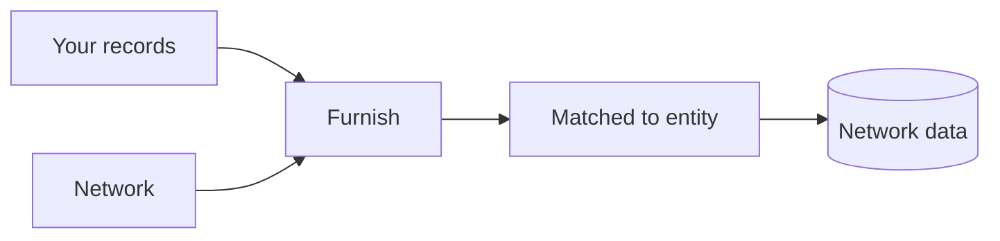
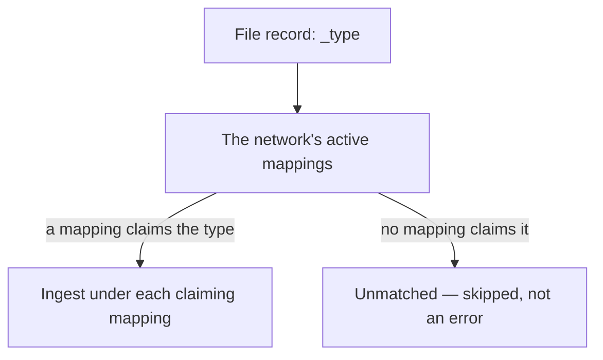

import DashboardFurnishingOverview from '/snippets/dashboard/furnishing-overview.mdx';

**Furnishing** is how a participant contributes verified work into a network.
It's the write half of the network: a verification your institution already
performed becomes a reusable [trust asset](/concepts/trust/trust-assets) that
entitled participants can later query. If querying is how you take value out of
a SOLO network, contributing is how you put value in — and how you earn the
right to take value out in the first place.

## Contributing is asset creation, not data donation

The natural fear of contributing is "I'm giving away proprietary customer
intelligence and losing control." A SOLO network is designed so that isn't what
happens. When you furnish a verification, it does not vanish into a vendor
database — it becomes an **attributed, governed asset** you still have a stake
in:

- **You keep attribution.** Every certificate sub-product your data backs
  carries your `furnishing_entity_id` and `attestation_event_id`. The verification
  travels with your name on it — see [Provenance](/concepts/trust/provenance).
- **You keep governance.** Contributed data is still gated by the subject's
  [consent](/concepts/identity/consent), the network's
  [querying policy](/concepts/governance/querying-policies), and each reader's
  [entitlement](/concepts/governance/entitlement). Furnishing does not expose
  your data to passive observers.
- **You gain read access.** Contributing is how you earn entitlement to read a
  subject back later (see below).

## Why furnish?

Banks furnish for two reasons, one regulatory and one economic:

1. **It's how the network has anything to say.** Every certificate, attestation,
   and screening result a querier receives traces back to a record some
   furnisher contributed. A network where nobody furnishes is an empty
   database with a governance layer.
2. **It earns you read access.** Furnishing an entity makes you
   [entitled](/concepts/governance/entitlement) to that entity's data on future
   queries. Contributing is one of the two ways to earn entitlement — the other
   is a prior query. For most participants, furnishing the entities you already
   onboard is by far the cheapest way to build broad read coverage across the
   network.

This earn-back loop is deliberate. Networks stay healthy when read access is
proportional to contribution, so the [entitlement
model](/concepts/governance/entitlement) treats every furnish as a deposit
against future reads.

## The three furnishing channels

There are three ways to get records into a network. All three converge on the
same ingestion machinery — the differences are in transport, batch size, and
how much automation you want to build.

| | REST furnish | Dashboard upload | SFTP drops |
|---|---|---|---|
| **Endpoint / transport** | `POST /v1/products/{product}/furnish` | The SOLO dashboard's upload dialog | SFTP server (`sftp.solo.one`) |
| **Payload** | JSON records in the request body | One [JSONL file](/api-overview/furnishing/file-upload) per upload | JSONL files dropped into `jsonl_furnish_data/` |
| **Batch size** | One to a few records per call | One file, many records | One file, many records; many files per session |
| **Processing** | Synchronous — response reflects the furnish | Asynchronous — tracked on the Uploads page | Asynchronous — ingestion triggers on upload |
| **Best for** | Real-time furnishing from your onboarding flow | Occasional batches and backfills | Recurring scheduled drops from core-banking or data-warehouse exports |

When to choose each:

- **REST furnish** when furnishing is an event in your system — a consumer
  finishes onboarding, you furnish their record in the same workflow. Lowest
  latency, immediate feedback, no file handling.
- **[Dashboard upload](/api-overview/furnishing/file-upload)** when you have a
  file in hand — a one-off backfill or a periodic batch you'd rather not
  automate.
- **[SFTP](/api-overview/sftp/overview)** when your data already leaves your
  systems as files on a schedule. Most core-banking and data-warehouse stacks
  can target an SFTP endpoint with zero custom code, which makes it the usual
  choice for nightly or monthly drops.

<Note>
  All three channels write the same network data. A record furnished over REST
  and the same record uploaded in a JSONL file end up identical in the network —
  same entity matching, same attribution, same entitlement effect.
</Note>

## How a furnish works

A furnish brings together a **network**, your **records**, and the **consumer**
(or business) they describe:



| Concept | Role in the furnish |
|---|---|
| **Product** | *What* you're contributing over REST (e.g. a KYC certificate). Determines the endpoint and record schema. |
| **Network** | *Where* the data is contributed. You must be a [furnisher](/concepts/governance/network-roles) of it. |
| **Mapping** | For files only: the network's [furnishing policy](/concepts/governance/furnishing-policies) that claims each record's `_type` and turns it into network data. |
| **Consumer / Business** | *Who* the data is about — matched from the identifiers in each record. |

### Anatomy of a REST furnish

You call the product's furnish endpoint with the network scope and one or more
records. For a KYC certificate:

```bash
curl -X POST https://api.solo.one/v1/products/kyc_certificate_snapshot/furnish \
  -H "Authorization: Bearer $SOLO_TOKEN" \
  -H "Content-Type: application/json" \
  -d '{
    "network_id": "9f1c0c2e-7a44-4f1e-9d2a-08b6f3a1c5d7",
    "application_date": "2026-05-28",
    "records": [
      {
        "first_name": "Jane",
        "last_name": "Doe",
        "date_of_birth": "1990-01-15",
        "social_security_number": "123-45-6789"
      }
    ]
  }'
```

A successful furnish returns a submission acknowledgment:

```json
{
  "success": true,
  "submission_id": "5b2e9f10-3c7d-4e8a-b1f6-2d9c0a47e831"
}
```

Field by field:

- `network_id` — the network you're furnishing into. You must hold the
  furnisher role there. The certificate is written straight into this network;
  no furnishing policy is involved.
- `application_date` — when the consumer applied. Required.
- `records` — one or more consumer records. For KYC certificates each record
  carries `first_name`, `last_name`, `date_of_birth`, and
  `social_security_number` — all strings. The SSN is the matching key that
  connects your record to a consumer [entity](/concepts/identity/entities).

The same shape applies to `POST /v1/products/kyb_certificate_snapshot/furnish` for
business records.

### How file records reach a mapping

You never name a mapping in a file. Each record's `_type` does it: the network's
active [furnishing policies](/concepts/governance/furnishing-policies) (mappings)
each claim a record type, and every record goes to each mapping that claims its
type. Records no mapping claims are counted as unmatched — skipped without being
treated as errors.



As a furnisher you state *facts* (network, record type, record); the governor's
mappings decide *rules*. See [record types](/api-overview/furnishing/file-upload#record-types)
for the details.

## What happens after ingest

Once a record is accepted, the furnishing pipeline takes over:

1. **Validation.** REST records are checked against the product's record
   schema; file records against the mapping that claimed them. Each record is
   processed independently — one bad record in a batch doesn't fail its
   neighbors.
2. **Entity matching.** Identifiers in the record (SSN for consumers; tax
   identifier and jurisdiction for businesses) are matched to an existing
   [entity](/concepts/identity/entities), or a new entity profile is created.
   Re-furnishing the same entity updates the existing profile rather than
   creating a duplicate.
3. **Records become network data.** The furnished attributes are written as
   that entity's data, attributed to your organization as furnisher.
4. **Certificates and attestations.** For certificate products, the furnished
   operations (document capture, address verification, and so on) become the
   evidence behind KYC/KYB certificates that
   queriers later receive. Where your organization has attested to the data,
   the attestation is linked to the resulting certificates.
5. **Entitlement is recorded.** Your organization becomes
   [entitled](/concepts/governance/entitlement) to this entity's data on
   future queries.

## Data quality expectations

The network is only as good as what's furnished into it. A few expectations
hold across every channel:

- **Identifiers must be real and complete.** SSNs, EINs, and dates of birth
  are matching keys. A typo doesn't just corrupt one record — it creates a
  phantom entity or pollutes a real one.
- **Treat identifiers as text.** SSNs and tax identifiers are strings, not
  integers. Exporting them as JSON numbers silently drops leading zeros.
- **Furnish what the certificate needs.** Certificates are built from specific
  verification operations. Records that don't carry them won't produce
  certificates, even if they ingest cleanly.
- **Idempotency is on natural keys.** Re-submitting a consumer record with the
  same SSN updates rather than duplicates. Don't "fix" a bad record by
  furnishing a second one with a tweaked identifier.

## Furnishing vs. querying

| | Furnishing | Querying |
|---|---|---|
| Direction | Write into the network | Read from the network |
| Needs consent? | No | Yes |
| Needs a policy you pass? | No (file records route by `_type`) | Yes (`network_policy`) |
| Earns entitlement? | Yes | Yes |

See [Querying](/api-overview/querying/overview) for the read half.

## Troubleshooting

<AccordionGroup>
  <Accordion title="403 / not authorized to furnish">
    Your organization must hold the furnisher role in the target network. See
    [network roles](/concepts/governance/network-roles). Check that
    `network_id` is the network where you were granted the role — roles don't
    carry across networks.
  </Accordion>
  <Accordion title="File accepted but no certificate appears">
    Most often the records were **unmatched**: no active mapping in the target
    network claims their `_type`. Unmatched records are skipped deliberately,
    not errored. The upload's results name the unmatched types — compare them
    with the record types your network's feeds declare.
  </Accordion>
  <Accordion title="Validation errors on individual records">
    Records are validated independently, so a batch can partially succeed.
    Common causes: missing required fields (all four KYC record fields are
    required), malformed dates (use ISO 8601, e.g. `1990-01-15`), or empty
    identifier strings.
  </Accordion>
  <Accordion title="Duplicate entities after furnishing">
    Entity matching keys on identifiers (SSN; EIN + jurisdiction). If you see
    duplicates, the identifiers differed between submissions — check for
    formatting drift such as dropped leading zeros or embedded whitespace.
  </Accordion>
</AccordionGroup>

<DashboardFurnishingOverview />

## Related concepts

<CardGroup cols={2}>
  <Card title="JSONL Files" icon="file-arrow-up" href="/api-overview/furnishing/file-upload">
    Furnish whole files of records from the dashboard.
  </Card>
  <Card title="SFTP Ingestion" icon="server" href="/api-overview/sftp/overview">
    Recurring JSONL drops, no HTTP client required.
  </Card>
  <Card title="Furnishing Policies" icon="scale-balanced" href="/concepts/governance/furnishing-policies">
    The rules the network applies to what you contribute.
  </Card>
  <Card title="Furnish an entity" icon="rocket" href="/home/quickstart/furnish-an-entity">
    A hands-on walkthrough of your first furnish.
  </Card>
</CardGroup>
