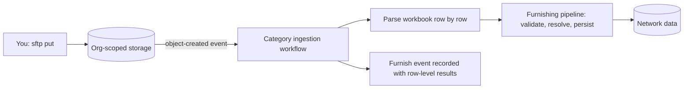

import DashboardSftpOverview from '/snippets/dashboard/sftp-overview.mdx';

The SOLO Network supports bulk data ingestion via SFTP. Upload Excel workbooks
to your organization's SFTP endpoint, and each file is automatically routed to
the right ingestion workflow, validated row by row, and written into the
network — through the **same furnishing pipeline** that backs the
[REST channels](/api-overview/furnishing/overview). SFTP is a transport, not a
separate system: a record dropped over SFTP and the same record furnished over
HTTPS produce identical network data.

Choose SFTP when your data already leaves your systems as files on a schedule.
Core-banking platforms and data warehouses can usually target an SFTP endpoint
with no custom code, which makes this the natural channel for nightly or
monthly batch drops.

## Connecting

Connect to `sftp.solo.one` on port 22. Your **email address** is the username
and your organization's **WorkOS API key** is the password:

```bash
sftp your-email@yourbank.com@sftp.solo.one
```

For the sandbox environment, append `+sandbox` to the local part of your email:

```bash
sftp your-email+sandbox@yourbank.com@sftp.solo.one
```

Or using an SFTP library:

<CodeGroup>

```python Python (paramiko)
import paramiko

transport = paramiko.Transport(("sftp.solo.one", 22))
transport.connect(
    username="alice@yourbank.com",
    password="sk_live_your_workos_api_key",
)
sftp = paramiko.SFTPClient.from_transport(transport)

sftp.put("policies.xlsx", "/kyc_cert_policy/policies.xlsx")

sftp.close()
transport.close()
```

```bash SSH config
# ~/.ssh/config
Host solo-sftp
    HostName sftp.solo.one
    User alice@yourbank.com
    Port 22
```

</CodeGroup>

### How authentication works

Every connection is verified live, not against a stored password:

1. The username is parsed into an email and an environment tag
   (`+sandbox` → sandbox; no tag → production). Usernames are
   case-insensitive. An unrecognized tag is rejected outright.
2. The password is validated as a **WorkOS API key** against WorkOS. Revoked
   or malformed keys are rejected.
3. The key's owning WorkOS organization — not anything in the username — is
   resolved to your SOLO organization. Your session is scoped to that
   organization's isolated storage area in the selected environment.

<Note>
  Because authorization derives from the **API key**, the key is the credential
  that matters: rotating or revoking it in WorkOS immediately cuts off SFTP
  access (allow up to a minute for cached sessions to expire). Contact your
  SOLO account manager to provision keys.
</Note>

<Warning>
  SFTP sessions are **upload-only**. You can `put` files and create
  directories, but listing, downloading, overwriting, and deleting are not
  permitted. Upload each file under a name you haven't used before, and use
  the SOLO dashboard — not the SFTP session — to confirm what was ingested.
</Warning>

## Directory layout

Files are uploaded to one of five category directories directly under the
session root:

```
{category}/{filename}.xlsx
```

For example:

```
kyc_cert_policy/kyc-policies-2026.xlsx
kyb_cert_policy/kyb-policies.xlsx
programs/network-programs.xlsx
kyc_furnish_data/consumer-batch-jan.xlsx
kyb_furnish_data/business-batch-jan.xlsx
```

The directory **is** the schema selector — it tells the ingester how to parse
the workbook:

| Category | Directory | Description |
|---|---|---|
| KYC Certificate Policy | `kyc_cert_policy/` | Define KYC verification policies with operation flags |
| KYB Certificate Policy | `kyb_cert_policy/` | Define KYB verification policies with operation flags |
| Programs | `programs/` | Configure network programs linking KYC and KYB policies |
| KYC Furnish Data | `kyc_furnish_data/` | Consumer onboarding records for KYC certificates |
| KYB Furnish Data | `kyb_furnish_data/` | Business onboarding records for KYB certificates |

See [Upload Categories](/api-overview/sftp/schemas) for the expected columns in
each category.

## What happens on upload

Ingestion is event-driven — there is no polling window to wait for:



1. **Upload.** The file lands in your organization's isolated storage area,
   prefixed by environment and organization.
2. **Trigger.** The storage event fires the ingestion workflow for the file's
   category — within seconds of the upload completing.
3. **Parse.** The workbook is read: first sheet only, row 1 treated as a
   banner, row 2 as headers, row 3+ as data
   ([format details](/api-overview/sftp/csv-format)).
4. **Ingest.** Each row runs through the same furnishing pipeline as the API
   channels. For data categories that means program routing and
   [furnishing-policy resolution](/concepts/governance/furnishing-policies)
   by `program_name` + `application_date`; for configuration categories
   (policies, programs) it means creating governor-controlled network
   configuration.
5. **Record.** The outcome — total rows, successes, filtered rows, failures
   with per-row messages — is recorded as a furnish event you can review in
   the dashboard.

Key behaviors:

- **Row-level processing** — each row succeeds or fails independently. A
  single invalid row never sinks the rest of the file.
- **Filtered is not failed** — data rows whose `application_date` falls
  outside every applicable policy window are skipped deliberately and
  reported as filtered.
- **Header normalization** — headers are lowercased and non-alphanumeric runs
  collapse to underscores, so column order and cosmetic formatting don't
  matter.
- **Example-row skipping** — rows whose identifier column starts with `Ex.`
  are treated as in-workbook examples and skipped.
- **Safe re-runs** — data rows upsert on their natural keys (SSN for
  consumers; tax identifier and jurisdiction for businesses), so re-uploading
  a corrected batch updates records instead of duplicating them. Re-uploaded
  policy and program rows that collide with existing names surface as
  per-row name-conflict errors rather than duplicates.

## File requirements

- **Format**: Excel workbook (`.xlsx`)
- **Sheet**: only the first sheet is read
- **Row 1**: banner row (ignored)
- **Row 2**: column headers
- **Row 3+**: data rows

See [Workbook Format](/api-overview/sftp/csv-format) for the full rules, including
data types and common pitfalls.

## Relationship to the API channels

SFTP shares everything but the transport with the REST furnishing surface:

- The five directories map one-to-one onto the `slug` values accepted by the
  [bulk file upload endpoint](/api-overview/furnishing/file-upload)
  (`POST /v1/file-upload/ingest`).
- Data rows go through the same program routing and policy resolution as a
  per-record `POST /v1/products/kyc_certificate/furnish` call — and earn the
  same [entitlement](/concepts/governance/entitlement) for your organization.
- The dashboard shows SFTP drops and API uploads in the same uploads view,
  with the same row-level result reporting.

That means you can mix channels freely: backfill history over SFTP, furnish
new onboarding events over REST in real time, and the network treats the
resulting data identically.

## Environments

Use plus-addressing on the email username to target an environment:

| Environment | Username format | Example |
|---|---|---|
| Production | `email@domain.com` | `alice@yourbank.com` |
| Sandbox | `email+sandbox@domain.com` | `alice+sandbox@yourbank.com` |

Each environment writes to its own isolated storage; nothing uploaded to
sandbox can reach production data. Start in sandbox — the
[getting-started guide](/api-overview/sftp/getting-started) walks through a first
upload end to end.

## Who can upload what

The five categories split into two permission tiers:

- **Data categories** (`kyc_furnish_data`, `kyb_furnish_data`) are for
  organizations holding the [furnisher role](/concepts/governance/network-roles)
  in the target network.
- **Configuration categories** (`kyc_cert_policy`, `kyb_cert_policy`,
  `programs`) define network rules and are enforced as governor-only at
  ingest — rows uploaded by a non-governor fail with an access error even
  though the file itself uploads successfully.

<DashboardSftpOverview />

<CardGroup cols={2}>
  <Card title="Getting Started" icon="rocket" href="/api-overview/sftp/getting-started">
    Your first upload, end to end, in about 15 minutes.
  </Card>
  <Card title="Upload Categories" icon="list" href="/api-overview/sftp/schemas">
    Required and optional columns for every category.
  </Card>
  <Card title="Workbook Format" icon="file-excel" href="/api-overview/sftp/csv-format">
    Header normalization, data types, and formatting rules.
  </Card>
  <Card title="Furnishing Overview" icon="arrow-up-from-bracket" href="/api-overview/furnishing/overview">
    How SFTP relates to the REST furnishing channels.
  </Card>
</CardGroup>
