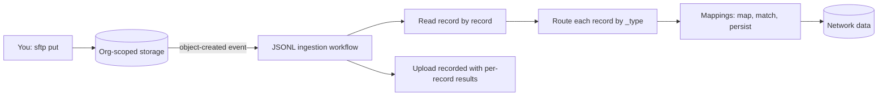

import DashboardSftpOverview from '/snippets/dashboard/sftp-overview.mdx';

The SOLO Network supports bulk data ingestion via SFTP. Drop
[JSONL files](/api-overview/furnishing/file-upload) into your organization's
SFTP endpoint, and each file is automatically ingested record by record into
the network — through the **same furnishing pipeline** as a
[dashboard upload](/api-overview/furnishing/file-upload#uploading-from-the-dashboard).
SFTP is a transport, not a separate system: a record dropped over SFTP and the
same record uploaded from the dashboard produce identical network data.

Choose SFTP when your data already leaves your systems as files on a schedule.
Core-banking platforms and data warehouses can usually target an SFTP endpoint
with no custom code, which makes this the natural channel for nightly or
monthly batch drops.

## Connecting

Connect to `sftp.solo.one` on port 22. Your **email address** is the username
and your organization's **WorkOS API key** is the password:

```bash
sftp your-email@yourbank.com@sftp.solo.one
```

For the sandbox environment, append `+sandbox` to the local part of your email:

```bash
sftp your-email+sandbox@yourbank.com@sftp.solo.one
```

Or using an SFTP library:

<CodeGroup>

```python Python (paramiko)
import paramiko

transport = paramiko.Transport(("sftp.solo.one", 22))
transport.connect(
    username="alice@yourbank.com",
    password="sk_live_your_workos_api_key",
)
sftp = paramiko.SFTPClient.from_transport(transport)

sftp.put("consumers_aug.jsonl", "/jsonl_furnish_data/consumers_aug.jsonl")

sftp.close()
transport.close()
```

```bash SSH config
# ~/.ssh/config
Host solo-sftp
    HostName sftp.solo.one
    User alice@yourbank.com
    Port 22
```

</CodeGroup>

### How authentication works

Every connection is verified live, not against a stored password:

1. The username is parsed into an email and an environment tag
   (`+sandbox` → sandbox; no tag → production). Usernames are
   case-insensitive. An unrecognized tag is rejected outright.
2. The password is validated as a **WorkOS API key** against WorkOS. Revoked
   or malformed keys are rejected.
3. The key's owning WorkOS organization — not anything in the username — is
   resolved to your SOLO organization. Your session is scoped to that
   organization's isolated storage area in the selected environment.

<Note>
  Because authorization derives from the **API key**, the key is the credential
  that matters: rotating or revoking it in WorkOS immediately cuts off SFTP
  access (allow up to a minute for cached sessions to expire). Contact your
  SOLO account manager to provision keys.
</Note>

<Warning>
  SFTP sessions are **upload-only**. You can `put` files and create
  directories, but listing, downloading, overwriting, and deleting are not
  permitted. Upload each file under a name you haven't used before, and use
  the SOLO dashboard — not the SFTP session — to confirm what was ingested.
</Warning>

## Directory layout

Files go into the `jsonl_furnish_data/` directory, optionally under a network
directory that names the network to furnish into:

```
network_{network_id}/jsonl_furnish_data/{filename}.jsonl
jsonl_furnish_data/{filename}.jsonl
```

- **`network_{network_id}/jsonl_furnish_data/`** furnishes into that network.
  Each SFTP feed in the dashboard shows the network id in its drop path; leave
  off the path's leading `entity_…/` segment, since your session is already
  scoped to your organization.
- **`jsonl_furnish_data/`** on its own furnishes into your organization's
  governed network.

Files anywhere else are stored but never ingested.

## What happens on upload

Ingestion is event-driven — there is no polling window to wait for:


```mermaid
flowchart LR
    U[You: sftp put] --> S[(Org-scoped storage)]
    S -->|object-created event| W[JSONL ingestion workflow]
    W --> P[Read record by record]
    P --> R[Route each record by _type]
    R --> F[Mappings: map, match, persist]
    F --> D[(Network data)]
    W --> E[Upload recorded with per-record results]
```

1. **Upload.** The file lands in your organization's isolated storage area,
   prefixed by environment and organization.
2. **Trigger.** The storage event fires the ingestion workflow within seconds
   of the upload completing.
3. **Route.** Each line is read as one record and sent to every active mapping
   in the target network that claims its
   [`_type`](/api-overview/furnishing/file-upload#record-types).
4. **Ingest.** Each mapping maps the record, matches it to a consumer or
   business, and persists its events.
5. **Record.** The outcome — records read, successes, filtered, failures, and
   unmatched record types — is recorded on the upload, which you can review in
   the dashboard.

Key behaviors:

- **Record-level processing** — each line succeeds or fails independently. A
  single invalid line never sinks the rest of the file.
- **Unmatched is not failed** — records whose `_type` no active mapping claims
  are skipped deliberately and reported as unmatched.
- **Safe re-runs** — identity records resolve to the existing consumer or
  business on their natural keys, so re-uploading a corrected batch attaches to
  the same profiles instead of duplicating them.

## Relationship to the other channels

SFTP shares everything but the transport with the dashboard upload:

- The same [JSONL format](/api-overview/furnishing/file-upload#file-format)
  and the same routing by `_type`.
- The dashboard shows SFTP drops and dashboard uploads in the same Uploads
  view, with the same per-record result reporting.
- Furnished records earn the same [entitlement](/concepts/governance/entitlement)
  as a per-record `POST /v1/products/kyc_certificate_snapshot/furnish` call.

That means you can mix channels freely: backfill history over SFTP, furnish
new onboarding events over REST in real time, and the network treats the
resulting data identically.

## Environments

Use plus-addressing on the email username to target an environment:

| Environment | Username format | Example |
|---|---|---|
| Production | `email@domain.com` | `alice@yourbank.com` |
| Sandbox | `email+sandbox@domain.com` | `alice+sandbox@yourbank.com` |

Each environment writes to its own isolated storage; nothing uploaded to
sandbox can reach production data. Start in sandbox — the
[getting-started guide](/api-overview/sftp/getting-started) walks through a first
upload end to end.

## Who can upload

Your organization must hold the **furnisher** or **governor**
[role](/concepts/governance/network-roles) in the target network. A file
aimed at a network you don't furnish into still uploads, but its ingestion
fails with an access error and no records are written.

<DashboardSftpOverview />

<CardGroup cols={2}>
  <Card title="Getting Started" icon="rocket" href="/api-overview/sftp/getting-started">
    Your first upload, end to end, in about 15 minutes.
  </Card>
  <Card title="JSONL Files" icon="file-arrow-up" href="/api-overview/furnishing/file-upload">
    The file format, record types, and results.
  </Card>
  <Card title="Furnishing Policies" icon="shield-check" href="/concepts/governance/furnishing-policies">
    How mappings turn records into network data.
  </Card>
  <Card title="Furnishing Overview" icon="arrow-up-from-bracket" href="/api-overview/furnishing/overview">
    How SFTP relates to the REST furnishing channel.
  </Card>
</CardGroup>
