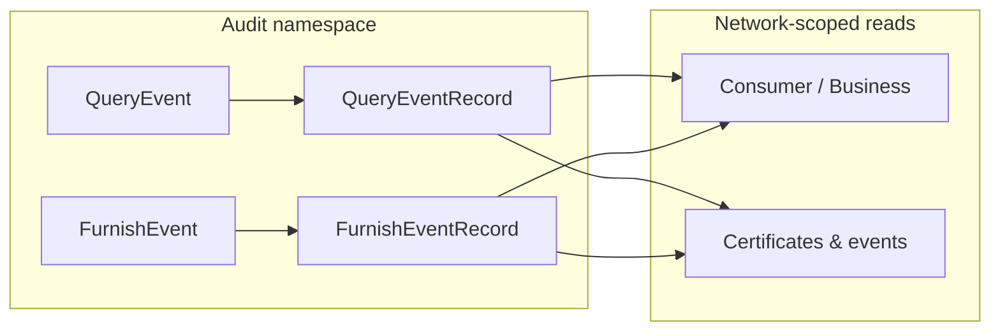

SOLO separates **audit telemetry** (the record of queries and furnish runs) from **runtime profile data** (consumers, businesses, certificates, events). They use different scoping rules.

## Two layers

| Layer | Purpose | Primary scope |
|---|---|---|
| **Audit telemetry** | Immutable history of queries and furnish runs | **Entity** (who ran the operation) |
| **Runtime data** | Profile and verification rows you query or furnish | **Entity + network** |



## Audit namespace

GraphQL exposes read-only audit telemetry under the **`audit`** namespace:

```graphql
query {
  audit {
    queryEventsConnection(first: 20) { ... }
    furnishEventsConnection(first: 20) { ... }
    auditedNode(id: "...") { ... }
  }
}
```

The audit namespace is **not** network-scoped — it does not take a `networkId` argument. Instead, every request is filtered by the caller's **accessible entity ids** (your stakeholder plus any furnishing entities you hold active consent grants for).

### Query events

A **query event** is written when your stakeholder runs a product query (REST or GraphQL). Key fields:

| Field | Meaning |
|---|---|
| `entity_id` / `queryingEntityId` | Who ran the query (always the caller) |
| `furnishingEntityId` | Who originally furnished the underlying data, when known |
| `productId` | Product that was queried |
| `queryEventRecords` | Junction rows linking the event to profiles and every object touched |

You always see **your own** query history. You do **not** automatically see query events run by other network members against the same profiles.

### Furnish events

A **furnish event** is written when your stakeholder ingests data (API, SFTP, or upload). Key fields:

| Field | Meaning |
|---|---|
| `entity_id` | The furnishing stakeholder who ran the upload |
| `network_id` | Which network or program the run targeted |
| `furnishEventRecords` | Junction rows linking the run to profiles and furnished objects |

You see furnish events where `entity_id` is in your accessible entity set — your entity, or a furnishing entity you hold consent to audit.

## Entitlement records

`QueryEventRecord` and `FurnishEventRecord` are junction tables that answer: *"this audit event touched this profile / this object."*

They power:

- **Entitled reads** — when `networks(ids:, isEntitled: true)` is set, nested reads return only rows linked by prior query or furnish events for `(your_entity, profile)` pairs
- **Subject resolution** on audit objects (e.g. `subjectConsumer` on a query event)
- **Dashboard navigation** via `AuditedNode` routes

Entitlement loading unions query and furnish links, always anchored on **your entity** as querier or furnisher — not on network governorship.

## Who sees subnetwork-furnished data?

When you **govern** a parent network but a **member furnishes into a child program**:

| Question | Answer |
|---|---|
| Can I see their furnish runs in audit? | **No**, unless their entity id is in your consent-expanded entity set |
| Can I read the furnished profiles? | **No**, unless an explicit consent grant widens your entity scope |
| Can I query those profiles myself? | **Yes** (with consent) — you get a new query event under **your** `entity_id` |
| Does governorship alone help? | **No** — governor is an admin seat, not a data-access privilege |

See [Networks](/concepts/networks) for membership, governance rules, and consent mechanics.

## AuditedNode

`audit.auditedNode(id:)` resolves any Relay global ID and returns:

1. **`node`** — the underlying object (same as `node(id:)`)
2. **`routes`** — every dashboard path where **you** can reach that object

```graphql
query InspectObject($id: ID!) {
  audit {
    auditedNode(id: $id) {
      node {
        __typename
        ... on KycCertificateObject { identifier }
      }
      routes {
        kind
        label
        href
        tab
        segments { typename identifier label globalId }
        viaQueryEvent { identifier createdAt }
        viaFurnishEvent { identifier slug }
        viaConsumer { firstName lastName }
        viaBusiness { businessLegalName }
      }
    }
  }
}
```

Batch lookup: `audit.auditedNodes(ids: [...])`.

### Route kinds

| Kind | Meaning | Example |
|---|---|---|
| `DIRECT_PAGE` | Top-level dashboard URL | `/history/{id}`, `/furnishing/{id}` |
| `ENTITY_TAB` | Profile detail tab | `/entities/consumer/{id}?tab=queries` |
| `AUDIT_EVENT` | Reachable via a query or furnish run | History page linked from a profile |
| `PARENT_OBJECT` | No standalone page — visible on a profile | Certificate on consumer overview |
| `CATALOG` | Platform catalog page | `/products/{id}`, `/networks/{id}` |

Routes are built from:

1. **Static templates** for types with canonical pages (query events, furnish events, consumers, businesses, products, networks, policies)
2. **Reverse lookups** through `QueryEventRecord` and `FurnishEventRecord`, filtered to audit events your entity can see

Routes respect the same entity scope as audit lists — you will not receive navigation paths through another member's furnish runs without consent.

## GraphQL query namespaces (summary)

| Namespace | Scope | Typical use |
|---|---|---|
| `audit` | Entity | Query/furnish history, `AuditedNode` |
| `networks(ids:)` | Network + entity (+ optional entitlement) | Profile data, certificates, policies |
| `meta` | Unscoped catalog | Field definitions, platform products |
| `identity` | Entity | Caller entity, consent resolution |
| `search` | Cross-scope directory | Find-or-create dialogs |

Global `node(id:)` resolves any type but still applies entity and network row filters from the request context.

## Related concepts

<CardGroup cols={2}>
  <Card title="Networks" icon="sitemap" href="/concepts/networks">
    Membership, programs, governance, and consent.
  </Card>
  <Card title="Data model" icon="diagram-project" href="/concepts/data-model">
    Consumers, businesses, and multi-tenancy basics.
  </Card>
</CardGroup>
