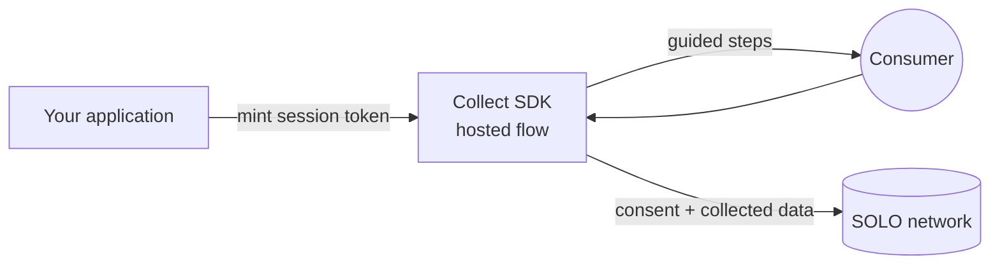

<Info>
  **Available to registered partners only.** The Collect SDK is provisioned per
  partner. Contact your SOLO representative to request access and a sandbox.
</Info>

## What it is

The **Collect SDK** is a ready-made screen flow that asks a person for their
information and permission, so you don't have to build those screens yourself.
You hand the consumer off to it, they answer a few guided steps — who they are,
a quick phone check, what they agree to share — and the result comes back to you
through the SOLO network.

Think of it as the "front door" where data and
[consent](/concepts/identity/consent) are gathered directly from the consumer.
It's the human-facing counterpart to SOLO's machine interfaces: the
[Furnishing API](/concepts/furnishing/overview) (how data gets *into* a network)
and the [Query API](/concepts/querying/overview) (how data is read back).

## Why it's useful

- **You skip building intake UI.** Identity capture, phone one-time-passcode
  verification, consent screens, dynamic forms, and conflict resolution are all
  provided and kept current by SOLO.
- **Consent is captured at the source.** The consumer's
  [consent](/concepts/identity/consent) is recorded in the same flow that
  collects their data, so the legal basis travels with the data from the moment
  it's gathered.
- **You can change what's collected without a release.** The steps and fields
  are decided on the server, so product and compliance changes don't require
  shipping new front-end code.

## When and why you'd use it

Reach for the Collect SDK whenever you need a real person to provide information
or grant permission as part of a flow you run:

| Situation | How the Collect SDK helps |
|---|---|
| **Onboarding a new customer** | Walks them through identity, phone verification, and consent in one guided flow, then makes the result available to the network. |
| **Getting permission to query someone** | Captures the consumer's [consent](/concepts/identity/consent) so you can later run a [product query](/concepts/querying/overview) about them. |
| **Collecting missing details** | Presents a dynamic form for exactly the fields you still need — without you designing the form. |
| **You don't want to build or maintain intake screens** | SOLO hosts and updates the experience; you just launch it. |

If your data already lives in your own systems and no consumer interaction is
needed, you'll typically use the [Furnishing API](/concepts/furnishing/overview)
instead. The Collect SDK is specifically for the moments a consumer is in the
loop.

## How it works

<Note>
  The Collect SDK is a **hosted experience**, not a code library you bundle. You
  integrate by minting a short-lived session token from your backend and opening
  the hosted SDK URL — there's no client package to install or upgrade.
</Note>

<Steps>
  <Step title="Mint a session token">
    Your backend requests a short-lived SDK session token, scoped to the
    workflow you want the consumer to complete (and, optionally, the
    [entity](/concepts/identity/entities) it concerns). Tokens are
    single-purpose and time-limited.
  </Step>
  <Step title="Launch the hosted flow">
    Send the consumer to the hosted Collect SDK URL with the token. The SDK
    validates the token and renders the first step. No token, no flow — the SDK
    will not start without a valid session.
  </Step>
  <Step title="The consumer completes the steps">
    The SDK drives a step-by-step flow (below), advancing as each step is
    submitted. The sequence and the fields requested are decided server-side by
    the workflow.
  </Step>
  <Step title="Hand back to your app">
    On completion the consumer returns to your application, and the consented,
    collected data is available in the network for furnishing or querying.
  </Step>
</Steps>

### The collection flow

A Collect session is a sequence of server-driven steps. A given workflow uses
the subset it needs:

| Step | What the consumer does |
|---|---|
| **Identity** | Provides core identifying details (e.g. name and phone number). |
| **Phone verification** | Confirms ownership of their phone with a one-time passcode. |
| **Consent** | Affirms or denies consent per attribute, for exactly the attributes the workflow requests. See [Consent](/concepts/identity/consent). |
| **Collect** | Fills in a dynamic form — fields (email, address, dates, selections, and so on) are specified by the workflow, not hard-coded in the UI. |
| **Conflict resolution** | Chooses between conflicting values when the same attribute arrives from more than one source. |
| **Review** | Confirms the aggregated consents and collected values before submitting. |

Because the steps and fields are defined by the workflow on the server, the same
hosted SDK can power very different collection experiences — a light phone-and-
consent capture, or a full onboarding intake — without any change on your side.

## Related concepts

<CardGroup cols={2}>
  <Card title="Consent" icon="signature" href="/concepts/identity/consent">
    The permission the SDK captures alongside the data.
  </Card>
  <Card title="Entities" icon="user" href="/concepts/identity/entities">
    The consumer or business a Collect session concerns.
  </Card>
  <Card title="Furnishing API" icon="arrow-up-from-bracket" href="/concepts/furnishing/overview">
    How collected data is contributed into a network.
  </Card>
  <Card title="Query API" icon="magnifying-glass" href="/concepts/querying/overview">
    How collected, furnished data is read back.
  </Card>
</CardGroup>
