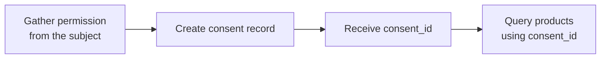

**Consent** is your record that you have permission to query a specific consumer
or business. Querying personal and business data carries a legal obligation to
have a permissible purpose — consent is how the network captures that you do.

You create a consent record once per subject, receive a `consent_id`, and pass
that `consent_id` on every query for that subject.



## Why consent is required

A consent record ties together three things:

- **Who is asking** — your organization
- **Who the subject is** — the consumer or business identity
- **That permission was obtained** — you attest you gathered the subject's
  consent before querying

Without a valid `consent_id`, product queries for a consumer or business are
rejected. This keeps querying tied to a lawful, auditable basis.

## Creating consent

Consent is created server-to-server. You supply the subject's identity and
confirm that you gathered their permission beforehand.

<Tabs>
  <Tab title="Consumer">
    `POST /consent/consumer`

    ```json
    {
      "network_id": "9f1c0c2e-…",
      "did_gather_consent_from_consumer_prior": true,
      "consumer_consent_identity": {
        "first_name": "Jane",
        "last_name": "Doe",
        "date_of_birth": "1990-01-15",
        "personal_email": "jane@example.com",
        "phone_number": "+14155550100",
        "social_security_number": "123-45-6789"
      }
    }
    ```

    The response contains a `consent_id`. Use it on every subsequent consumer
    product query.
  </Tab>
  <Tab title="Business">
    `POST /consent/business`

    ```json
    {
      "did_gather_consent_from_business_prior": true,
      "business_consent_identity": {
        "business_legal_name": "Acme Corp",
        "business_jurisdiction_of_formation": "DE",
        "business_registration_identifier_from_jurisdiction_of_formation": 1234567,
        "business_tax_identifier_type": "EIN",
        "business_tax_identifier_value": "12-3456789"
      },
      "identity": { "business_legal_name": "Acme Corp", "business_jurisdiction_of_formation": "DE", "business_registration_identifier_from_jurisdiction_of_formation": 1234567 }
    }
    ```
  </Tab>
</Tabs>

<Warning>
  You must obtain the subject's permission **before** creating the consent record.
  Setting `did_gather_consent_from_consumer_prior` (or the business equivalent) to
  `true` is an attestation that you have done so.
</Warning>

## Using a consent ID

Pass the `consent_id` in the body of a product query. The network resolves the
consent to the subject's identity and applies the appropriate field access — you
don't need to repeat the subject's identifying details on every call.

```json
{
  "consent_id": "a3f0b9c7-…",
  "network_policy": [{ "network_id": "9f1c0c2e-…", "policy_id": "5e7d2a14-…" }]
}
```

You can read back a consumer consent record at any time with
`GET /consent/consumer/{consent_id}`.

## How consent relates to entitlement

Consent and [entitlement](/concepts/entitlement) are complementary:

| | Consent | Entitlement |
|---|---|---|
| Question it answers | *May I query this subject at all?* | *Which fields may I read?* |
| How you get it | Record permission, get a `consent_id` | Earn it by furnishing or querying the subject |
| Scope | A single subject | Per field, per entity |

A query needs **both**: consent to be permitted to ask, and entitlement to
determine what comes back.

## Related concepts

<CardGroup cols={2}>
  <Card title="Querying" icon="magnifying-glass" href="/concepts/querying">
    How consent plugs into a product query.
  </Card>
  <Card title="Entitlement" icon="key" href="/concepts/entitlement">
    What determines which fields a query returns.
  </Card>
</CardGroup>
