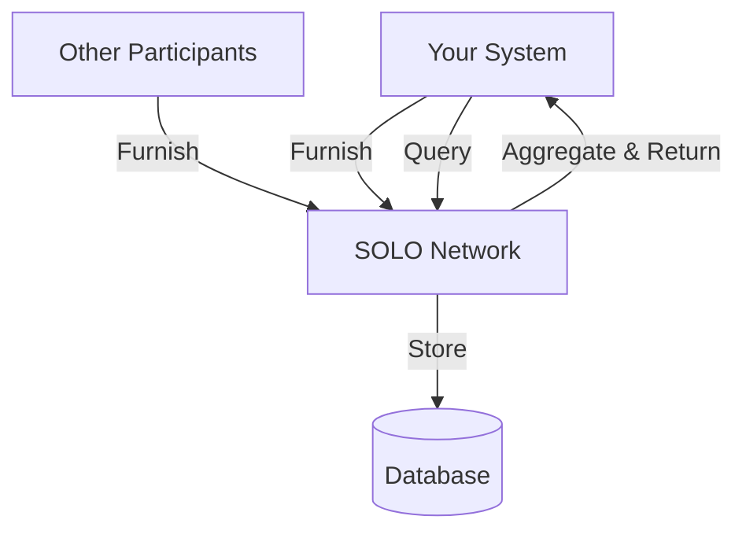

Understanding the SOLO data model helps you work effectively with the API. Here are the core entities and how they relate.

## Core Entities

### Stakeholder (Entity)

A **stakeholder** (called an **entity** in the GraphQL schema) represents an organization participating in the SOLO Network — typically a financial institution, fintech company, or data provider.

Your API credentials are scoped to a stakeholder. All data you furnish and query is associated with your entity context. Row-level isolation uses `entity_id` on furnished records; audit telemetry uses the same boundary.

### Account

An **account** links a user to a stakeholder. Each stakeholder has one or more accounts, with one designated as the **owner** account.

### Consumer

A **consumer** represents an individual person in the network. Consumer data is identified by PII fields like name, date of birth, and SSN (last four digits). The network matches consumers across stakeholders using these identifiers.

Consumers are **globally unique profiles** — the same person is one row across the network. Which fields you can read depends on consent and prior query/furnish entitlements, not on which network you scope to.

### Business

A **business** represents a legal entity. Businesses are identified by fields like legal name, tax identifier (EIN), jurisdiction of formation, and registered address.

Like consumers, businesses are global profile records with entity- and entitlement-governed visibility.

### Network

A **network** groups participants, policies, and furnished data. Networks can contain **child programs** (sub-partitions for furnishers). See [Networks](/concepts/networks) for membership, governance, and how parent/child scoping works.

## Multi-Tenancy

The SOLO Network is multi-tenant by design:

- Each stakeholder's **furnish and audit rows** are isolated by `entity_id` — you see your operations and those of furnishing entities you hold active consent grants for
- **Network scoping** (`networks(ids: [...])`) adds a second filter on runtime data via `network_id` / `network_ids`
- **Governing a network does not** automatically grant read access to other members' furnished data
- Stakeholder context is automatically set from your authentication token

<Warning>
  Network containment alone is not sufficient for cross-participant reads. Entity scope and explicit consent grants enforce the second line of defense. See [Audit & visibility](/concepts/audit-and-visibility).
</Warning>

## Data Flow

When you **furnish** data, it is stored in the network and associated with the matched consumer or business entity. When you **query**, the network aggregates data from all participants who have furnished data for that subject.

## Data Ingestion

For bulk data operations, the SOLO Network supports file-based ingestion:

1. **Upload** files via SFTP to your designated bucket
2. Files are **automatically detected** by the S3 polling workflow
3. Each file is **streamed** record-by-record through the ingestion pipeline
4. Records are **routed** to the appropriate template based on schema detection
5. Processing results are tracked per-file with completion status

Supported formats include CSV and JSON Lines (JSONL). Schema detection happens automatically based on column headers.

## Concept guides

<CardGroup cols={2}>
  <Card title="Networks" icon="sitemap" href="/concepts/networks">
    Membership, programs, governance, and consent between participants.
  </Card>
  <Card title="Audit & visibility" icon="clock-rotate-left" href="/concepts/audit-and-visibility">
    Query/furnish history, entitlements, and the AuditedNode API.
  </Card>
</CardGroup>

<Tip>
  Contact your SOLO account manager to set up SFTP access for bulk data ingestion.
</Tip>
