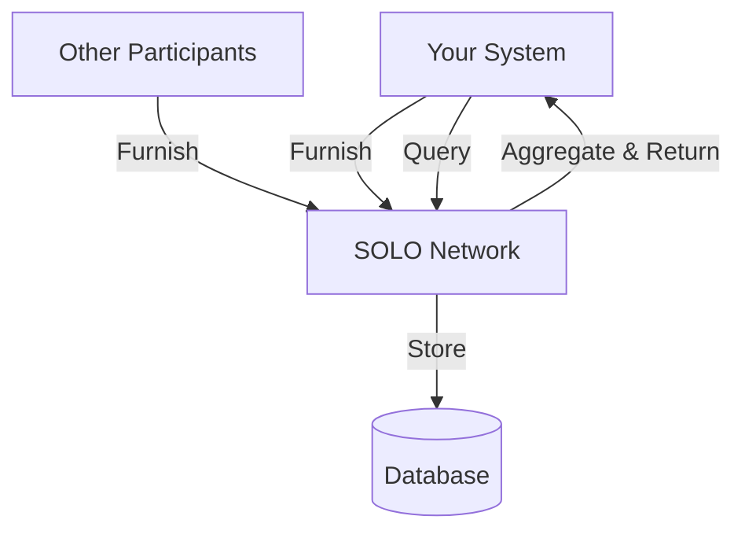

Understanding the SOLO data model helps you work effectively with the API. Here are the core entities and how they relate.

## Core Entities

### Stakeholder

A **stakeholder** represents an organization participating in the SOLO Network — typically a financial institution, fintech company, or data provider.

Your API credentials are scoped to a stakeholder. All data you furnish and query is associated with your stakeholder context.

### Account

An **account** links a user to a stakeholder. Each stakeholder has one or more accounts, with one designated as the **owner** account.

### Consumer

A **consumer** represents an individual person in the network. Consumer data is identified by PII fields like name, date of birth, and SSN (last four digits). The network matches consumers across stakeholders using these identifiers.

### Business

A **business** represents a legal entity. Businesses are identified by fields like legal name, tax identifier (EIN), jurisdiction of formation, and registered address.

## Multi-Tenancy

The SOLO Network is multi-tenant by design:

- Each stakeholder's data is isolated — you can only query data that has been explicitly shared with the network
- Cross-reference IDs (`cross_reference_id`) allow you to map SOLO records to your internal systems
- Stakeholder context is automatically set from your authentication token

## Data Flow

When you **furnish** data, it is stored in the network and associated with the matched consumer or business entity. When you **query**, the network aggregates data from all participants who have furnished data for that subject.

## Data Ingestion

For bulk data operations, the SOLO Network supports file-based ingestion:

1. **Upload** files via SFTP to your designated bucket
2. Files are **automatically detected** by the S3 polling workflow
3. Each file is **streamed** record-by-record through the ingestion pipeline
4. Records are **routed** to the appropriate template based on schema detection
5. Processing results are tracked per-file with completion status

Supported formats include CSV and JSON Lines (JSONL). Schema detection happens automatically based on column headers.

<Tip>
  Contact your SOLO account manager to set up SFTP access for bulk data ingestion.
</Tip>
