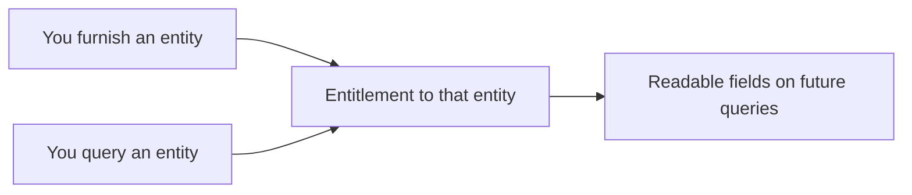

**Entitlement** is what determines *which fields* you may read about an entity.
Belonging to a network and holding consent let you ask a question; entitlement
decides what the answer contains.

The principle is simple: **you can read what you have contributed to or
previously looked at.** You earn entitlement to an entity's data by participating
in the network — not by your role or by network membership alone.

There are two ways to become entitled.

## Entitlement through furnishments

When you **furnish** data for an entity, you become entitled to read that
entity's data on future queries. Contributing to the network earns you the right
to see consolidated results for the subjects you've furnished.

This is the most direct path: furnish what you know about a consumer or business,
and subsequent queries for that subject return data — yours, plus anything else
you're entitled to — consolidated into one result.

## Entitlement through historical queries

When you **query** an entity (with valid [consent](/concepts/consent)), that query
also establishes entitlement going forward. Having lawfully queried a subject, you
remain entitled to read the data that query covered.

This means entitlement accrues over time. Each legitimate interaction —
furnishing or querying — widens the set of data you can see for the entities
you've actually engaged with.

## Putting it together

A query result is shaped by three layers, applied in order:

<Steps>
  <Step title="Consent">
    You hold a valid [consent](/concepts/consent) record for the subject — you're
    permitted to ask.
  </Step>
  <Step title="Policy ceiling">
    The network's querying [policy](/concepts/policies) defines the maximum set of
    fields this product can expose in this network.
  </Step>
  <Step title="Entitlement filter">
    Of those fields, you receive only the ones you've **earned** — through prior
    furnishing or querying of this entity.
  </Step>
</Steps>

The result is the intersection of what the policy allows and what you're entitled
to.

<Note>
  This is why two participants can run the *same* query on the *same* entity and
  get *different* results: each sees only the data they've earned access to.
</Note>

## What entitlement is not

- **Not a role.** Being a [governor](/concepts/networks#permissions--roles) of a
  network does not entitle you to members' data.
- **Not network containment.** Sharing a network with another participant does not
  entitle you to what they furnished.
- **Not retroactive by configuration.** Changing roles or network settings does
  not grant access to data you didn't earn through your own furnishing or
  querying.

## Related concepts

<CardGroup cols={2}>
  <Card title="Consent" icon="file-signature" href="/concepts/consent">
    The permission layer that gates whether you may query at all.
  </Card>
  <Card title="Querying" icon="magnifying-glass" href="/concepts/querying">
    How entitlement is applied when a query runs.
  </Card>
</CardGroup>
