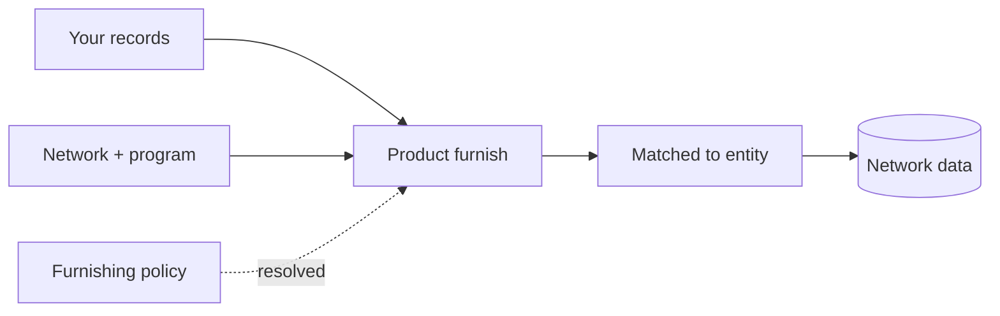

**Furnishing** contributes verified data about an entity into a network. It's the
write half of the network: what one participant furnishes becomes data that
entitled participants can later query.

## How furnishing works

A furnish brings together a **network**, an optional **policy**, and a **consumer**
(or business):



| Concept | Role in the furnish |
|---|---|
| **Product** | *What* you're contributing (e.g. a KYC certificate). Determines the endpoint and schema. |
| **Network** | *Where* the data is contributed. You must be a [furnisher](/concepts/networks#permissions--roles) of it. |
| **Program** | *Which partition* inside the network the data belongs to. |
| **Policy** | *Optional* — the [furnishing policy](/concepts/policies) the network resolves automatically to govern acceptance. |
| **Consumer / Business** | *Who* the data is about — matched from the identifiers in each record. |

### Anatomy of a furnish

You call the product's furnish endpoint with the network scope and one or more
records:

```bash
curl -X POST https://api.solo.one/products/kyc_certificate/furnish \
  -H "Authorization: Bearer $SOLO_TOKEN" \
  -H "Content-Type: application/json" \
  -d '{
    "network_id": "9f1c0c2e-…",
    "program_name": "default",
    "application_date": "2026-05-28",
    "records": [
      {
        "first_name": "Jane",
        "last_name": "Doe",
        "date_of_birth": "1990-01-15",
        "social_security_number": "123-45-6789"
      }
    ]
  }'
```

- `network_id` and `program_name` scope the furnish and let the network resolve
  the applicable [furnishing policy](/concepts/policies).
- `application_date` is used in policy resolution.
- `records` is one or more entities' data to contribute.

### The policy is optional to you

You don't attach a furnishing policy yourself. The network resolves it
automatically from the network, program, and application date. As a furnisher you
simply furnish — the network applies the right rules. This is why the policy is
"optional" from your perspective: it's always applied, but never something you
pass in.

## What furnishing earns you

Furnishing an entity makes you [entitled](/concepts/entitlement) to read that
entity's data on future queries. Contributing to the network is one of the two
ways to earn read access — the other being a prior query. See
[Entitlement](/concepts/entitlement).

## Bulk furnishing

For high volume, you don't have to furnish one record at a time:

- **Multiple records per call** — pass several entries in `records`.
- **Spreadsheet upload** — `POST /products/{product}/furnish_via_upload` accepts
  an Excel file for products that support it.
- **SFTP** — drop files into your designated bucket for automated ingestion. See
  the [SFTP guide](/sftp/overview).

## Furnishing vs. querying

| | Furnishing | Querying |
|---|---|---|
| Direction | Write into the network | Read from the network |
| Needs consent? | No | Yes |
| Needs a policy you pass? | No (resolved automatically) | Yes (`network_policy`) |
| Earns entitlement? | Yes | Yes |

## Related concepts

<CardGroup cols={2}>
  <Card title="Querying" icon="magnifying-glass" href="/concepts/querying">
    The read half of the network.
  </Card>
  <Card title="Furnish an entity" icon="rocket" href="/quickstart/furnish-an-entity">
    A hands-on walkthrough.
  </Card>
</CardGroup>
