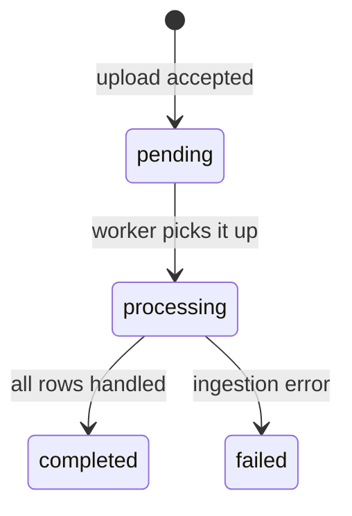

The bulk file upload endpoint lets you furnish an entire file of records with a
single HTTPS request — no SFTP credentials, no file-transfer infrastructure.
You `POST` a CSV file plus a category slug; the network accepts it
synchronously, queues it for ingestion, and processes the rows asynchronously.

It sits between the other two [furnishing channels](/concepts/furnishing/overview):
heavier than a per-record REST furnish, lighter than standing up a recurring
[SFTP](/concepts/sftp/overview) pipeline. Reach for it when you have a batch
job that already speaks HTTPS and produces files on a schedule you control.

## The endpoint

```
POST /v1/file-upload/ingest
```

The request is `multipart/form-data` with two parts:

| Part | Type | Required | Description |
|---|---|---|---|
| `file` | file | Yes | The CSV file to ingest. The first row must be a header row; every subsequent row is one record. |
| `slug` | form field | Yes | The data category for this upload. Determines how the rows are interpreted. |

### Accepted categories

`slug` must be one of the five upload categories — the same set used by the
SFTP channel's directory layout:

| Slug | Contents |
|---|---|
| `kyc_cert_policy` | KYC certificate policy definitions |
| `kyb_cert_policy` | KYB certificate policy definitions |
| `programs` | Network program configuration |
| `kyc_furnish_data` | Consumer onboarding records |
| `kyb_furnish_data` | Business onboarding records |

Any other value is rejected with a `400` validation error. The expected
columns for each category are documented in the
[upload categories reference](/concepts/sftp/schemas).

### Filename rules

The uploaded filename is validated before anything else:

- Exactly **one dot**, separating the name from the extension.
- The name may contain only **letters, digits, underscores, and hyphens**.
- The extension must be one of `csv`, `xls`, or `xlsx` (case-insensitive).

So `kyc-batch_2026-06.csv` is valid; `kyc batch.csv` (space),
`kyc.batch.csv` (two dots), and `batch.txt` (extension) are all rejected with
a `400` whose body lists every rule that was violated.

<Note>
  The request body is parsed as **CSV** — UTF-8 text with a header row (a
  leading byte-order mark is tolerated). Send CSV content. Excel workbooks
  belong on the [SFTP channel](/concepts/sftp/overview), which parses `.xlsx`
  natively.
</Note>

## Example

<Steps>
  <Step title="Prepare the file">
    A CSV with the category's column headers in the first row. For
    `kyc_furnish_data`:

    ```csv
    file,social_security_number,date_of_birth,first_name,last_name,program_name,application_date
    F-1001,123456789,1990-01-15,Jane,Doe,default,2026-05-28
    F-1002,987654321,1985-09-02,John,Smith,default,2026-05-29
    ```
  </Step>
  <Step title="Upload it">
    ```bash
    curl -X POST https://api.solo.one/v1/file-upload/ingest \
      -H "Authorization: Bearer $SOLO_TOKEN" \
      -F "file=@kyc-batch_2026-06.csv" \
      -F "slug=kyc_furnish_data"
    ```
  </Step>
  <Step title="Read the response">
    The endpoint responds as soon as the file is received and queued. The body
    is the created upload record:

    ```json
    {
      "id": "7c3f2a91-4b8e-4d06-a2c5-91e84f0b6d23",
      "entity_id": "2d6b8e44-9f01-4c7a-8a3e-5b1c0d92f761",
      "account_id": "a1f09c35-6e72-4b88-b4d1-3c8e7a52d910",
      "status": "pending",
      "slug": "kyc_furnish_data",
      "source": "inline_upload",
      "original_filename": "kyc-batch_2026-06.csv",
      "file_format": "csv",
      "content_type": "text/csv",
      "declared_byte_size": 2048
    }
    ```

    Keep the `id` — it identifies this upload in the dashboard and in any
    follow-up with support.
  </Step>
</Steps>

## Upload lifecycle

The upload is accepted synchronously and processed asynchronously. The
record's `status` tracks where it is:



| Status | Meaning |
|---|---|
| `pending` | Accepted and queued; not yet picked up. This is what the `POST` response returns. |
| `processing` | A worker is ingesting the rows. |
| `completed` | Ingestion finished. |
| `failed` | Ingestion hit an unrecoverable error. |

<Tip>
  Small files typically move from `pending` to `completed` within seconds. The
  SOLO dashboard's uploads view shows the current status of every file your
  organization has sent.
</Tip>

### Retries and idempotency

Every request to the endpoint creates a **new upload record** with its own
`id` — retrying a failed `POST` is always safe and never half-applies a file.
What happens to the *rows* on a re-send depends on the category:

- **Data rows** upsert on their natural keys (SSN for consumers; tax
  identifier + jurisdiction for businesses). Re-sending a corrected batch
  updates the affected records rather than duplicating them.
- **Configuration rows** (policies, programs) are keyed by name. Re-sending a
  file whose rows collide with existing names produces per-row name-conflict
  errors; the originals are left untouched.

Because each row is processed independently, a partially bad file partially
succeeds: fix the failed rows and re-send just those (or the whole file, given
the upsert behavior above).

## How uploads connect to programs and policies

The `slug` decides what the rows *are*; the rows themselves decide where the
data *goes*:

- **Data uploads** (`kyc_furnish_data`, `kyb_furnish_data`) carry a
  `program_name` and `application_date` on every row. At ingest these drive
  the same program routing and
  [furnishing-policy resolution](/concepts/furnishing/overview#program-routing-and-policy-resolution)
  as a REST furnish — each row is matched to the program's linked policies by
  application date, and rows outside every policy window are filtered rather
  than errored.
- **Configuration uploads** (`kyc_cert_policy`, `kyb_cert_policy`,
  `programs`) don't furnish entity data at all. They create the policies and
  programs that data uploads later resolve against, and are restricted to the
  network's governor. Upload policies before programs that reference them, and
  programs before data that targets them.

## Failure modes

<AccordionGroup>
  <Accordion title="400 — invalid filename">
    One or more filename rules failed. The error body lists each violation
    (extra dots, disallowed characters, bad extension). Rename the file —
    letters, digits, `_`, `-`, one dot, `csv`/`xls`/`xlsx` — and retry.
  </Accordion>
  <Accordion title="400 — unknown upload slug">
    The `slug` form field isn't one of the five allowed categories. The error
    message includes the allowed set. Check for typos and stray whitespace —
    the value is matched against the allowlist exactly (after trimming).
  </Accordion>
  <Accordion title="401 — authentication failed">
    The endpoint requires a valid bearer token; the upload is attributed to
    the authenticated organization. See
    [Authentication](/home/authentication).
  </Accordion>
  <Accordion title="Upload accepted but stuck or failed">
    A `failed` status (or rows that never appear) usually means the file's
    content didn't match the category's expected columns. Compare your header
    row against the [category schema](/concepts/sftp/schemas) — header names
    matter, column order doesn't. The dashboard's uploads view surfaces
    row-level errors.
  </Accordion>
  <Accordion title="File isn't valid UTF-8 CSV">
    The body must decode as UTF-8 (a BOM is fine) and parse as CSV with a
    header row. Exports from spreadsheet tools in other encodings (e.g.
    Latin-1) should be re-saved as UTF-8 CSV.
  </Accordion>
</AccordionGroup>

## When to use a different channel

- **Furnishing one record at a time, in real time** — use the product furnish
  endpoints, e.g. `POST /v1/products/kyc_certificate/furnish`. See the
  [furnishing overview](/concepts/furnishing/overview).
- **Recurring drops from systems that produce files natively** — use
  [SFTP](/concepts/sftp/getting-started). Same categories, same ingestion
  pipeline, but `.xlsx` workbooks and no HTTP client required.

<CardGroup cols={2}>
  <Card title="Upload Categories" icon="list" href="/concepts/sftp/schemas">
    Column-by-column reference for every category.
  </Card>
  <Card title="API Reference" icon="webhook" href="/api-reference/introduction">
    Full request/response schema for the ingest endpoint.
  </Card>
</CardGroup>
