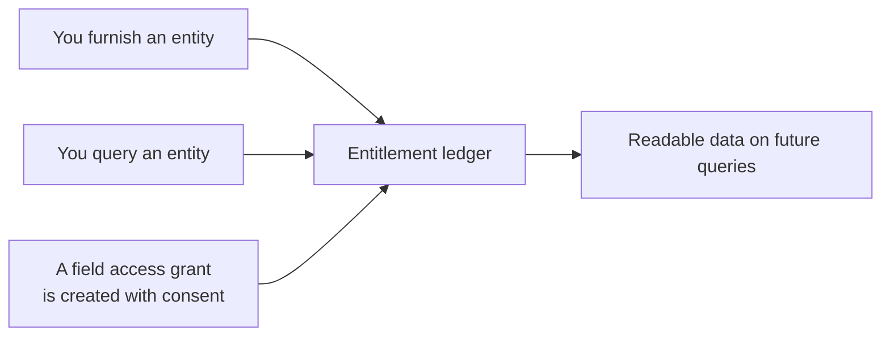
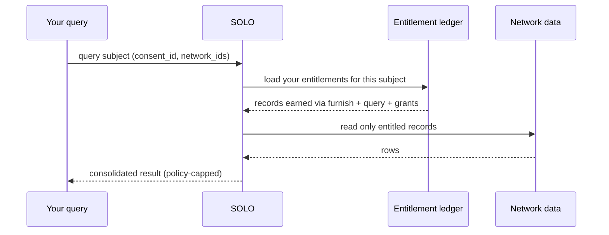

**Entitlement** is what determines *which data* you may read about an entity.
It is the third and most granular layer of SOLO's access model:

| Layer | Grants | Question it answers |
|---|---|---|
| [Network membership](/concepts/governance/network-roles) | **Capability** | *May I call this kind of operation on this network at all?* |
| [Consent](/concepts/identity/consent) | **Permission** | *May I query this particular subject?* |
| **Entitlement** | **Visibility** | *Of the data that exists, which records and fields may* ***I*** *see?* |

Membership lets you ask; consent makes the question lawful; entitlement decides
what the answer contains.

The principle is simple: **you can read what you have contributed or previously
looked at.** You earn entitlement to an entity's data by participating in the
network — not by your role, and not by network membership alone.



## Where entitlement comes from

SOLO maintains, per participant, a ledger of which records that participant has
earned the right to read. Entries land in the ledger three ways.

### Furnishing

When you **furnish** data for an entity, SOLO records an entitlement link for
each record you contributed, tied to your entity and the subject's profile. On
future queries for that subject, those records — and the consolidated results
built from them — are readable by you.

This is the most direct path: furnish what you know about a consumer or
business, and subsequent queries for that subject return data — yours, plus
anything else you're entitled to — consolidated into one result.

### Querying

When you **query** an entity (with valid
[consent](/concepts/identity/consent)), SOLO records entitlement links for the
records that query actually read. Having lawfully queried a subject, you remain
entitled to the data that query covered.

Entitlement therefore accrues over time. Each legitimate interaction —
furnishing or querying — widens the set of data you can see for the entities
you've actually engaged with. At read time, SOLO takes the **union** of your
furnish-derived and query-derived entitlements.

### Field access grants

The third source is explicit: a **field access grant**. A grant ties a
[consent](/concepts/identity/consent) record to a *furnishing entity* and
enumerates the specific field definitions you may read from that furnisher's
data about the subject.

Grants are created automatically when a consent record is created, and they are
returned when you read the consent back:

```json
{
  "consent_id": "a3f0b9c7-…",
  "field_access_grants": [
    {
      "furnishing_entity_id": "7c2d91e4-…",
      "field_definitions": ["consumer.first_name", "consumer.last_name"],
      "effective_from": "2026-06-01",
      "effective_to": null
    }
  ]
}
```

Three properties of grants matter operationally:

- **Effective windows.** A grant carries `effective_from` and `effective_to`
  dates. A grant outside its window contributes nothing.
- **Revocation.** A revoked grant stops contributing immediately, regardless of
  its window.
- **Consent expiry.** Grants ride on the consent they belong to — when the
  consent expires, its grants stop expanding your access.

While a grant is active, reads on the subject can draw on the named furnishing
entity's data for the granted fields — even data you didn't furnish and hadn't
previously read.

## How entitlement is enforced

Entitlement is enforced at **read time, per record**. When you run a query,
SOLO loads your ledger for the subject — the union of everything you've earned
through furnishing and through prior queries — and filters the candidate
records down to the ones the ledger covers. Records you aren't entitled to are
simply not consulted when the consolidated result is built; they don't appear
redacted, they don't appear at all.



Three consequences follow from this design:

- **Entitlement is per subject.** Furnishing one consumer earns you nothing
  about a different consumer, even one furnished by the same institution into
  the same network.
- **Entitlement is per participant.** It attaches to *your* entity. It is not
  shared across a network, not inherited from a parent network, and not
  transferred when roles change hands.
- **Entitlement doesn't expire on its own.** Furnish- and query-derived
  entitlements persist; only field access grants carry effective windows and
  revocation. (Consent, by contrast, can expire — and you always need valid
  consent to ask in the first place.)

## Putting it together

A query result is shaped by three layers, applied in order:

<Steps>
  <Step title="Consent">
    You hold a valid [consent](/concepts/identity/consent) record for the
    subject — you're permitted to ask.
  </Step>
  <Step title="Policy ceiling">
    The network's [querying policy](/concepts/governance/querying-policies)
    defines the maximum set of fields this product can expose in this network —
    for anyone.
  </Step>
  <Step title="Entitlement filter">
    Of those fields, you receive only what you've **earned** — through prior
    furnishing or querying of this entity, or through an active field access
    grant.
  </Step>
</Steps>

The result is the **intersection** of what the policy allows and what you're
entitled to:

| Question | Answered by |
|---|---|
| *In this network, what is this product allowed to expose at all?* | **Querying policy** — what *may* be read |
| *Of that, what have I personally earned the right to read?* | **Entitlement** — what *you* may read |

<Note>
  This is why two participants can run the *same* query on the *same* entity
  and get *different* results: each sees only the data they've earned access
  to. The policy is shared; the entitlement ledger is per-participant.
</Note>

## Worked examples

The JSON below is illustrative sketches, trimmed to the fields that matter for
each example.

### Example A: a furnisher reads back its own furnished fields

Coastal Bank furnishes a KYC record for Jane Doe into its network:

```bash
curl -X POST https://api.solo.one/v1/products/kyc_certificate/furnish \
  -H "Authorization: Bearer $SOLO_TOKEN" \
  -H "Content-Type: application/json" \
  -d '{
    "network_id": "9f1c0c2e-…",
    "program_name": "coastal-cards",
    "application_date": "2026-05-28",
    "records": [{ "first_name": "Jane", "last_name": "Doe", "date_of_birth": "1990-01-15", "social_security_number": "123-45-6789" }]
  }'
```

The furnish creates entitlement links between Coastal and every record it
contributed. When Coastal later queries Jane (with consent), the consolidated
result includes the data Coastal furnished — no extra setup, no grant needed:

```json
{
  "results": [{
    "meta": { "network_id": "9f1c0c2e-…", "policy_id": "5e7d2a14-…" },
    "document_capture": { "…": "populated from Coastal's furnished records" },
    "biometric_capture": { "…": "populated" }
  }]
}
```

### Example B: a querier sees gaps because it lacks entitlement

Summit Bank — a member of the same network, with the querier role and a valid
consent for Jane — runs the *identical* query. Summit has never furnished or
queried Jane, and no grant names Summit. The query is **authorized** (membership
+ consent), and the policy would allow the fields — but Summit's entitlement
ledger has nothing for Jane:

```json
{
  "results": [{
    "meta": { "network_id": "9f1c0c2e-…", "policy_id": "5e7d2a14-…" },
    "document_capture": null,
    "biometric_capture": null
  }]
}
```

Sections come back empty rather than erroring — an entitlement gap looks like
*missing data*, not like a `403`. For certificate products, if the entitled
data can't satisfy the policy's requirements at all, the API returns **`204 No
Content`** instead of issuing a certificate.

### Example C: a field access grant expands the result

Jane now consents to Summit's inquiry, and the consent's field access grant
names Coastal as the furnishing entity whose data Summit may read:

```json
{
  "consent_id": "b8e1d2f0-…",
  "field_access_grants": [{
    "furnishing_entity_id": "<Coastal's entity id>",
    "field_definitions": ["consumer.first_name", "consumer.last_name", "consumer.date_of_birth"],
    "effective_from": "2026-06-01",
    "effective_to": "2027-06-01"
  }]
}
```

Summit re-runs the same query — before and after:

<Tabs>
  <Tab title="Before (no grant)">
    ```json
    {
      "results": [{
        "meta": { "network_id": "9f1c0c2e-…", "policy_id": "5e7d2a14-…" },
        "document_capture": null
      }]
    }
    ```
  </Tab>
  <Tab title="After (grant active)">
    ```json
    {
      "results": [{
        "meta": { "network_id": "9f1c0c2e-…", "policy_id": "5e7d2a14-…" },
        "document_capture": {
          "first_name": "Jane",
          "last_name": "Doe",
          "date_of_birth": "1990-01-15"
        }
      }]
    }
    ```
  </Tab>
</Tabs>

The grant widened Summit's visibility into Coastal's furnished data for the
granted fields, for the grant's effective window. And because Summit has now
lawfully *queried* Jane, those reads are themselves recorded — Summit stays
entitled to what this query covered, even after the grant's window closes.

## What entitlement is not

- **Not a role.** Being a
  [governor](/concepts/governance/networks#permissions--roles) of a network does
  not entitle you to members' data.
- **Not network containment.** Sharing a network with another participant does
  not entitle you to what they furnished.
- **Not retroactive by configuration.** Changing roles, network settings, or
  [governance rules](/concepts/governance/network-governance) does not grant
  access to data you didn't earn through your own furnishing, querying, or an
  explicit grant.
- **Not a bypass of policy.** An entitlement (or grant) to a field the
  [querying policy](/concepts/governance/querying-policies) excludes still
  returns nothing — the policy is the ceiling.

## Troubleshooting: "why is this field missing?"

Work down this checklist when a query succeeds but a field you expected is
absent:

1. **Is the field enabled in the querying policy?** The policy caps every
   reader. Check the policy's field configuration — see
   [Querying Policies](/concepts/governance/querying-policies).
2. **Have you furnished this subject?** If not, you have no furnish-derived
   entitlement to their records.
3. **Have you previously queried this subject?** Query-derived entitlement only
   covers what earlier queries actually returned.
4. **Is there a field access grant for you — and is it alive?** Check the
   consent record's `field_access_grants`: is the field listed in
   `field_definitions`, is today inside `effective_from`/`effective_to`, has the
   grant been revoked, has the consent expired?
5. **Was the data furnished at all?** Entitlement filters existing data; it
   can't surface a field nobody contributed. A
   [coverage check](/api-overview/querying/coverage-check) tells you whether data
   exists before you spend a query.
6. **Are you querying the right network scope?** Data is network-bounded; see
   [Network Governance](/concepts/governance/network-governance) for which
   networks your query can reach.

If all six check out and the field is still missing, contact your SOLO account
manager with the `request_id` from the response.

## Related concepts

<CardGroup cols={2}>
  <Card title="Consent" icon="file-signature" href="/concepts/identity/consent">
    The permission layer that gates whether you may query at all — and carries
    field access grants.
  </Card>
  <Card title="Querying Policies" icon="sliders" href="/concepts/governance/querying-policies">
    The per-network ceiling on what a product can expose.
  </Card>
  <Card title="Querying" icon="magnifying-glass" href="/api-overview/querying/overview">
    How entitlement is applied when a query runs.
  </Card>
  <Card title="Furnishing" icon="arrow-up-from-bracket" href="/api-overview/furnishing/overview">
    Contributing data — the most direct way to earn entitlement.
  </Card>
</CardGroup>
