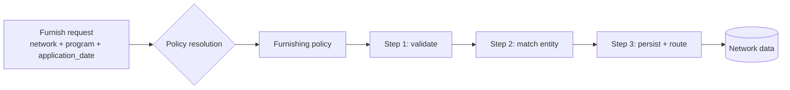
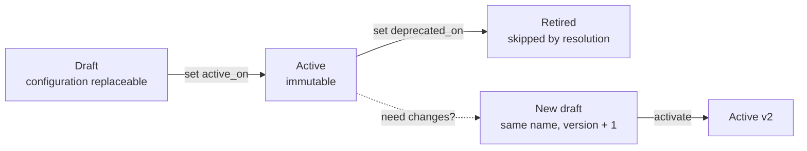

A **furnishing policy** defines how furnished data for a
[product](/concepts/querying/products) is **accepted, validated, and routed**
into a [network](/concepts/governance/networks). Where a
[querying policy](/concepts/governance/querying-policies) governs what leaves
the network on a read, a furnishing policy governs what happens to data on the
way in.

As a furnisher you never pass a furnishing policy yourself. You
[furnish](/concepts/furnishing/overview) with a network, a program, and an
application date — and the network resolves the applicable policy
automatically. Furnishing policies are authored and managed by the network's
[governor](/concepts/governance/network-roles).



## The pipeline model

Under the hood, a furnishing policy is a **pipeline**: an ordered sequence of
processing steps that every furnished record runs through. The pipeline for a
policy is derived from a **product default** — a SOLO-maintained template
pipeline for the product, identified by the policy's `source_default_slug`
(resolved from the product's catalogue path when the policy is created).

A policy customizes the default at three levels, which is exactly the surface
the configuration API exposes:

| Configuration | What it controls |
|---|---|
| `enabled_step_names` | Which of the default pipeline's steps run for this policy. Some steps are mandatory and are always retained, whether or not they are listed. |
| `step_model_defaults` | Per-step default values applied to the models a step processes. |
| `step_field_configuration` | Per-step, per-field settings — the field-level knobs a step exposes. |

Alongside the steps, a policy carries optional **runtime context** (named
inputs resolved when the pipeline runs) and an optional **filter** that rejects
records up front — this is what enforces the application-date windows described
below. You don't author these directly through the REST API; they come from
the product default and from workbook-based authoring.

<Note>
The step names and their available settings are product-specific — they come
from the product's default pipeline. List an existing policy (below) or
consult your SOLO account manager for the step catalogue of the products you
operate.
</Note>

## Policy fields and versioning

| Field | Meaning |
|---|---|
| `name` | Display name. Together with `network_id` and `version`, must be unique. |
| `version` | Integer version, starting at 1. New revisions of the same policy increment it. |
| `schema_version` | Version of the pipeline document schema the policy conforms to. |
| `source_default_slug` | Which product default pipeline this policy is derived from. |
| `active_on` | When the policy takes effect. **Once set, the policy is immutable.** |
| `deprecated_on` | When the policy is retired. Resolution skips deprecated policies. |
| `policy_metadata` | Free-form metadata recorded by the author. |

Versioning follows a simple rule: **activated policies never change**. While a
policy is a draft (`active_on` unset), its configuration can be replaced
freely. Setting `active_on` freezes it; further configuration writes are
rejected:

```json
{
  "detail": "Activated furnishing policies are immutable; create a new version",
  "error_code": "VALIDATION_ERROR"
}
```

To evolve an active policy, create a new version with the same `name` and a
higher `version`, configure it, and activate it. When SOLO needs "the current
policy named X in network Y", it picks the **highest-version, non-deprecated**
one.

A typical revision cycle looks like this:



Because activation freezes a policy, every furnish is reproducible after the
fact: the policy version that processed a record can be read back exactly as
it was when the record came in. Deprecating the old version (rather than
deleting it) keeps that audit trail intact while taking it out of resolution.

## How a policy is resolved at furnish time

Resolution is automatic and happens on every furnish. Three inputs drive it —
all from the furnish request:

```json
{
  "network_id": "9f1c0c2e-…",
  "program_name": "coastal-cards",
  "application_date": "2026-05-28",
  "records": [ { "…": "…" } ]
}
```

<Steps>
  <Step title="Resolve the program">
    `program_name` is matched to a [program network](/concepts/governance/networks#standard-networks-and-programs)
    under `network_id`. An unknown program is an error — programs are
    introduced ahead of time by the governor.
  </Step>
  <Step title="Find the program's assigned policies">
    Policies are **assigned** to programs, each assignment carrying an
    effective-date window (`effective_from`, optional `effective_to`). Every
    non-deprecated policy assigned to the program for the product is a
    candidate.
  </Step>
  <Step title="Apply the date windows">
    The record's `application_date` is checked against the policy and
    assignment windows. Records that fall outside every window are
    **filtered** — not failed — so a furnish can legitimately result in
    "accepted under policy v2, filtered by policy v1".
  </Step>
</Steps>

This is why furnishers never reference policies directly: the
(network, program, application date) triple is sufficient, and the governor
controls what it maps to.

## Managing policies via the API

Five routes cover the lifecycle. Listing and reading are available to any
member of the network; creating and configuring are governor operations.

### List policies in a network

```bash
curl -G https://api.solo.one/v1/networks/policies/furnishing \
  -H "Authorization: Bearer $SOLO_TOKEN" \
  --data-urlencode "network_id=9f1c0c2e-…" \
  --data-urlencode "limit=20" \
  --data-urlencode "offset=0"
```

`limit` accepts 1–100 (default 20); `offset` ≥ 0 (default 0). Returns an array:

```json
[
  {
    "id": "4f6e2a90-…",
    "entity_id": "7c2d91e4-…",
    "network_id": "9f1c0c2e-…",
    "name": "Coastal KYC intake",
    "version": 2,
    "schema_version": "1",
    "source_default_slug": "kyc_certificate",
    "active_on": "2026-01-01T00:00:00Z",
    "deprecated_on": null,
    "policy_metadata": {},
    "created_at": "2025-12-12T18:03:11Z",
    "updated_at": "2025-12-30T09:41:00Z"
  }
]
```

### Read a single policy

```bash
curl -G https://api.solo.one/v1/networks/policies/furnishing/4f6e2a90-… \
  -H "Authorization: Bearer $SOLO_TOKEN" \
  --data-urlencode "network_id=9f1c0c2e-…"
```

The `network_id` query parameter scopes the lookup; a policy that exists but
isn't visible in that network returns `404` `RESOURCE_NOT_FOUND`.

### Create a policy

`POST /v1/networks/policies/furnishing` creates an empty policy **shell** for a
(product, network) pair. The server derives `source_default_slug` from the
product; pipeline steps are added afterwards via configuration (or workbook
ingestion).

```bash
curl -X POST https://api.solo.one/v1/networks/policies/furnishing \
  -H "Authorization: Bearer $SOLO_TOKEN" \
  -H "Content-Type: application/json" \
  -d '{
    "product_id": "1b9a4c33-…",
    "network_id": "9f1c0c2e-…",
    "name": "Coastal KYC intake"
  }'
```

```json
{
  "id": "4f6e2a90-…",
  "entity_id": "7c2d91e4-…",
  "network_id": "9f1c0c2e-…",
  "name": "Coastal KYC intake",
  "source_default_slug": "kyc_certificate"
}
```

### Configure a policy

`PUT /v1/networks/policies/furnishing/{policy_id}/configuration` replaces the
draft policy's pipeline configuration. `enabled_step_names` is required; the
rest is optional.

```bash
curl -X PUT https://api.solo.one/v1/networks/policies/furnishing/4f6e2a90-…/configuration \
  -H "Authorization: Bearer $SOLO_TOKEN" \
  -H "Content-Type: application/json" \
  -d '{
    "enabled_step_names": ["validate_identity", "match_entity", "persist_records"],
    "step_model_defaults": { "validate_identity": { "strictness": "high" } },
    "step_field_configuration": { "match_entity": { "match_on": ["ssn", "dob"] } },
    "active_on": "2026-07-01T00:00:00Z"
  }'
```

```json
{
  "id": "4f6e2a90-…",
  "name": "Coastal KYC intake",
  "step_count": 3
}
```

Like querying-policy configuration, this is a **replace**, not a patch — submit
the full intended step selection each time. Step names shown above are
illustrative; use the names from your product's default pipeline. Including
`active_on` activates the policy, after which it is immutable; `deprecated_on`
retires it from resolution.

## Bulk authoring and ingestion

Furnishing policies sit at the heart of SOLO's bulk-ingestion paths:

- **Policy workbooks.** Governors can author policies in bulk by uploading a
  policy workbook (per product) through
  [file upload](/concepts/furnishing/file-upload) or
  [SFTP](/concepts/sftp/overview). Each row clones the product default and
  applies the row's step selections — equivalent to the create + configure flow
  above. Workbook ingestion is rejected when the caller doesn't govern the
  target network.
- **Program workbooks** assign policies (by name, latest non-deprecated
  version) to the programs they define.
- **Data files.** Records arriving in bulk — see
  [CSV format](/concepts/sftp/csv-format) and [schemas](/concepts/sftp/schemas) —
  go through exactly the same resolution and pipeline as API furnishes. There is
  one set of rules, regardless of transport.

## Relationship to other concepts

| Concept | Relationship |
|---|---|
| [Querying policies](/concepts/governance/querying-policies) | The read-side counterpart. A product in a network typically has both: a furnishing policy shaping intake, a querying policy capping reads. |
| [Entitlement](/concepts/governance/entitlement) | Furnishing under a policy is what *earns* a furnisher read access to the subjects it contributed. |
| [Networks & programs](/concepts/governance/networks) | Policies belong to a network; assignments bind them to programs. |
| [Furnishing](/concepts/furnishing/overview) | The furnisher-facing view: furnish with network + program + application date, and the policy applies itself. |

## Related concepts

<CardGroup cols={2}>
  <Card title="Furnishing" icon="arrow-up-from-bracket" href="/concepts/furnishing/overview">
    The furnisher's view of the same flow.
  </Card>
  <Card title="Querying Policies" icon="magnifying-glass" href="/concepts/governance/querying-policies">
    Field-level read rules — the other half of policy governance.
  </Card>
  <Card title="SFTP Ingestion" icon="server" href="/concepts/sftp/overview">
    Bulk delivery of programs, policies, and data.
  </Card>
  <Card title="File Upload" icon="file-import" href="/concepts/furnishing/file-upload">
    Inline workbook and CSV ingestion.
  </Card>
</CardGroup>
