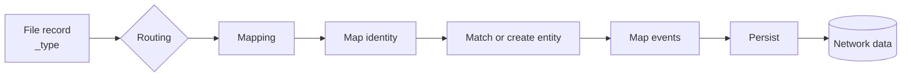
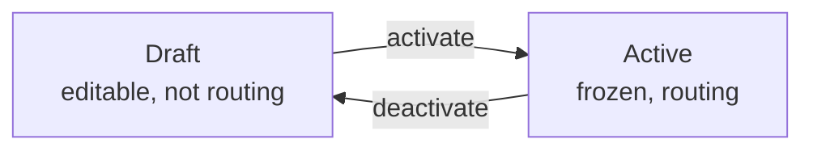

import DashboardGovernanceFurnishingPolicies from '/snippets/dashboard/governance-furnishing-policies.mdx';

A **furnishing policy** — called a **mapping** in the dashboard — defines how
one type of furnished record is **mapped, validated, and persisted** into a
[network](/concepts/governance/networks). Where a
[querying policy](/concepts/governance/querying-policies) governs what leaves
the network on a read, a furnishing policy governs what happens to data on the
way in.

As a furnisher you never name a mapping yourself. Every record in a
[JSONL file](/api-overview/furnishing/file-upload) carries a `_type`, and the
network sends the record to each active mapping that claims that type.
Mappings are authored and managed by the network's
[governor](/concepts/governance/network-roles).


```mermaid
flowchart LR
    F[File record<br/>_type] --> R{Routing}
    R --> P[Mapping]
    P --> S1[Map identity]
    S1 --> S2[Match or create entity]
    S2 --> S3[Map events]
    S3 --> S4[Persist]
    S4 --> Store[(Network data)]
```

## Feeds and record types

Mappings are created from a **feed** — a stream of records arriving from one
source, such as an SFTP drop path. The feed declares a sample record:

- The sample's `_type` is the **record type** the feed's mappings claim.
- The sample's fields are the **source schema** the mapping reads from.

A record whose `_type` no active mapping claims is counted as unmatched and
skipped; it never fails the file.

## The pipeline model

Under the hood, a mapping is a **pipeline**: an ordered sequence of steps that
every claimed record runs through. Each mapping is derived from a
SOLO-maintained default pipeline, identified by its `source_default_slug`:

| `source_default_slug` | Records it ingests |
|---|---|
| `jsonl_mapping_default` | Consumer records — identity plus KYC verification events |
| `jsonl_mapping_business_default` | Business records — identity plus KYB verification events |

The governor authors two mapping documents, in the mapping's **Mapping** tab in
the dashboard:

| Document | What it controls |
|---|---|
| **Identity mapping** | Which record fields identify the consumer or business (for example SSN and date of birth), used to match an existing profile or create one. |
| **Tree mapping** | Which verification events the record becomes, and which record fields fill each event's fields. |

The dashboard verifies both documents against the source schema; a mapping
can't be activated until they verify.

## Lifecycle

A mapping moves between two states:


```mermaid
flowchart LR
    D[Draft<br/>editable, not routing] -->|activate| A[Active<br/>frozen, routing]
    A -->|deactivate| D
```

- **Draft** — the configuration can be edited freely. Drafts never receive
  records.
- **Active** — the configuration is frozen and the mapping receives every
  record that carries its record type. To change it, deactivate it, edit, and
  activate again.

| Field | Meaning |
|---|---|
| `name` | Display name. Together with `network_id` and `version`, must be unique. |
| `version` | Integer version, starting at 1. |
| `schema_version` | Version of the pipeline document schema the mapping conforms to. |
| `source_default_slug` | Which default pipeline the mapping is derived from. |
| `is_active` | Whether the mapping currently receives records. |
| `mapping_metadata` | Routing and authoring metadata, including the claimed record type. |

## Reading policies via the API

Any member of a network can list and read its furnishing policies. Authoring
happens in the dashboard.

### List policies in a network

```bash
curl -G https://api.solo.one/v1/networks/policies/furnishing \
  -H "Authorization: Bearer $SOLO_TOKEN" \
  --data-urlencode "network_id=9f1c0c2e-…" \
  --data-urlencode "limit=20" \
  --data-urlencode "offset=0"
```

`limit` accepts 1–100 (default 20); `offset` ≥ 0 (default 0). Returns an array:

```json
[
  {
    "id": "4f6e2a90-…",
    "entity_id": "7c2d91e4-…",
    "network_id": "9f1c0c2e-…",
    "name": "Coastal KYC intake",
    "version": 1,
    "schema_version": "1",
    "source_default_slug": "jsonl_mapping_default",
    "is_active": true,
    "mapping_metadata": {
      "selector": { "path": "/_type", "op": "eq", "value": "kyc_certificate" }
    },
    "created_at": "2025-12-12T18:03:11Z",
    "updated_at": "2025-12-30T09:41:00Z"
  }
]
```

### Read a single policy

```bash
curl -G https://api.solo.one/v1/networks/policies/furnishing/4f6e2a90-… \
  -H "Authorization: Bearer $SOLO_TOKEN" \
  --data-urlencode "network_id=9f1c0c2e-…"
```

The `network_id` query parameter scopes the lookup; a policy that exists but
isn't visible in that network returns `404` `RESOURCE_NOT_FOUND`.

## Relationship to other concepts

| Concept | Relationship |
|---|---|
| [Querying policies](/concepts/governance/querying-policies) | The read-side counterpart. A network typically has both: mappings shaping intake, querying policies capping reads. |
| [Entitlement](/concepts/governance/entitlement) | Furnishing is what *earns* a furnisher read access to the subjects it contributed. |
| [Networks](/concepts/governance/networks) | Mappings belong to a network and only receive records furnished into it. |
| [Furnishing](/api-overview/furnishing/overview) | The furnisher-facing view: send records with a `_type`, and the mapping applies itself. |

<DashboardGovernanceFurnishingPolicies />

## Related concepts

<CardGroup cols={2}>
  <Card title="Furnishing" icon="arrow-up-from-bracket" href="/api-overview/furnishing/overview">
    The furnisher's view of the same flow.
  </Card>
  <Card title="Querying Policies" icon="magnifying-glass" href="/concepts/governance/querying-policies">
    Field-level read rules — the other half of policy governance.
  </Card>
  <Card title="JSONL Files" icon="file-arrow-up" href="/api-overview/furnishing/file-upload">
    The file format mappings read.
  </Card>
  <Card title="SFTP Ingestion" icon="server" href="/api-overview/sftp/overview">
    Scheduled delivery of JSONL files.
  </Card>
</CardGroup>
