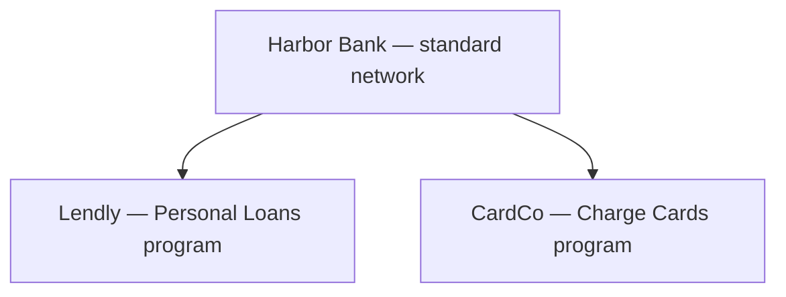
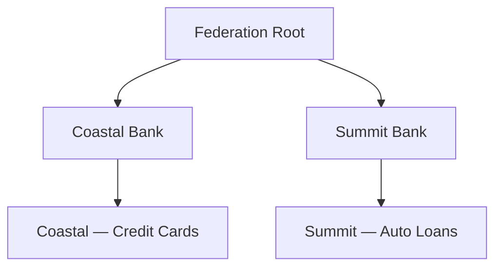

**Network governance** is the set of rules that decide whether a querier in one network is allowed to read data scoped to another. Governance sits on top of the network tree (see [Networks](/concepts/governance/networks)) and the role model (see [Network Roles](/concepts/governance/network-roles)).

The model has two parts: a small set of paths that are **always allowed**, and a small set of **opt-in rules** that a network's governor can turn on to permit further query paths.

## How these rules work: authorization vs data visibility

Every governance check answers two questions, in order:

1. **Authorization** — *can* this querier make this query at all? The answer is yes or no. If no, the API returns an authorization error and no data comes back.
2. **Data visibility** — *given* the query is allowed, *what records* come back? The answer is a set, which may be large, small, or empty.

Most of the rules described on this page are about authorization — they decide whether a query is allowed. One rule, `auto_include_descendants`, is purely about visibility — it widens what comes back once a query is already allowed, but it can never authorize a query on its own. The decision matrix at the end of this page is the authorization view; visibility behavior is called out inline with each rule.

This distinction matters in practice. An authorization failure surfaces as a clear error; a visibility filter that excludes all rows surfaces as a successful query with zero results.

## Querier role is the gate

Throughout this page, "querier on N" means an entity that participates on network N with the **querier** role. Running a product query is a querier's job — see [Network Roles](/concepts/governance/network-roles) — so the governance checks below are described from the querier's point of view: can a querier on one network read data scoped to another?

Two clarifications keep this honest:

- **Governance authorizes scope, not content.** Passing a governance check means the query is allowed to *target* the network. What actually comes back is still filtered by [entitlement](/concepts/governance/entitlement) and capped by the [querying policy](/concepts/governance/querying-policies) — a governor or furnisher who is also a member does not, by virtue of those seats, see other members' data.
- **The authorization check consults network membership.** SOLO's scope check asks which networks the calling entity participates in. Holding the querier role is the operational prerequisite for product queries; treat the role model as the contract even where the scope check is membership-based today.

## Always-allowed query paths

These hold for every network. They are built into the model — there is no setting that controls them, and they cannot be turned off.

| If the querying entity is… | …it can query data scoped to… |
|---|---|
| A querier on network **N** | network **N** |
| A querier on any **ancestor** of network **N** | network **N** ("query your descendants") |

The intuition: a bank that holds the querier role on a network can always see data in any program it runs underneath that network, even if it doesn't separately hold the querier role on each program. A querier in a specific program can always see that program's data.

Everything else — querying upward, querying across to a cousin — is **denied by default** unless one of the rules below is explicitly enabled.

## Opt-in rules

Each opt-in rule is a setting **stored on a specific network** — the network whose data is being opened up. When SOLO evaluates a governance check, it reads the rule from that network and nowhere else. Turning a rule on at one network has no effect on any other network, including its ancestors, descendants, or cousins.

A network's governor can enable any of the following three rules.

### `ancestor_query` — let descendants query upward

**Type:** Authorization rule.
**Stored on:** the ancestor network (the one being opened up).

When this rule is enabled on a network, a querier on any **descendant** of that network is authorized to query data scoped to the network itself.

**Example:** Coastal Bank turns on `ancestor_query` on its own network. A querier in *Coastal — Credit Cards* (a program underneath Coastal Bank) can now query *Coastal Bank* data directly.

### `cousin` — let cousins query each other

**Type:** Authorization rule.
**Stored on:** the **closest** common ancestor of the two cousin networks.

When this rule is enabled, a querier on any network underneath that ancestor is authorized to query data scoped to any other network underneath the same ancestor — even though neither is in the other's direct line.

**Example:** A Federation root turns on `cousin` on its own network. A querier in *Coastal Bank* can now query *Summit Bank* data, because both networks share the Federation as their closest common ancestor.

<Warning>
The rule must sit on the *closest* common ancestor. Setting `cousin` on a higher ancestor — say, an ancestor of the Federation — has no effect on cousins underneath the Federation. Each cousin pair consults exactly one network's setting: their closest shared ancestor.
</Warning>

### `auto_include_descendants` — expand a query to cover descendants

**Type:** Visibility rule.
**Stored on:** the parent network whose descendants should be pulled into queries against it.

This rule does not change *who* can query — it changes *what comes back*. When enabled, a query scoped to a network automatically pulls in data from all of its descendants as well.

**Example:** Coastal Bank turns on `auto_include_descendants` on its own network. A querier authorized to read *Coastal Bank* data automatically gets data from *Coastal — Credit Cards*, *Coastal — Mortgages*, and any other program underneath Coastal in the same query — without having to query each program separately.

<Note>
`auto_include_descendants` is a *scope expander*, not an *authorization*. The querier still needs to be separately authorized to query the parent network — via a direct querier role, a querier role on an ancestor, or one of the authorization rules above.
</Note>

<Note>
**No descendant membership required.** When `auto_include_descendants` is enabled, the descendants' data flows into the parent query automatically — the querier does not need to hold a querier role on each descendant network. This is what makes it a visibility rule rather than an authorization rule: a senior network's governor can declare "anyone authorized to query me can also see what flows through my children," without each querier separately enrolling on every descendant.
</Note>

## Putting it together: the authorization matrix

Here's the complete authorization matrix for whether a querier can read data scoped to a given network. The matrix covers **only the authorization question** — the yes/no decision about whether the query is allowed at all. Once a query is authorized, `auto_include_descendants` may additionally widen what comes back; that visibility behavior is separate from the matrix below.

The third column shows **which network holds the setting** SOLO consults — that is, which governor controls the answer.

| Querier's network in relation to the target | Authorized? | Where the controlling rule lives |
|---|---|---|
| Querier on the target | Always | — (built in, no rule) |
| Querier on an ancestor of the target | Always | — (built in, no rule) |
| Querier on a descendant of the target | Only if `ancestor_query` is enabled | On the target network |
| Querier on a cousin of the target | Only if `cousin` is enabled | On the closest common ancestor |
| Querier with no relationship to the target | Never | — (no rule grants this) |

## Worked example 1: a sponsor bank and its fintech programs

Harbor Bank sponsors two fintechs. Each fintech's offering runs as a **program** under Harbor's network:

Harbor holds querier (and governor) on its own network. Lendly and CardCo each hold furnisher and querier on **their own program only**.

**What works out of the box:**

- **Lendly queries Lendly.** A querier on a network can always query it. Same for CardCo.
- **Harbor queries either program.** Harbor is an ancestor of both, and "query your descendants" is built in. Harbor does not need a seat on each program.

**What is denied by default:**

- **Lendly queries Harbor.** That's querying *upward*. It stays denied until Harbor's governor enables `ancestor_query` **on Harbor's own network** — Lendly's governor cannot flip that switch.
- **Lendly queries CardCo.** They are cousins (siblings, sharing Harbor as parent). Denied until Harbor — their closest common ancestor — enables `cousin`. Most sponsors deliberately leave this off: it's exactly the wall that keeps one fintech's customers invisible to another.

**One convenience Harbor will likely want:** enabling `auto_include_descendants` on Harbor's network means a single Harbor-scoped query also returns data flowing through *Lendly* and *CardCo*, without Harbor issuing one query per program. This is a visibility rule — it widens Harbor's already-authorized query; it grants nothing to the fintechs.

Even with every rule enabled, [entitlement](/concepts/governance/entitlement) still applies: Harbor sees consolidated results only for the subjects it has furnished or lawfully queried, and the fields are capped by the [querying policy](/concepts/governance/querying-policies). Governance opens the door to the room; it doesn't hand over the filing cabinet.

## Worked example 2: two cousin banks in a federation

Coastal Bank and Summit Bank both participate in a data-sharing federation. Each bank runs programs of its own:

**Initially**, with no opt-in rules anywhere:

- Coastal can query Coastal and *Coastal — Credit Cards* (descendant). It **cannot** query Summit or *Summit — Auto Loans*: Summit is a cousin, and Summit's program is also a cousin (common ancestor: the Federation).
- The Federation root's querier (if the federation operator holds one) can query every network in the tree — everything is its descendant.

**The federation decides cousins should be able to screen against each other's data.** The fix is one switch in one place: the Federation governor enables `cousin` **on the Federation root** — the closest common ancestor of Coastal and Summit. Now a Coastal querier can scope queries to Summit (and vice versa), and likewise across the cousin programs.

**Common mistakes in this topology:**

- **Setting `cousin` on Coastal or Summit does nothing.** The rule is consulted on the closest common ancestor, not on either leaf. Neither bank can open (or, alone, close) the cousin path — that authority sits with the Federation governor, which is the point: cross-bank sharing is a federation-level agreement.
- **Expecting `cousin` on a network *above* the Federation to work.** If the Federation itself had a parent, enabling `cousin` there would not authorize Coastal ↔ Summit; only their *closest* shared ancestor's setting is consulted.
- **Expecting Coastal to see Summit's programs in one query.** Authorizing Coastal → Summit doesn't bundle in *Summit — Auto Loans*. For that, Summit's governor would additionally enable `auto_include_descendants` on Summit's network, widening any authorized Summit-scoped query to include its programs.

And as always: authorization gets Coastal's query in the door at Summit; what rows come back is governed by Coastal's [entitlement](/concepts/governance/entitlement), and which fields appear is governed by the applicable [querying policy](/concepts/governance/querying-policies). A bank that has never furnished or queried a given consumer gets an empty (but successful) result, not a treasure trove.

## Who can change governance rules

Only the **governor entity** of a network can change that network's governance rules. A governor cannot change rules on a parent, child, or cousin network without separately being its governor.

The governor entity is the single entity recorded as the owner of the network when it was created. See the footnote on [Network Roles](/concepts/governance/network-roles) for the distinction between the governor entity and entities holding the governor role.

There is no field-level permissioning *inside* the governance settings today — a governor who can edit the network at all can change any of the three rules.

## Rules can only be enabled from above

Because each rule is stored on the network being opened up — not on the network that wants access — only the governor of the *opening* network can turn it on. This has an important consequence:

> A child network's governor cannot grant themselves visibility into the parent by enabling `ancestor_query`. That switch lives on the *parent*, and only the parent's governor can flip it.

The same property holds for `cousin`: the rule sits on the closest common ancestor of the two cousin networks, so opening up cross-cousin visibility requires a governor at that ancestor — not a governor at either of the two leaf networks.

This is a deliberate property of the model. Access flows from the top down, configured by the senior network's governor; a junior network cannot elevate itself into a senior network's data.

<Note>
If the *same* entity happens to be the governor of both networks (for example, a bank that governs both itself and a program underneath it), that entity can edit both networks' settings — but that is the same entity already holding authority over both networks, not a child governor reaching up.
</Note>

## Current limitations

<Warning>
The governance rule format is provisional and **subject to change**. The three keys above (`ancestor_query`, `cousin`, `auto_include_descendants`) represent the rules SOLO supports today. We expect the surface area to grow — for example, with per-entity overrides, role-specific rules, or expiry windows — and the key names may change as the schema matures. This page will be updated when the schema is finalized.
</Warning>

Other things to be aware of in the current model:

- **Rules are network-wide.** A rule applies uniformly to every querier it could affect. There is no way today to enable `cousin` for some cousin networks but not others.
- **No validation on unknown keys.** Anything else written into the governance settings is silently ignored. Be careful about typos — `ancestor_querys` (with an s) will read as "off" rather than producing an error.

If you need behaviour that the current rules don't express, contact your SOLO account manager — we are actively gathering input on the next iteration of the governance model.

## What's next

- See [Networks](/concepts/governance/networks) for the underlying tree structure.
- See [Network Roles](/concepts/governance/network-roles) for who can participate in a network and how.
