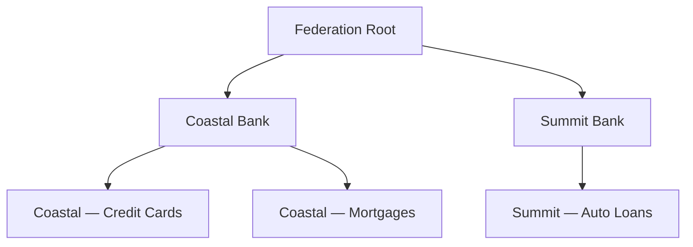
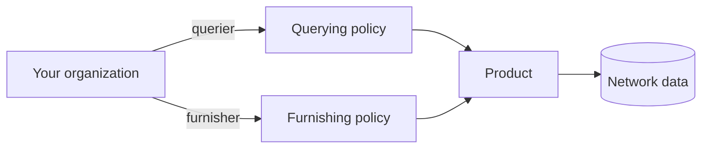

import DashboardGovernanceNetworks from '/snippets/dashboard/governance-networks.mdx';

A **network** is the trust boundary of p SOLO platform. It groups the
participants who have agreed to share data, the **products** they can use, the
**policies** that govern those products, and the data that gets furnished.

Everything you do — furnishing, querying, applying policies — happens *within* a
network you belong to.

## What a network represents

A network is a logical grouping that ties together three things:

- **Participants** — the entities that operate within the network (see
  [Network Roles](/concepts/governance/network-roles))
- **Data** — every furnished record carries a network reference, so the network
  acts as a boundary on what data can be read
- **Rules** — the [querying policies](/concepts/governance/querying-policies) and
  [furnishing policies](/concepts/governance/furnishing-policies) that govern each
  product, and how data is allowed to move between this network and neighbouring
  networks (see [Network Governance](/concepts/governance/network-governance))

A network has a name, an optional description, and a single **governor entity**
that owns it.

## The network tree

Networks are not flat. Every network has at most one **parent network**, so
networks form a **tree** where smaller, more specific networks live underneath
broader ones. A network with no parent sits at the top of the tree and is called
a **root** network. Networks below it are its **descendants**; the networks
directly under it are its **children**.



In the diagram above, *Coastal Bank* is a child of *Federation Root* and a parent
of *Coastal — Credit Cards*. *Summit Bank* is a **sibling** of *Coastal Bank*
because they share a parent. *Coastal — Credit Cards* and *Summit — Auto Loans*
are **cousins** because they share a common ancestor (the Federation) without
being in each other's direct line.

This lets a single arrangement — such as a sponsor bank and the fintechs it
sponsors — share a parent network while keeping each participant's data within
its own boundary.

## Relations between networks

These are the words SOLO uses to describe how any two networks relate. They show
up throughout the permissioning model, so it's worth getting them straight up
front.

| Term | Meaning |
|---|---|
| **Parent** | The network directly above this one. |
| **Child** | A network whose parent is this one. |
| **Ancestor** | Any network reachable by walking upward — parent, grandparent, and so on, up to the root. |
| **Descendant** | Any network reachable by walking downward — child, grandchild, and so on. |
| **Sibling** | Two networks that share the same parent. |
| **Cousin** | Two networks that share a common ancestor but are not in each other's ancestor or descendant line. |
| **Root** | A network with no parent. |

<Note>
SOLO treats siblings as a special case of cousins for permissioning purposes.
Anywhere governance rules talk about cousins, siblings are included.
</Note>

## Standard networks and subnetworks

Networks come in two kinds, distinguished by their `network_type`:

- **Standard networks** are the default. A bank, a consortium, or a fintech
  operating in SOLO each runs as a standard network. These are typically created
  through the SOLO Dashboard.
- **Subnetworks** are child networks of a standard network that represent a
  specific product or initiative the operator runs — a credit card line, a
  mortgage line, a partnership offering. Subnetworks are usually created
  automatically by SOLO's data-furnishing workflows when a subnetwork definition
  first arrives through bulk ingestion (see [Network lifecycle](#network-lifecycle)).

Subnetworks always sit beneath a standard parent network. They behave like any
other network in the tree — they can have their own participants, their own
data, and their own governance settings — but their lifecycle is typically tied
to the upstream data flow that created them.

When you furnish, you name the **subnetwork** so the network can route the data
and resolve the right [furnishing policy](/concepts/governance/furnishing-policies):

```json
{
  "network_id": "9f1c0c2e-…",
  "subnetwork_name": "acme-lending",
  "application_date": "2026-05-28",
  "records": [ /* … */ ]
}
```

<Tip>
If you operate a single product line, you probably only need a standard network.
Subnetworks become useful when you want to keep data, participants, or rules
isolated between distinct product offerings under the same operator.
</Tip>

## Network lifecycle

Standard networks and subnetworks come into existence in different ways, and
it's worth understanding both paths.

### Standard networks: created through the dashboard

Standard networks are created deliberately, through the **SOLO Dashboard**, as
part of onboarding your organization or standing up a new arrangement (a
consortium, a sponsorship structure, a new line of business). A new network
needs:

- a **name** and an optional **description**,
- an optional **parent network**, which places it in the tree, and
- a **governor entity** — the entity that owns and administers it.

The entity that creates the network is recorded as its governor entity, and
SOLO automatically provisions that entity's **governor membership** on the new
network at the same time. This means a freshly created network is never
ownerless: from the first moment, exactly one entity can administer it, add
participants, and configure its [governance
rules](/concepts/governance/network-governance).

After creation, the governor typically:

1. adds participants with the [roles](/concepts/governance/network-roles) they need
   (furnisher, querier, or additional governors),
2. creates and configures the [querying
   policies](/concepts/governance/querying-policies) and [furnishing
   policies](/concepts/governance/furnishing-policies) for the products the network
   will use, and
3. optionally enables governance rules to open query paths to related networks.

### Subnetworks: created by furnishing workflows

Subnetworks usually aren't created by hand. They are created
**automatically by SOLO's data-furnishing workflows** when a subnetwork
definition first arrives through bulk ingestion — typically a subnetworks
workbook delivered over [SFTP](/api-overview/sftp/overview) or via [file
upload](/api-overview/furnishing/file-upload). The workflow creates a child network
with `network_type: subnetwork` underneath the standard network the definition
was furnished into, named after the subnetwork, and links it to the [furnishing
policies](/concepts/governance/furnishing-policies) named in the definition.

Two properties of this flow are worth knowing:

- **Only the network's governor can introduce subnetworks.** Subnetwork
  definitions furnished by an entity that doesn't govern the target network are
  rejected.
- **Subnetwork names are unique within their parent network.** A definition that
  re-uses an existing subnetwork name in the same network fails for that row
  rather than silently overwriting the existing subnetwork.

From then on, every furnish that names that `subnetwork_name` is routed into the
subnetwork, and the subnetwork's furnishing-policy assignments determine how
the data is accepted (see [Furnishing
Policies](/concepts/governance/furnishing-policies)). Furnishing data with a
`subnetwork_name` that doesn't exist in the target network is an error — the
subnetwork definition has to arrive first.

Because a subnetwork's lifecycle is tied to the upstream data flow that created
it, you generally don't delete or restructure subnetworks directly — you stop
furnishing into them, or deprecate the policies assigned to them.

## Permissions & roles

Your organization joins a network with one or more **roles**. Roles describe what
you can do, not what data you can see.

| Role | What it allows |
|---|---|
| **Governor** | Administer the network — configure policies and directory metadata. A governor seat is **not** a backdoor to other members' data. |
| **Furnisher** | Contribute data into the network for a product. |
| **Querier** | Run product queries scoped to the network. |

A single organization can hold several roles at once (for example, both furnisher
and querier). See [Network Roles](/concepts/governance/network-roles) for the full model.

<Warning>
  Governing a network does **not** automatically let you read what other members
  have furnished. Reading another participant's data still requires
  [consent](/concepts/identity/consent) and [entitlement](/concepts/governance/entitlement). Roles
  grant *capabilities*, not *visibility*.
</Warning>

## Policy usage within a network

A network ties products to participants through policies:

- A **[querying policy](/concepts/governance/querying-policies)** binds a product
  to the network and defines, field by field, what queriers may read.
- A **[furnishing policy](/concepts/governance/furnishing-policies)** defines how
  furnished data for a product is accepted, validated, and routed.

When you query, you scope the request to one or more network ids and a querying
policy, so the network knows both *where* to read and *which* reading rules
apply. When you furnish, the network resolves the applicable furnishing policy
from the network, subnetwork, and application date automatically — you never
pass a furnishing policy id yourself.



## Joining a network

Membership and roles are arranged with your SOLO account manager. Once you're a
member, you can:

- **search** for entities within the network,
- **furnish** products into it (as a furnisher), and
- **query** products from it (as a querier, with [consent](/concepts/identity/consent)).

See the [quickstart](/home/quickstart/join-a-network) for a walkthrough.

<DashboardGovernanceNetworks />

## Related concepts

<CardGroup cols={2}>
  <Card title="Network Roles" icon="users" href="/concepts/governance/network-roles">
    How entities participate in a network.
  </Card>
  <Card title="Network Governance" icon="scale-balanced" href="/concepts/governance/network-governance">
    How data can flow between related networks.
  </Card>
  <Card title="Querying Policies" icon="magnifying-glass" href="/concepts/governance/querying-policies">
    The field-level read rules a network applies to each product.
  </Card>
  <Card title="Furnishing Policies" icon="arrow-up-from-bracket" href="/concepts/governance/furnishing-policies">
    How furnished data is accepted, validated, and routed.
  </Card>
  <Card title="Entitlement" icon="key" href="/concepts/governance/entitlement">
    Why network membership alone doesn't grant data access.
  </Card>
</CardGroup>
