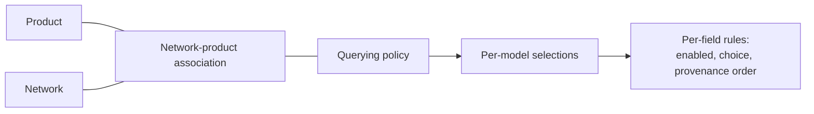

import DashboardGovernanceQueryingPolicies from '/snippets/dashboard/governance-querying-policies.mdx';

A **querying policy** is the set of read rules a
[network](/concepts/governance/networks) applies to a
[product](/api-overview/querying/products). It binds the product to the network and
defines, field by field, what queriers may read — and from which sources.

The same product can be configured differently in different networks. Querying
policies are how a network tailors a shared product schema to its own
agreements: expose these fields, suppress those, prefer this furnisher's data
over that one's.



<Note>
Querying policies govern *reads*. The write-side counterpart — how furnished
data is accepted, validated, and routed — is the
[furnishing policy](/concepts/governance/furnishing-policies).
</Note>

## Why querying policies exist

Products define a standard schema — every KYC certificate has the same shape
everywhere. But networks have different agreements about what may be shared: a
closed consortium might expose document-verification outcomes that a broader
federation suppresses; one network might accept any furnisher's biometric data
while another only trusts a named source. Querying policies let a network:

- expose only the fields appropriate for its participants,
- rank which **sources** (provenances) a field may be answered from, in order
  of preference,
- keep read rules explicit, versionable, and auditable, and
- evolve those rules without changing the underlying product or any
  integration code — queriers keep calling the same endpoint.

Because the policy hangs off the product-network association rather than the
product itself, the same product can run under strict rules in one network and
permissive rules in a sibling network, simultaneously.

## What a policy contains

A querying policy hangs off the **network-product association** (the pairing of
one product with one network) and carries:

| Attribute | Meaning |
|---|---|
| `name` | Display name, unique per product-network pairing for its author. |
| `is_default` | Whether this is the policy used when a query doesn't name one explicitly. |
| `enforced` | Whether the policy's selections are applied to reads. |
| `status` | Lifecycle state: `draft`, `published`, or `archived`. |

Beneath the policy sit **per-model selections** — one for each product model
the policy has an opinion about — and beneath those, **per-field rules**:

- **`is_enabled`** — whether the field may be read at all under this policy.
- **`boolean_choice`** — for fields with a constrained choice, which value the
  policy requires.
- **`selected_provenance_option_ids`** — an *ordered* list of acceptable data
  sources for the field. Order matters: the first option is tried first, and
  later options are lower priority.

A model with no selections is explicitly excluded from provenance
customization; a model the policy doesn't mention at all falls back to the
product's defaults.

## Lifecycle

Policies carry a `status` of `draft`, `published`, or `archived`. New revisions
are authored as drafts (the dashboard's version wizard works this way); saving
a configuration through the API leaves the policy in `published` status, at
which point it governs live queries. Archived policies are retained for audit
but no longer selectable.

<Warning>
Saving a configuration **replaces** the policy's per-model and per-field
selections with the submitted set — it is not a patch. Always submit the
complete intended configuration.
</Warning>

## Creating a policy

Creating a querying policy is a two-step flow: create the policy shell, then
configure its field selections.

### Step 1 — create

`POST /v1/networks/policies/querying` with the product, the network, and a
name. The server resolves the product-network association — creating it if it
doesn't exist yet — and returns the new policy.

```bash
curl -X POST https://api.solo.one/v1/networks/policies/querying \
  -H "Authorization: Bearer $SOLO_TOKEN" \
  -H "Content-Type: application/json" \
  -d '{
    "product_id": "1b9a4c33-…",
    "network_id": "9f1c0c2e-…",
    "name": "Coastal KYC — standard read"
  }'
```

```json
{
  "id": "5e7d2a14-…",
  "network_product_id": "c4f8e6d1-…",
  "entity_id": "7c2d91e4-…",
  "name": "Coastal KYC — standard read",
  "is_default": false
}
```

### Step 2 — configure fields

`PUT /v1/networks/policies/querying/{policy_id}/configuration` with the full
set of per-model, per-field selections:

```bash
curl -X PUT https://api.solo.one/v1/networks/policies/querying/5e7d2a14-…/configuration \
  -H "Authorization: Bearer $SOLO_TOKEN" \
  -H "Content-Type: application/json" \
  -d '{
    "model_selections": [
      {
        "product_model_definition_id": "0a1b2c3d-…",
        "field_selections": [
          {
            "product_field_definition_id": "e5f6a7b8-…",
            "is_enabled": true,
            "boolean_choice": null,
            "selected_provenance_option_ids": ["11aa22bb-…", "33cc44dd-…"]
          },
          {
            "product_field_definition_id": "f9e8d7c6-…",
            "is_enabled": false,
            "boolean_choice": null,
            "selected_provenance_option_ids": []
          }
        ]
      }
    ]
  }'
```

```json
{
  "id": "5e7d2a14-…",
  "name": "Coastal KYC — standard read",
  "status": "published"
}
```

You can optionally include a `"name"` in the configuration body to rename the
policy in the same call.

<Note>
Policy authoring is a [governor](/concepts/governance/network-roles)
responsibility. Queriers consume policies; they don't write them.
</Note>

## How a query selects a policy

When you [query a product](/api-overview/querying/overview), the request body
carries the network scope and, optionally, the policy:

```bash
curl -X POST https://api.solo.one/v1/products/kyc_certificate/query \
  -H "Authorization: Bearer $SOLO_TOKEN" \
  -H "Content-Type: application/json" \
  -d '{
    "consent_id": "a3f0b9c7-…",
    "network_ids": ["9f1c0c2e-…"],
    "policy_id": "5e7d2a14-…"
  }'
```

- **`network_ids`** (required) — one or more networks to read across.
- **`policy_id`** (optional) — the querying policy to apply. The single policy
  is applied across every network in `network_ids`. **If omitted, each
  network's default policy** (`is_default: true`) **is used.**

The response echoes the resolution per network, so you always know which
rules shaped each result:

```json
{
  "results": [
    { "meta": { "network_id": "9f1c0c2e-…", "policy_id": "5e7d2a14-…" }, "…": "…" }
  ]
}
```

### Resolution and audit stamping

Every query event is stamped with the querying policy that governed it, so
results are auditable after the fact. Resolution works through a fixed
fallback chain:

1. the policy id **explicitly stamped** on the query event;
2. failing that, a policy id found in the **request or response payload**;
3. failing that, the policy referenced by **certificates linked** to the query;
4. failing that, the **network's default policy** — matched first against the
   querying entity's own policies, then against the network governor's.

As a caller you only ever interact with step 1 (pass `policy_id`) or step 4
(omit it and rely on the default). Steps 2–3 are how SOLO back-fills the audit
trail for historical events.

<Tip>
If your network has exactly one published policy per product and it's marked
default, queriers can omit `policy_id` entirely and always get the right
rules. Reserve explicit `policy_id` for networks that run multiple read
profiles side by side.
</Tip>

### Querying across multiple networks

`network_ids` accepts more than one network, and the listed `policy_id` (or
each network's default) is applied across all of them. Two things to keep in
mind when fanning a query out:

- **Authorization is per network.** Each network in the list is checked
  independently against your memberships and the
  [governance rules](/concepts/governance/network-governance). A network you
  can't scope to fails the query with an authorization error rather than being
  silently dropped.
- **The policy still only caps; it doesn't fetch.** Adding networks widens
  where SOLO looks, but [entitlement](/concepts/governance/entitlement) still
  filters every record to what you've earned, regardless of how many networks
  the query touches.

## The policy is a ceiling, not a grant

A querying policy defines what the product **may** expose in the network — for
anyone. What *you* get back is further narrowed by
[entitlement](/concepts/governance/entitlement):

| Question | Answered by |
|---|---|
| *What may be read from this network, at most?* | **Querying policy** |
| *What may* ***I*** *read, given my history with this subject?* | **Entitlement** |

A query returns the **intersection**: fields the policy permits **and** records
you are entitled to. Enabling a field in the policy does not push data to
anyone who hasn't earned it; disabling a field hides it even from participants
who furnished it through this product in this network.

## Errors you may encounter

All errors use the standard envelope (see [Errors](/home/errors)):

```json
{ "detail": "…", "error_code": "…" }
```

| Situation | Status / code |
|---|---|
| Configuration references an unknown `policy_id` | `404` `RESOURCE_NOT_FOUND` |
| Creating a duplicate policy (same product-network pairing, same name) | `409` `RESOURCE_CONFLICT` |
| Malformed selection payload (missing field, bad UUID) | `422` (short shape, no `error_code`) |
| Querying a network you can't scope to | `403` `PERMISSION_DENIED` |

<DashboardGovernanceQueryingPolicies />
## Related concepts

<CardGroup cols={2}>
  <Card title="Furnishing Policies" icon="arrow-up-from-bracket" href="/concepts/governance/furnishing-policies">
    The write-side counterpart: how data gets into the network.
  </Card>
  <Card title="Entitlement" icon="key" href="/concepts/governance/entitlement">
    The per-participant layer that narrows what a policy exposes.
  </Card>
  <Card title="Querying" icon="magnifying-glass" href="/api-overview/querying/overview">
    How policies plug into a product query.
  </Card>
  <Card title="Networks" icon="sitemap" href="/concepts/governance/networks">
    The boundary policies are scoped to.
  </Card>
</CardGroup>
