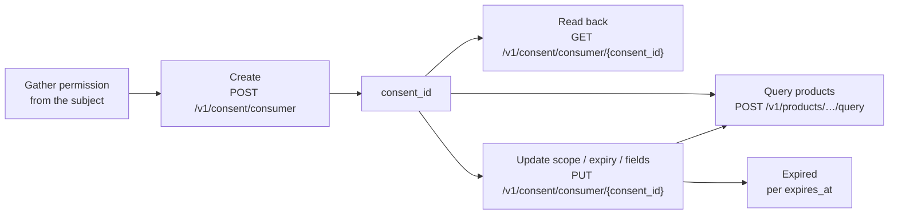

**Consent** is your record that you have permission to query a specific consumer
or business. Querying personal and business data carries a legal obligation to
have a permissible purpose — consent is how the network captures, and can later
prove, that you had one.

A consent record is two things at once:

- **A key.** You create it once per subject per network, receive a
  `consent_id`, and pass that `consent_id` on every product query for the
  subject. Without a valid `consent_id`, consumer and business queries are
  rejected.
- **An audit artifact.** The record permanently captures *who* consented, *as
  identified by which details*, *when*, and *with what scope* — so that every
  query you ever ran can be traced back to a lawful basis.

That dual nature drives the API's design, including its strictest rule: the
identity on a consent record can never be edited.

## Lifecycle

A consumer consent record moves through a simple lifecycle, with one endpoint
for each transition you control:



You gather the subject's permission **outside** the API — in your onboarding
flow, your terms, your call script — then record it. From there the
`consent_id` is reusable on queries until the consent expires, and you can read
it back or adjust its mutable attributes at any time.

## What a consent record contains

All three consumer endpoints return the same shape:

| Field | Type | Notes |
|---|---|---|
| `consent_id` | string | The token you pass on product queries |
| `field_access_grants` | array | Grants attached to this consent — see [below](#field-access-grants) |
| `created_at` | string | When the record was created |
| `scope` | string | Free-form scope label; empty until you set one |
| `expires_at` | string \| null | When the consent lapses; `null` means no expiry recorded |
| `consented_fields` | string \| null | Free-form description of the fields the subject consented to |
| `events` | string | Event history for the record |

## Creating consent

`POST /v1/consent/consumer` records consent server-to-server. You supply the
subject's identity and attest that you gathered their permission beforehand.

| Body field | Required | Notes |
|---|---|---|
| `network_id` | Yes | The [network](/concepts/governance/networks) this consent belongs to |
| `did_gather_consent_from_consumer_prior` | Yes | Must be `true` — see warning below |
| `consumer_consent_identity` | Yes | `first_name`, `last_name`, `date_of_birth`, `personal_email`, `phone_number`, `social_security_number` |
| `consumer_id` | No | Link to an existing consumer profile found via [entity search](/concepts/identity/entities) |

```bash
curl -X POST https://api.solo.one/v1/consent/consumer \
  -H "Authorization: Bearer $SOLO_TOKEN" \
  -H "Content-Type: application/json" \
  -d '{
    "network_id": "9f1c0c2e-…",
    "did_gather_consent_from_consumer_prior": true,
    "consumer_consent_identity": {
      "first_name": "Jane",
      "last_name": "Doe",
      "date_of_birth": "1990-01-15",
      "personal_email": "jane@example.com",
      "phone_number": "+14155550100",
      "social_security_number": "123-45-6789"
    }
  }'
```

A `200 OK` returns the full record, including a default field access grant
created alongside the consent:

```json
{
  "consent_id": "a3f0b9c7-…",
  "field_access_grants": [
    {
      "furnishing_entity_id": null,
      "field_definitions": [
        "fraud_verification_event.confirmed_fraud_indicator",
        "fraud_verification_event.fraud_attribute_label",
        "fraud_verification_event.fraud_event_date"
      ],
      "effective_from": "2026-06-09",
      "effective_to": null
    }
  ],
  "created_at": "2026-06-09T22:14:03.512000+00:00",
  "events": "",
  "scope": "",
  "expires_at": null,
  "consented_fields": null
}
```

<Warning>
  `did_gather_consent_from_consumer_prior: true` is an **attestation** that you
  obtained the consumer's permission before making this call. Sending `false`
  is rejected with `400 VALIDATION_ERROR` — the network will not create a
  consent record that asserts no consent was gathered.
</Warning>

### Linking identity: `consumer_id` vs. the identity payload

How the consent attaches to an [entity](/concepts/identity/entities) depends on whether
you pass `consumer_id`:

- **With `consumer_id`** — the consent links to that existing consumer profile.
  Use this after a successful
  `GET /v1/entities/consumer/search`, so the subject's history stays
  consolidated on one profile.
- **Without `consumer_id`** — a new consumer profile is created from the
  identity payload and linked to the consent.

Either way, the identity details you submitted are stamped onto the consent
record itself as the audit trail of who consented.

## Using a consent ID

Pass the `consent_id` in the body of a product query. The network resolves the
consent to the subject's identity and applies the appropriate field access — you
don't repeat the subject's identifying details on every call.

```bash
curl -X POST https://api.solo.one/v1/products/kyc_certificate/query \
  -H "Authorization: Bearer $SOLO_TOKEN" \
  -H "Content-Type: application/json" \
  -d '{
    "consent_id": "a3f0b9c7-…",
    "network_policy": [
      { "network_id": "9f1c0c2e-…", "policy_id": "5e7d2a14-…" }
    ]
  }'
```

See [Querying your first product](/home/quickstart/query-a-product) for the
end-to-end walkthrough.

## Reading consent back

`GET /v1/consent/consumer/{consent_id}` returns the current state of a consent
record. The `network_id` query parameter is **required** — the lookup is scoped
to that network:

```bash
curl -G https://api.solo.one/v1/consent/consumer/a3f0b9c7-… \
  -H "Authorization: Bearer $SOLO_TOKEN" \
  --data-urlencode "network_id=9f1c0c2e-…"
```

The response is the same shape as create. If the `consent_id` doesn't exist
**or** exists in a different network, you get a `404`:

```json
{
  "detail": "Consent record not found",
  "error_code": "RESOURCE_NOT_FOUND"
}
```

<Note>
  A consent record belongs to one network. The same subject needs a separate
  consent in each network you query them through, and a `consent_id` minted in
  one network is invisible — `404`, not `403` — from another.
</Note>

## Updating consent

`PUT /v1/consent/consumer/{consent_id}` changes the **mutable attributes** of a
consent record: its scope, its expiry, and the description of consented fields.

| Body field | Required | Notes |
|---|---|---|
| `network_id` | Yes | Network scope — same rule as read |
| `scope` | At least one of these three | New scope label |
| `expires_at` | | New expiry timestamp (ISO 8601) |
| `consented_fields` | | New consented-fields description |

```bash
curl -X PUT https://api.solo.one/v1/consent/consumer/a3f0b9c7-… \
  -H "Authorization: Bearer $SOLO_TOKEN" \
  -H "Content-Type: application/json" \
  -d '{
    "network_id": "9f1c0c2e-…",
    "scope": "kyc",
    "expires_at": "2027-06-09T00:00:00Z"
  }'
```

The response is the **post-update** record:

```json
{
  "consent_id": "a3f0b9c7-…",
  "field_access_grants": [
    {
      "furnishing_entity_id": null,
      "field_definitions": [
        "fraud_verification_event.confirmed_fraud_indicator",
        "fraud_verification_event.fraud_attribute_label",
        "fraud_verification_event.fraud_event_date"
      ],
      "effective_from": "2026-06-09",
      "effective_to": null
    }
  ],
  "created_at": "2026-06-09T22:14:03.512000+00:00",
  "events": "",
  "scope": "kyc",
  "expires_at": "2027-06-09T00:00:00+00:00",
  "consented_fields": null
}
```

Omitting all three updatable fields is a `400`:

```json
{
  "detail": "At least one of scope, expires_at, or consented_fields must be provided",
  "error_code": "VALIDATION_ERROR"
}
```

### Identity is immutable — by design

The update endpoint deliberately accepts **only** `scope`, `expires_at`, and
`consented_fields`. The subject's name, date of birth, email, phone, and SSN on
a consent record can never change.

<Warning>
  A consent record is an audit artifact of **who consented and when**. If the
  identity could be edited after the fact, the record could no longer prove
  which person's permission authorized your past queries. To consent with
  different identity data — a legal name change, a corrected SSN — create a
  **new** consent record and use its `consent_id` going forward.
</Warning>

## Field access grants

Each consent record carries one or more **field access grants** in
`field_access_grants`. A grant is a concrete statement of *which fields, from
which furnisher, over which time window* this consent unlocks.

| Grant field | Type | Meaning |
|---|---|---|
| `furnishing_entity_id` | string \| null | The furnisher whose contributed data this grant covers. `null` means the grant is not pinned to a specific furnisher. |
| `field_definitions` | array of strings | The fields covered, as `source_table.source_column` strings — e.g. `fraud_verification_event.fraud_event_date`. |
| `effective_from` | string \| null | Date the grant becomes active. |
| `effective_to` | string \| null | Date the grant lapses; `null` means open-ended. |

When you create a consent, a default grant is attached automatically with
`effective_from` set to the creation date and a baseline set of field
definitions. Grants outside their effective window no longer apply.

<Note>
  Grants describe what this **consent** covers. They sit alongside — not in
  place of — [entitlement](/concepts/governance/entitlement): a field appears in a query
  result only if the consent covers asking, the network's
  [querying policy](/concepts/governance/querying-policies) exposes the field, and you have
  earned entitlement to it.
</Note>

## Failure modes

| Status | `error_code` | When | Example `detail` |
|---|---|---|---|
| `400` | `VALIDATION_ERROR` | `did_gather_consent_from_consumer_prior` is `false` on create | `Consent cannot be created without prior consumer consent gathering` |
| `400` | `VALIDATION_ERROR` | Update with none of `scope`, `expires_at`, `consented_fields` | `At least one of scope, expires_at, or consented_fields must be provided` |
| `404` | `RESOURCE_NOT_FOUND` | Unknown `consent_id`, or a consent from a different network | `Consent record not found` |
| `422` | — | Request shape errors: missing required fields, wrong types | `body -> consumer_consent_identity -> date_of_birth: value is not a valid datetime` |

Error responses follow the standard envelope — see
[Errors](/home/errors):

```json
{
  "detail": "Consent cannot be created without prior consumer consent gathering",
  "error_code": "VALIDATION_ERROR"
}
```

## Business consent

`POST /v1/consent/business` records consent to query a business, mirroring the
consumer flow:

```bash
curl -X POST https://api.solo.one/v1/consent/business \
  -H "Authorization: Bearer $SOLO_TOKEN" \
  -H "Content-Type: application/json" \
  -d '{
    "did_gather_consent_from_business_prior": true,
    "business_consent_identity": {
      "business_legal_name": "Acme Corp",
      "business_jurisdiction_of_formation": "DE",
      "business_registration_identifier_from_jurisdiction_of_formation": 1234567,
      "business_tax_identifier_type": "EIN",
      "business_tax_identifier_value": "12-3456789"
    },
    "identity": {
      "business_legal_name": "Acme Corp",
      "business_jurisdiction_of_formation": "DE",
      "business_registration_identifier_from_jurisdiction_of_formation": 1234567
    }
  }'
```

The response contains `consent_id`, `consented_fields`, `created_at`, `events`,
and `scope`. Use the `consent_id` on business product queries exactly as you
would a consumer one.

<Note>
  Business consent currently supports **create only**. There is no
  `GET` or `PUT /v1/consent/business/{consent_id}` today — read-back and
  updates are consumer-only. If you need to change a business consent's
  attributes, create a new record and switch to its `consent_id`.
</Note>

## How consent relates to entitlement

Consent and [entitlement](/concepts/governance/entitlement) are complementary gates, and a
query needs both:

| | Consent | Entitlement |
|---|---|---|
| Question it answers | *May I query this subject at all?* | *Which fields come back?* |
| How you get it | Record permission, get a `consent_id` | Earn it by furnishing or querying the subject |
| Scope | One subject, in one network | Per field, per entity |
| Carried on the query | `consent_id` in the request body | Applied automatically by the network |
| Can it change? | Mutable scope/expiry; immutable identity | Accrues with each furnish and query |

Consent without entitlement yields a permitted query with little or no data;
entitlement without consent yields no query at all.

## Common questions

<AccordionGroup>
  <Accordion title="Should I reuse a consent_id across queries?">
    Yes. Create one consent per subject per network and reuse its `consent_id`
    on every product query for that subject while the consent is valid. You do
    not need a new consent record for each query.
  </Accordion>
  <Accordion title="Why does GET return 404 for a consent I just created?">
    The read is scoped by the `network_id` query parameter. The most common
    cause is passing a different `network_id` than the one the consent was
    created under — the record exists, but it isn't visible from that network,
    so the API reports `404 RESOURCE_NOT_FOUND` rather than confirming it
    exists elsewhere.
  </Accordion>
  <Accordion title="When do I update versus create a new consent?">
    **Update** when the subject's permission itself changed shape — a broader
    or narrower scope, a new expiry date, a revised description of consented
    fields. **Create new** when anything about the subject's identity needs to
    differ: identity fields are immutable, so a corrected SSN, a legal name
    change, or a new email all require a fresh record and a switch to its
    `consent_id`.
  </Accordion>
  <Accordion title="Does furnishing require consent?">
    The `consent_id` requirement documented here applies to **queries** —
    reading data back out of the network. See
    [Furnishing](/concepts/furnishing/overview) for the obligations that apply when
    contributing data.
  </Accordion>
</AccordionGroup>

## Related concepts

<CardGroup cols={2}>
  <Card title="Entities" icon="users" href="/concepts/identity/entities">
    The subjects consent records are about, and how to find them.
  </Card>
  <Card title="Querying" icon="magnifying-glass" href="/concepts/querying/overview">
    How consent plugs into a product query.
  </Card>
  <Card title="Entitlement" icon="key" href="/concepts/governance/entitlement">
    What determines which fields a query returns.
  </Card>
  <Card title="Errors" icon="triangle-exclamation" href="/home/errors">
    The error envelope and status codes used across the API.
  </Card>
</CardGroup>
