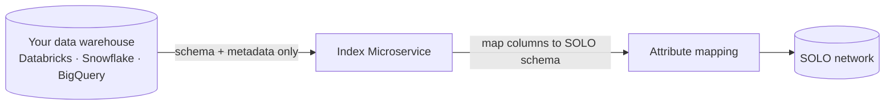

<Info>
  **Available to registered partners only.** The Index Microservice is an
  emerging capability provisioned per partner. Contact your SOLO representative
  to discuss access before designing an integration.
</Info>

## What it is

The **Index Microservice** lets you take part in a network using the data you
*already have*, without sending that data to SOLO. Instead of exporting records,
you connect your data warehouse and SOLO looks only at its **structure** — the
table and column layout — to learn what kinds of data you hold. Your actual
records stay in your warehouse; SOLO never reads the values during indexing.

In short: you point SOLO at your warehouse, SOLO learns the *shape* of your data
and lines it up with the [SOLO schema](/products/overview), and from then on your
existing data can serve the network in place.

## Why it's useful

- **No data export.** The raw records never leave your systems, which sidesteps
  the cost and the data-handling concerns of copying sensitive data to a vendor.
- **No row values exposed.** Indexing reads schema and metadata only — names,
  types, and shape — not the contents of any row.
- **Use what you already maintain.** If your verification data already lives in
  Databricks, Snowflake, BigQuery, or similar, you can contribute from it
  directly rather than building and running an export pipeline.

## When and why you'd use it

| Situation | Why the Index Microservice fits |
|---|---|
| **You hold large existing datasets** | Connect once and map, instead of continuously pushing records to SOLO. |
| **Exporting data is a non-starter** | Your records stay put; only schema and metadata are indexed. |
| **You already run a warehouse** | Reuse the data and access controls you maintain today. |
| **You want low-maintenance participation** | After the one-time connect and mapping, there's no per-record or per-file submission to operate. |

If instead you want to push data as events or scheduled files, use the direct
[furnishing channels](/concepts/furnishing/overview) (REST, bulk upload, or
SFTP). The Index Microservice is the option for *leaving the data where it is*.

## How it works

The Index Microservice is effectively a fourth way to get data into a network,
alongside the three direct [furnishing](/concepts/furnishing/overview) channels.
The difference is *where the data lives*:

| | REST / Bulk / SFTP furnish | Index Microservice |
|---|---|---|
| **Data movement** | You push records to SOLO | Data stays in your warehouse |
| **What SOLO sees** | The records you send | Schema and metadata only |
| **Setup** | Per-record or per-file submission | One-time connect + attribute mapping |
| **Best for** | Event-driven or batch contribution | Large existing datasets you don't want to export |

<Steps>
  <Step title="Connect your warehouse">
    Authorize a connection scoped to schema and metadata reads only — no
    row-value access.
  </Step>
  <Step title="Scan the schema">
    SOLO indexes the structure of the connected source: tables, columns, and
    types.
  </Step>
  <Step title="Map to the SOLO schema">
    Map your indexed columns onto SOLO models and fields, so the network knows
    how your data corresponds to its shared vocabulary.
  </Step>
  <Step title="Participate">
    Once mapped, your indexed source can back the network's products under the
    same [governance](/concepts/governance/networks) — consent, policy, and
    entitlement — as any other contribution.
  </Step>
</Steps>

### Governance still applies

Indexing a source does not bypass the network's controls. Everything served
through an indexed source remains gated by the subject's
[consent](/concepts/identity/consent), the network's
[querying policy](/concepts/governance/querying-policies), and each reader's
[entitlement](/concepts/governance/entitlement) — exactly as with directly
furnished data.

## Related concepts

<CardGroup cols={2}>
  <Card title="Furnishing API" icon="arrow-up-from-bracket" href="/concepts/furnishing/overview">
    The direct channels for contributing data.
  </Card>
  <Card title="Products" icon="box" href="/products/overview">
    The SOLO schema your columns map onto.
  </Card>
  <Card title="Querying policies" icon="scale-balanced" href="/concepts/governance/querying-policies">
    The rules that govern what an indexed source can serve.
  </Card>
  <Card title="Entitlement" icon="key" href="/concepts/governance/entitlement">
    Who can read what, regardless of where the data lives.
  </Card>
</CardGroup>
