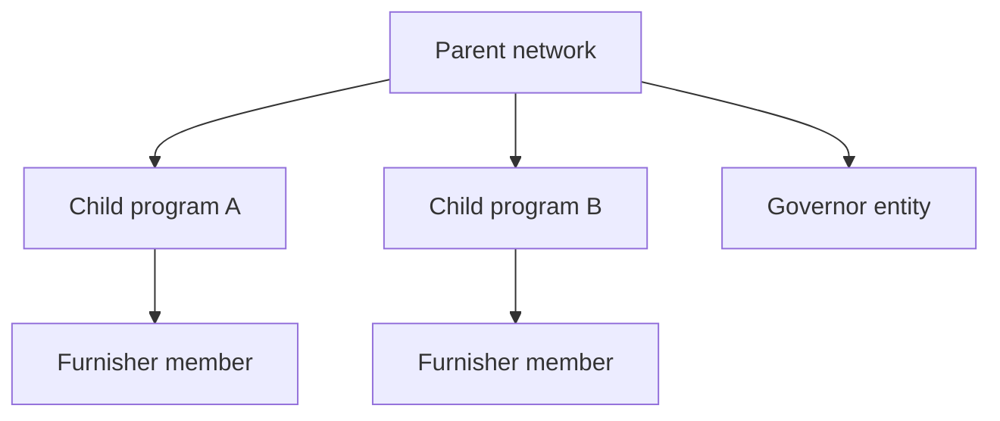

The SOLO Network is organized as a **hierarchy of networks**. Each participant (stakeholder) interacts with the network through **membership** and **consent** — not by inheriting visibility from a "governor" role alone.

## Networks and programs

A **network** is the top-level container for policies, products, and furnished data. Networks can have **child programs** — sub-partitions used in production to separate furnishers inside a shared network (for example, a sponsor bank and its fintech programs).

When data is furnished into a **child program**, rows are stamped with:

- `network_id` — the program where the data was written
- `network_ids` — typically `[program_id, parent_network_id]` so parent-scoped queries can match on network containment

Programs are intentionally shallow: the platform currently supports at most **two tiers** (parent network → program child).

## Membership

Each stakeholder holds one or more **network memberships** that define what they can do in a network:

| Permission | Meaning |
|---|---|
| **Governor** | Administrative seat on a network (policy configuration, directory metadata). Does **not** automatically grant read access to other members' furnished data. |
| **Furnisher** | Can submit data into the network or program. |
| **Querier** | Can scope queries to the network and run products against entitled profiles. |

Opening a query scope with `networks(ids: [...])` checks membership (and governance rules) for each requested network id. Unauthorized ids raise an error before any data is returned.

## Governance rules

Networks can carry governance metadata that controls **cross-network scoping** — which network ids are included when you open a query against a given network:

| Rule | Effect |
|---|---|
| `ancestor_query` | A member of an ancestor network can scope queries to a descendant network. |
| `cousin` | Members of sibling networks under a common ancestor can scope to each other's networks when the common ancestor allows it. |
| `auto_include_descendants` | Scoping to a network automatically expands the row filter to include descendant program ids. |

Governance controls **where you can point a query**, not **whose data you can read**. Entity scope and consent still apply.

## Governor vs. member data

**Governing a network is not a data-access backdoor.**

- A parent-network governor **cannot** read rows furnished by a subnetwork member solely because the row's `network_ids` includes the parent id.
- Entity scope (`entity_id` on each row) is the second line of defense after network containment.
- A governor **can** read member data when an explicit **consent grant** widens their accessible entity set, or when they run their own queries/furnish operations that create entitlement links.

Changing `governor_entity_id` on a network does **not** retroactively grant access to previously furnished rows.

## Consent and cross-participant access

When participant A wants to query data furnished by participant B, a **consent grant** links:

- The **accessor** (A) — the querying stakeholder
- The **furnishing entity** (B) — who originally supplied the data
- A **consumer or business profile** — the subject of the grant

Active consents expand the accessor's **accessible entity ids** for the request. Without consent, sharing a network membership is **not** equivalent to sharing data.

<Tip>
  See [Audit & visibility](/concepts/audit-and-visibility) for how query/furnish telemetry and dashboard navigation respect these same boundaries.
</Tip>

## Related concepts

<CardGroup cols={2}>
  <Card title="Data model" icon="diagram-project" href="/concepts/data-model">
    Core entities: consumers, businesses, stakeholders, and data flow.
  </Card>
  <Card title="Audit & visibility" icon="clock-rotate-left" href="/concepts/audit-and-visibility">
    Query/furnish history, entitlements, and AuditedNode routes.
  </Card>
</CardGroup>
