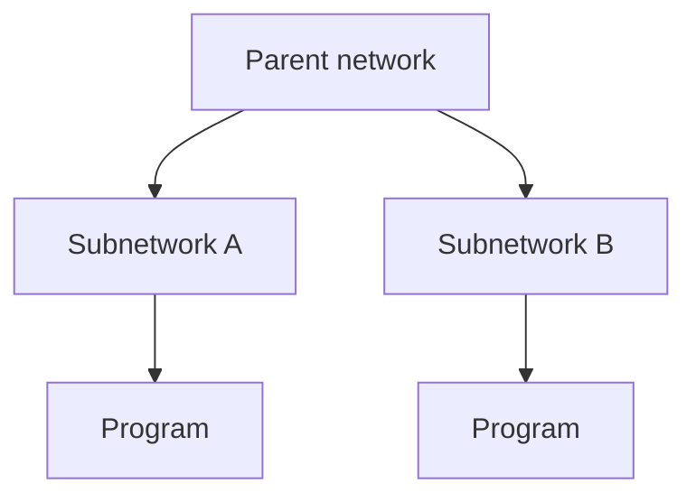
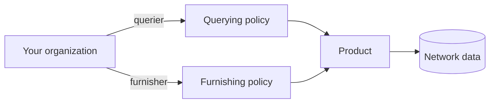

A **network** is the trust boundary of the SOLO platform. It groups the
participants who have agreed to share data, the **products** they can use, the
**policies** that govern those products, and the data that gets furnished.

Everything you do — furnishing, querying, applying policies — happens *within* a
network you belong to.

## Permissions & roles

Your organization joins a network with one or more **roles**. Roles describe what
you can do, not what data you can see.

| Role | What it allows |
|---|---|
| **Governor** | Administer the network — configure policies and directory metadata. A governor seat is **not** a backdoor to other members' data. |
| **Furnisher** | Contribute data into the network for a product. |
| **Querier** | Run product queries scoped to the network. |

A single organization can hold several roles at once (for example, both furnisher
and querier).

<Warning>
  Governing a network does **not** automatically let you read what other members
  have furnished. Reading another participant's data still requires
  [consent](/concepts/consent) and [entitlement](/concepts/entitlement). Roles
  grant *capabilities*, not *visibility*.
</Warning>

## Subnetworks

Networks form a shallow hierarchy. A parent network can contain **subnetworks** —
narrower trust boundaries nested beneath it. This lets a large network organize
participants into groups while keeping shared rules at the top.



Subnetworks let a single arrangement — such as a sponsor bank and the fintechs it
sponsors — share a parent network while keeping each participant's data within its
own boundary.

## Programs

A **program** is a partition *inside* a network used to separate furnishers that
share the same network. A common example is a sponsor bank running several fintech
programs: each program furnishes into the shared network, but its data is tagged
to that program.

When you furnish, you name the **program** so the network can route the data and
resolve the right [furnishing policy](/concepts/policies):

```json
{
  "network_id": "9f1c0c2e-…",
  "program_name": "acme-lending",
  "application_date": "2026-05-28",
  "records": [ /* … */ ]
}
```

<Note>
  Programs are intentionally shallow. They organize furnishing within a network —
  they are not a substitute for the network's roles, policies, and consent rules.
</Note>

## Policy usage within a network

A network ties products to participants through [policies](/concepts/policies):

- A **querying policy** binds a product to the network and defines, field by
  field, what queriers may read.
- A **furnishing policy** defines how furnished data for a product is accepted and
  routed.

When you query, you pass a `(network_id, policy_id)` pair so the network knows both
*where* to read and *which* reading rules apply. When you furnish, the network
resolves the applicable furnishing policy from the network, program, and
application date automatically.



## Joining a network

Membership and roles are arranged with your SOLO account manager. Once you're a
member, you can:

- **search** for entities within the network,
- **furnish** products into it (as a furnisher), and
- **query** products from it (as a querier, with [consent](/concepts/consent)).

See the [quickstart](/quickstart/join-a-network) for a walkthrough.

## Related concepts

<CardGroup cols={2}>
  <Card title="Policies" icon="sliders" href="/concepts/policies">
    The rules a network applies to each product.
  </Card>
  <Card title="Entitlement" icon="key" href="/concepts/entitlement">
    Why network membership alone doesn't grant data access.
  </Card>
</CardGroup>
