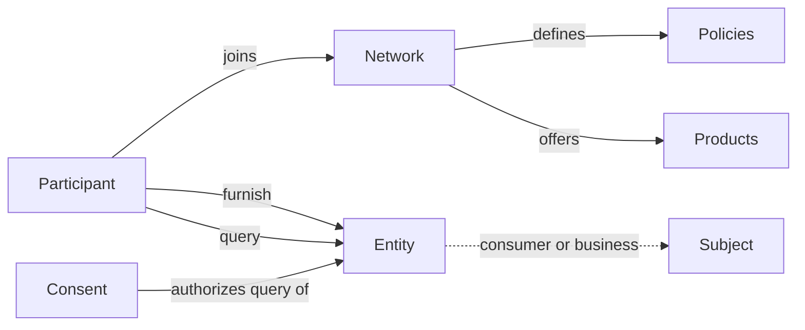

The SOLO Network is a shared data network. Participants **furnish** verified data
about consumers and businesses, and **query** that data — under clear rules about
who can read what, and why.

A handful of concepts power everything you do with the API. This page introduces
them and shows how they connect.

## The building blocks

<CardGroup cols={2}>
  <Card title="Entities" icon="users" href="/concepts/entities">
    The subjects of the network: **consumers** (people) and **businesses**. Every query and furnish is about an entity.
  </Card>
  <Card title="Consent" icon="file-signature" href="/concepts/consent">
    A record that you have permission to query a specific consumer or business. Required before you can query their data.
  </Card>
  <Card title="Products" icon="box" href="/concepts/products">
    The data you can query or furnish — like a KYC certificate, a credit snapshot, or a screening list.
  </Card>
  <Card title="Networks" icon="sitemap" href="/concepts/networks">
    The trust boundary that groups participants, defines roles, and contains furnished data.
  </Card>
  <Card title="Policies" icon="sliders" href="/concepts/policies">
    Per-network rules that govern what a product can read (querying) or write (furnishing).
  </Card>
  <Card title="Entitlement" icon="key" href="/concepts/entitlement">
    Why you can read a given field — earned by previously furnishing or querying an entity.
  </Card>
</CardGroup>

## How they fit together

Every interaction with the network is one of two operations, and they always
involve the same cast of concepts.

- **Furnishing** contributes data about an entity into a network. See
  [Furnishing](/concepts/furnishing).
- **Querying** reads data about an entity from a network. See
  [Querying](/concepts/querying).

## A typical flow

<Steps>
  <Step title="Join a network">
    Your organization is added to a network with one or more roles —
    **furnisher**, **querier**, or **governor**. See [Networks](/concepts/networks).
  </Step>
  <Step title="Furnish or query a product">
    Use a product (e.g. a KYC certificate) to write verified data, or read data
    others have furnished. See [Products](/concepts/products).
  </Step>
  <Step title="Capture consent before querying">
    To query a consumer or business, you first record [consent](/concepts/consent)
    and receive a `consent_id`.
  </Step>
  <Step title="Read only what you're entitled to">
    Results are limited to data you're [entitled](/concepts/entitlement) to see —
    earned through prior furnishing or querying — and shaped by the network's
    [policies](/concepts/policies).
  </Step>
</Steps>

## Where to go next

<CardGroup cols={2}>
  <Card title="Quickstart" icon="rocket" href="/quickstart">
    Furnish an entity, query a product, and join a network — hands-on.
  </Card>
  <Card title="Querying" icon="magnifying-glass" href="/concepts/querying">
    How a query resolves across network, policy, product, and consumer.
  </Card>
  <Card title="Furnishing" icon="arrow-up-from-bracket" href="/concepts/furnishing">
    How contributing data works, with or without a policy.
  </Card>
  <Card title="API Reference" icon="webhook" href="/api-reference/introduction">
    Endpoint-by-endpoint request and response schemas.
  </Card>
</CardGroup>
