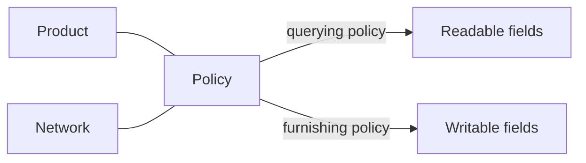

A **policy** is the set of rules a network applies to a product. It connects a
product to a network and defines, at the field level, what participants may do
with that product in that network.

There are two kinds:

<CardGroup cols={2}>
  <Card title="Furnishing policies" icon="arrow-up-from-bracket">
    Govern **what** can be written into the network for a product, and how
    furnished records are accepted and routed.
  </Card>
  <Card title="Querying policies" icon="magnifying-glass">
    Govern **what** can be read from the network for a product, down to individual
    fields.
  </Card>
</CardGroup>

The same product can be configured differently in different networks. Policies
are how a network tailors a shared product to its own rules.

## Why policies exist

Products define a standard schema. But networks have different agreements about
what may be shared. Policies let a network:

- expose only the fields appropriate for its participants,
- keep furnishing and querying rules explicit and auditable, and
- evolve those rules without changing the underlying product.

## Querying policies

A querying policy binds a **product** to a **network** and carries per-field
selections describing what may be read.

Creating one is a two-step flow:

<Steps>
  <Step title="Create the policy">
    `POST /networks/policies/querying` with the `product_id`, `network_id`, and a
    `name`. The network resolves the product-network association (creating it if
    needed) and returns a `policy_id`.
  </Step>
  <Step title="Configure field selections">
    `PUT /networks/policies/querying/{policy_id}/configuration` to save the
    per-field selections that define what the policy reads.
  </Step>
</Steps>

When you [query a product](/concepts/querying), you reference a `(network_id,
policy_id)` pair. The policy determines the ceiling of what the query can return;
your [entitlement](/concepts/entitlement) narrows it further to the fields you've
earned.

## Furnishing policies

A furnishing policy governs how data is accepted into a network for a product.
When you [furnish](/concepts/furnishing), the network resolves the applicable
furnishing policy from the network, program, and the record's application date.

You can browse furnishing policies in a network:

- `GET /networks/policies/furnishing?network_id=…` — list policies in a network
- `GET /networks/policies/furnishing/{policy_id}` — fetch a single policy

<Note>
  Furnishing policies are typically configured by a network's **governor**.
  As a furnisher you usually don't create them — you furnish, and the network
  applies the right policy automatically based on the program and application date.
</Note>

## How policies interact with entitlement

It helps to separate two questions:

| Question | Answered by |
|---|---|
| *In this network, what is this product allowed to expose at all?* | **Policy** |
| *Of that, what have I personally earned the right to read?* | **[Entitlement](/concepts/entitlement)** |

A query returns the **intersection**: fields the policy permits **and** fields you
are entitled to.

## Related concepts

<CardGroup cols={2}>
  <Card title="Networks" icon="sitemap" href="/concepts/networks">
    Where policies live and how roles relate to them.
  </Card>
  <Card title="Entitlement" icon="key" href="/concepts/entitlement">
    The per-participant layer that narrows what a policy exposes.
  </Card>
</CardGroup>
