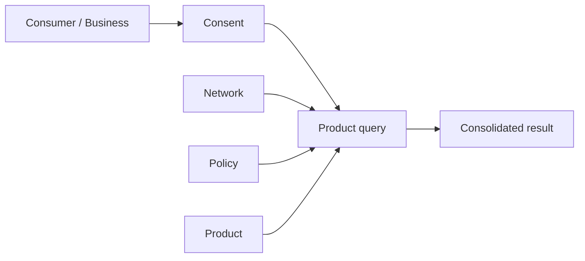

**Querying** reads consolidated data about an entity from the network. A single
query brings together four concepts — a **network**, a **policy**, a **product**,
and a **consumer** (or business) — gated by **consent**.

## How querying works



Each piece plays a distinct role:

| Concept | Role in the query |
|---|---|
| **Product** | *What* you're reading (e.g. a KYC certificate). Determines the endpoint and schema. |
| **Network** | *Where* you're reading from. You must be a [querier](/concepts/networks#permissions--roles) of it. |
| **Policy** | *Which rules* apply — the field-level [querying policy](/concepts/policies) for that product in that network. |
| **Consumer / Business** | *Who* the query is about — resolved from your [consent](/concepts/consent) record. |

### Anatomy of a query

You call the product's query endpoint and provide a consent ID plus one or more
network + policy pairs:

```bash
curl -X POST https://api.solo.one/products/kyc_certificate/query \
  -H "Authorization: Bearer $SOLO_TOKEN" \
  -H "Content-Type: application/json" \
  -d '{
    "consent_id": "a3f0b9c7-…",
    "network_policy": [
      { "network_id": "9f1c0c2e-…", "policy_id": "5e7d2a14-…" }
    ]
  }'
```

- `consent_id` resolves the **subject** and your permission to query it.
- `network_policy` lists the **network + policy** pairs to read across. You can
  query across more than one network in a single call.

### What you get back

The result is **consolidated** — the network gathers data furnished by entitled
participants and returns a single record for the subject. The fields included are
the intersection of:

1. what the network's querying [policy](/concepts/policies) allows, and
2. what you're [entitled](/concepts/entitlement) to read for that entity.

See [Entitlement](/concepts/entitlement) for why two participants can get
different results from the same query.

## How consent ties in — and why it's needed

You cannot query a consumer or business without a valid `consent_id`.

Querying personal and business data carries a legal obligation: you must have a
permissible purpose and the subject's permission. [Consent](/concepts/consent)
records that obligation has been met. It also identifies the subject, so you
don't repeat their personal details on every call.

<Steps>
  <Step title="Gather permission and record consent">
    Create a consent record for the subject and receive a `consent_id`. See
    [Consent](/concepts/consent).
  </Step>
  <Step title="Reference the consent on each query">
    Pass the `consent_id` in the query body. The network resolves it to the
    subject and applies the right field access.
  </Step>
  <Step title="Reuse it">
    The same `consent_id` can be used for repeated queries of that subject while
    the consent remains valid.
  </Step>
</Steps>

<Warning>
  A query without a valid consent for the subject is rejected. Consent is the gate;
  [entitlement](/concepts/entitlement) and [policy](/concepts/policies) shape the
  result once you're through it.
</Warning>

## Related concepts

<CardGroup cols={2}>
  <Card title="Furnishing" icon="arrow-up-from-bracket" href="/concepts/furnishing">
    The other half of the network — contributing data.
  </Card>
  <Card title="Query a product" icon="rocket" href="/quickstart/query-a-product">
    A hands-on walkthrough.
  </Card>
</CardGroup>
