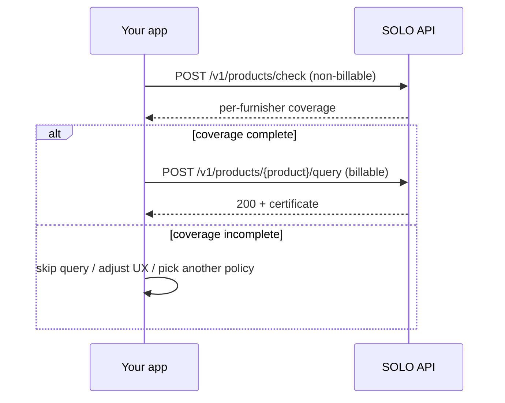

The **coverage check** is a non-billable, read-only pre-flight for product
queries. Given a product, a subject, and a network + policy scope, it reports —
**per furnisher** — which of the policy's required fields are covered by data
already furnished to the network. It answers *"if I run this query now, can it
succeed?"* without issuing a certificate, recording a query event, or creating
a billable event.

```text
POST /v1/products/check
```

One endpoint serves every product: pass the `product_id` of the product you
intend to query.

## Why it exists

A product query that resolves but cannot satisfy the policy returns
[`204 No Content`](/concepts/querying/overview#200-vs-204-here-is-data-vs-nothing-usable)
— and that resolved query is still a billable event. The coverage check lets you
avoid predictable `204`s:



## Request

```bash
curl -X POST https://api.solo.one/v1/products/check \
  -H "Authorization: Bearer $SOLO_TOKEN" \
  -H "Content-Type: application/json" \
  -d '{
    "product_id": "3e8a1d5f-…",
    "consent_id": "a3f0b9c7-…",
    "policy_id": "5e7d2a14-…",
    "network_ids": ["9f1c0c2e-…"]
  }'
```

| Field | Type | Required | Purpose |
|---|---|---|---|
| `product_id` | UUID | yes | The product to coverage-check. |
| `consent_id` | string | one of¹ | Consent token — the system resolves the subject's identity. |
| `consumer_id` | UUID | one of¹ | Direct consumer profile reference (for consumer-targeted products). |
| `business_id` | UUID | one of¹ | Direct business profile reference (for business-targeted products). |
| `network_ids` | UUID[] | yes | Networks to check across. |
| `policy_id` | UUID | no | The [querying policy](/concepts/governance/querying-policies) whose requirements to check against. If omitted, each network's default policy is used. |
| `furnishing_entity_ids` | UUID[] | no | Restrict the check to specific furnishers. When omitted, all furnishers are considered. |

¹ Identify the subject the same way you would on the query itself: a
`consent_id`, or the direct profile id matching the product's target
(`consumer_id` for consumer products, `business_id` for business products).

## Response

A `200 OK` with one entry per furnisher that has relevant data:

```json
{
  "product_id": "3e8a1d5f-…",
  "consumer_id": "c2a4e8d0-…",
  "business_id": null,
  "entities": [
    {
      "furnishing_entity_id": "e1d2c3b4-…",
      "furnishing_entity_name": "First Example Bank",
      "network_id": "9f1c0c2e-…",
      "complete": false,
      "models": [
        {
          "model_name": "DocumentCaptureEvent",
          "met_count": 2,
          "total_count": 2,
          "fields": [
            { "field_name": "is_document_captured", "met": true },
            { "field_name": "document_capture_timestamp", "met": true }
          ]
        },
        {
          "model_name": "LivenessCheckEvent",
          "met_count": 0,
          "total_count": 1,
          "fields": [
            { "field_name": "is_liveness_captured", "met": false }
          ]
        }
      ]
    }
  ]
}
```

| Field | Meaning |
|---|---|
| `entities[]` | One row per furnisher whose data was evaluated. |
| `entities[].complete` | Whether this furnisher's data alone satisfies every checked requirement. |
| `entities[].models[]` | Per-model breakdown, keyed by the product's model names (see each product's field reference). |
| `models[].met_count` / `total_count` | How many of the model's checked fields are covered. |
| `models[].fields[]` | Field-level detail: each `field_name` and whether it's `met`. |

The `field_name` values trace directly to the product's field reference tables
— see the [KYC certificate](/concepts/querying/kyc-certificate#field-reference)
and [KYB certificate](/concepts/querying/kyb-certificate#field-reference) pages.

If the `product_id` cannot be resolved, the endpoint returns `404` with the
standard error envelope (`{"detail": "…", "error_code": "RESOURCE_NOT_FOUND"}`)
— see [Errors](/home/errors).

## When to use it

- **Pre-flight UX.** Before showing a "verify with SOLO" path during
  onboarding, check whether the network can actually produce a certificate for
  this subject — and degrade gracefully if not, rather than surfacing a dead
  end.
- **Avoiding empty 204s.** A billable query that returns `204` tells you the
  policy's requirements weren't met *after* the fact. The coverage check tells
  you the same thing for free, before you spend the query.
- **Choosing a scope.** The per-furnisher, per-network breakdown shows *which*
  furnisher's data is complete, so you can target `furnishing_entity_ids` or
  pick the right network — or a different policy — before querying.
- **Diagnosing a 204 you already received.** Run the same scope through the
  coverage check to see exactly which model's fields fell short.

## What it does not do

<Warning>
  The coverage check is a *soft* check. It does **not**:

  - issue a certificate or return any subject data — only coverage booleans and
    counts;
  - record a query event — there is no `X-Ref-Id` to quote, and nothing is added
    to the billable audit trail;
  - create a billable event;
  - guarantee the subsequent query returns `200` — data can change between the
    check and the query, and the final result is still shaped by
    [entitlement](/concepts/governance/entitlement) and the
    [policy](/concepts/governance/querying-policies) at query time.
</Warning>

## Related

<CardGroup cols={2}>
  <Card title="Querying" icon="magnifying-glass" href="/concepts/querying/overview">
    The billable query the coverage check pre-flights.
  </Card>
  <Card title="Products" icon="box" href="/concepts/querying/products">
    The catalog of products you can check and query.
  </Card>
</CardGroup>
