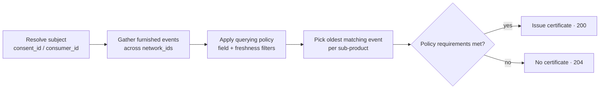

The **KYC Certificate** is a reusable identity-verification certificate bundle
for consumer onboarding. It replaces per-bank KYC intake with a network-issued
attestation: instead of each institution re-running document capture, biometric
checks, and identity corroboration for the same person, a query assembles the
verification work already furnished by network participants into a single
certificate.

| | |
|---|---|
| **Category** | Identity Verification |
| **Use case** | Customer Onboarding |
| **Subject** | Consumer |
| **Operations** | `POST /v1/products/kyc_certificate/query`, `POST /v1/products/kyc_certificate/furnish` |

## What's in the certificate

A KYC certificate consolidates up to nine **sub-products**, each a block in the
query response with its own `assertions` (what was attested, and when) and
`data` (the supporting attributes):

| Sub-product | Response key | What it attests |
|---|---|---|
| Document capture | `document_capture` | An identity document was captured, with its type, number, and dates. |
| Document review | `document_review` | The document's attributes were reviewed — tamper and machine-readable-data checks. |
| Biometric capture | `biometric_capture` | A biometric artifact (e.g. a selfie) was captured. |
| Biometric review | `biometric_review` | The biometric was compared against a reference, with quality and outcome. |
| Liveness capture | `liveness_capture` | Liveness evidence was captured. |
| Liveness review | `liveness_review` | The liveness evidence was reviewed, with outcome and confidence tier. |
| Address capture | `address_capture` | A residential address was captured. |
| Address verification | `address_verification` | The address was verified, with methods and per-source match counts. |
| Identity corroboration | `identity_corroboration` | CIP-style corroboration — SSN, name, and DOB matches across sources. |

Every populated sub-product carries the `furnishing_entity_id` of the
participant whose data backed it and the `attestation_id` of their attestation,
so the certificate is auditable down to its sources.

## Querying

```bash
curl -X POST https://api.solo.one/v1/products/kyc_certificate/query \
  -H "Authorization: Bearer $SOLO_TOKEN" \
  -H "Content-Type: application/json" \
  -d '{
    "consent_id": "a3f0b9c7-…",
    "policy_id": "5e7d2a14-…",
    "network_ids": ["9f1c0c2e-…"]
  }'
```

The request follows the standard [query anatomy](/concepts/querying/overview):
identify the subject with `consent_id` (or `consumer_id` for direct
permissible-purpose lookups), and scope the read with `network_ids` plus an
optional `policy_id` and `furnishing_entity_ids`.

A `200 OK` means a certificate was issued:

```json
{
  "certificate_id": "1c9f4e2a-…",
  "query_event_id": "7b2d9c4e-…",
  "consumer_id": "c2a4e8d0-…",
  "result": {
    "meta": {
      "network_id": "9f1c0c2e-…",
      "policy_id": "5e7d2a14-…"
    },
    "document_capture": {
      "furnishing_entity_id": "e1d2c3b4-…",
      "attestation_id": "f0a1b2c3-…",
      "assertions": {
        "document_capture_assertion": true,
        "document_capture_timestamp": "2026-04-15T00:00:00Z"
      },
      "data": {
        "document_artifact": "passport_scan.pdf",
        "document_type": "passport",
        "document_issuing_state": "government",
        "document_number": "934712385",
        "document_issue_date": "2021-03-02",
        "document_expiration_date": "2031-03-02",
        "document_capture_method": "mobile_scan"
      }
    },
    "document_review": {
      "furnishing_entity_id": "e1d2c3b4-…",
      "attestation_id": "f0a1b2c3-…",
      "assertions": {
        "document_attribute_review_assertion": true,
        "document_attribute_review_timestamp": "2026-04-16T00:00:00Z"
      },
      "data": {
        "document_review_method": "automated_ocr",
        "document_tamper_review_performed": true,
        "document_tamper_indicators_observed": false,
        "is_document_machine_readable_data_validation_performed": true,
        "is_document_machine_readable_data_validation_consistent_with_document_face": true
      }
    },
    "biometric_capture": {
      "furnishing_entity_id": "e1d2c3b4-…",
      "attestation_id": "f0a1b2c3-…",
      "assertions": {
        "biometric_capture_assertion": true,
        "biometric_capture_timestamp": "2026-04-15T00:00:00Z"
      },
      "data": {
        "biometric_artifact": "selfie.jpg",
        "biometric_capture_method": "selfie"
      }
    },
    "identity_corroboration": {
      "furnishing_entity_id": "e1d2c3b4-…",
      "attestation_id": "f0a1b2c3-…",
      "assertions": {
        "is_identity_corroboration_performed": true,
        "identity_corroboration_timestamp": "2026-04-16T09:30:00Z"
      },
      "data": {
        "identity_elements_corroborated": "pass",
        "identity_corroboration_methods": ["database", "documentary"],
        "identity_corroboration_outcomes": ["ssn_match", "name_match", "dob_match"],
        "total_identity_corroboration_sources_consulted": 3,
        "identity_corroboration_source_count_full_match": 3,
        "identity_corroboration_source_count_inconclusive": 0,
        "identity_corroboration_source_count_no_match": 0,
        "identity_corroboration_source_count_partial_match": 0
      }
    },
    "biometric_review": null,
    "liveness_capture": null,
    "liveness_review": null,
    "address_capture": null,
    "address_verification": null
  }
}
```

- `certificate_id` — the issued certificate. The certificate records the
  date it was issued, its attestation timestamp, and the network + policy pairs
  it was resolved under.
- `query_event_id` — the billable query event id; the same value is returned in
  the `X-Ref-Id` response header. Quote it to support and keep it in your audit
  log.
- `result` — the consolidated certificate. Sub-products the policy didn't
  require (or that lacked data) are `null`.

## How the certificate resolves per network



The query gathers furnished events across every network in `network_ids` and
applies the querying policy's filters uniformly. For each sub-product it selects
the **oldest matching event** from any allowed network, and the result's
`meta.network_id` is anchored to the **first** network in your request — list
your primary network first. Which furnishers' data is considered, and which
fields you see, is further shaped by your
[entitlement](/concepts/governance/entitlement).

## When you get a 204

The endpoint declares a `204 No Content` response: *no certificate could be
created — the available data did not satisfy the policy requirements*. Concretely,
a `204` is returned when:

- a sub-product the policy requires was never furnished for this consumer in
  the queried networks, or
- furnished data exists but fails the policy's filters (e.g. outside the
  freshness window the policy selected), or
- the policy selected specific data fields that the resolved certificate could
  not populate.

The body is empty. The response still carries the `X-Ref-Id` header, and the
query event is still recorded. To anticipate `204`s before spending a billable
query, run a [coverage check](/concepts/querying/coverage-check) first.

## Furnishing

Participants contribute the underlying KYC data with
`POST /v1/products/kyc_certificate/furnish`:

```json
{
  "network_id": "9f1c0c2e-…",
  "program_name": "default",
  "application_date": "2026-05-28",
  "records": [
    {
      "first_name": "Jane",
      "last_name": "Doe",
      "date_of_birth": "1990-01-15",
      "social_security_number": "123-45-6789"
    }
  ]
}
```

The response is `{"success": true, "submission_id": "…"}`. Bulk contribution is
also available via [file upload](/concepts/furnishing/file-upload) and
[SFTP](/concepts/sftp/overview); see [Furnishing](/concepts/furnishing/overview)
for the full model.

## Field reference

The KYC certificate's data dictionary, model by model. *Field* is the display
name, *API name* is the `field_name` used in policies and coverage checks, and
*Source model* is the underlying table the value is drawn from.

### Consumer

| Field | API name | Type | Source model |
|---|---|---|---|
| First Name | `first_name` | String | `consumer` |
| Last Name | `last_name` | String | `consumer` |

### DocumentCaptureEvent

| Field | API name | Type | Source model |
|---|---|---|---|
| Attestation ID | `attestation_id` | UUID | `document_capture_event` |
| Furnishing Entity ID | `furnishing_entity_id` | UUID | `attestation` |
| Is Document Captured | `is_document_captured` | Boolean | `document_capture_event` |
| Document Capture Timestamp | `document_capture_timestamp` | Date | `document_capture_event` |
| Is Document Attribute Reviewed | `is_document_attribute_reviewed` | Boolean | `document_capture_event` |
| Document Attribute Review Timestamp | `document_attribute_review_timestamp` | Date | `document_capture_event` |

### IdentityDocument

| Field | API name | Type | Source model |
|---|---|---|---|
| Identity Document Type | `type` | String | `identity_document` |
| Document Issue Date | `issue_date` | Date | `identity_document` |
| Document Expiration Date | `expiration_date` | Date | `identity_document` |
| Issuing Authority | `issuing_authority` | String | `identity_document` |
| Is Tampering Detected | `is_tampering_detected` | Boolean | `identity_document` |
| Are Security Features Verified | `are_security_features_verified` | Boolean | `identity_document` |
| Document Number | `number` | Integer | `identity_document` |
| Document Upload | `upload` | String | `identity_document` |

### BiometricCaptureEvent

| Field | API name | Type | Source model |
|---|---|---|---|
| Attestation ID | `attestation_id` | UUID | `biometric_capture_event` |
| Furnishing Entity ID | `furnishing_entity_id` | UUID | `attestation` |
| Is Biometric Captured | `is_biometric_captured` | Boolean | `biometric_capture_event` |
| Biometric Capture Timestamp | `biometric_capture_timestamp` | Date | `biometric_capture_event` |
| Is Biometric Attribute Reviewed | `is_biometric_attribute_reviewed` | Boolean | `biometric_capture_event` |
| Biometric Attribute Review Timestamp | `biometric_attribute_review_timestamp` | Date | `biometric_capture_event` |
| Biometric Artifact Type | `biometric_artifact_type` | String | `biometric_capture_event` |
| Biometric Artifact Image Quality | `biometric_artifact_image_quality` | String | `biometric_capture_event` |
| Biometric Artifact Subject Present | `biometric_artifact_subject_present` | Boolean | `biometric_capture_event` |
| Biometric Artifact Upload | `biometric_artifact_upload` | String | `biometric_capture_event` |

### LivenessCheckEvent

| Field | API name | Type | Source model |
|---|---|---|---|
| Attestation ID | `attestation_id` | UUID | `liveness_check_event` |
| Furnishing Entity ID | `furnishing_entity_id` | UUID | `attestation` |
| Is Liveness Captured | `is_liveness_captured` | Boolean | `liveness_check_event` |
| Capture Timestamp | `capture_timestamp` | Date | `liveness_check_event` |
| Is Liveness Evidence Reviewed | `is_liveness_evidence_reviewed` | Boolean | `liveness_check_event` |
| Evidence Review Timestamp | `evidence_review_timestamp` | Date | `liveness_check_event` |
| Capture Method Type | `capture_method_type` | String | `liveness_check_event` |
| Check Result | `check_result` | String | `liveness_check_event` |
| Evidence Clarity | `evidence_clarity` | String | `liveness_check_event` |

### AddressCaptureEvent

| Field | API name | Type | Source model |
|---|---|---|---|
| Attestation ID | `attestation_id` | UUID | `address_capture_event` |
| Furnishing Entity ID | `furnishing_entity_id` | UUID | `attestation` |
| Is Address Captured | `is_address_captured` | Boolean | `address_capture_event` |
| Address Capture Timestamp | `address_capture_timestamp` | Date | `address_capture_event` |
| Is Address Verified | `is_address_verified` | Boolean | `address_capture_event` |
| Address Verification Timestamp | `address_verification_timestamp` | Date | `address_capture_event` |
| Address Verification Method Type | `address_verification_method_type` | String | `address_capture_event` |
| Is Match | `is_match` | Boolean | `address_capture_event` |

### IdentityVerificationEvent

| Field | API name | Type | Source model |
|---|---|---|---|
| Attestation ID | `attestation_id` | UUID | `identity_verification_event` |
| Furnishing Entity ID | `furnishing_entity_id` | UUID | `attestation` |
| Is KYC CIP | `is_kyccip` | Boolean | `identity_verification_event` |
| KYC Decision | `kyc_decision` | String | `identity_verification_event` |
| Is SSN Match | `is_ssn_match` | Boolean | `identity_verification_event` |
| Is Name Match | `is_name_match` | Boolean | `identity_verification_event` |
| Name Verified | `name_verified` | Boolean | `identity_verification_event` |
| Is DOB Match | `is_dob_match` | Boolean | `identity_verification_event` |
| SSN Verified | `ssn_verified` | Boolean | `identity_verification_event` |
| Deliverable | `deliverable` | Boolean | `identity_verification_event` |
| Identity Corroboration Timestamp | `created_at` | Datetime | `identity_verification_event` |

### KycCertificate (policy configuration only)

These certificate-level fields are used when configuring a
[querying policy](/concepts/governance/querying-policies) — e.g. requiring a
certificate no older than 30 days. They are filters over issued certificates,
not data projected into the query response.

| Field | API name | Type | Source model |
|---|---|---|---|
| Certificate As Of Date | `certificate_as_of_date` | Date | `kyc_certificate` |
| Certificate Attestation Timestamp | `certificate_attestation_timestamp` | Datetime | `kyc_certificate` |
| Days Since Certificate As Of Date | `days_since_certificate_as_of_date` | Integer | `kyc_certificate` |
| Is Address Captured | `is_address_captured` | Boolean | `kyc_certificate` |
| Is Address Verification Performed | `is_address_verification_performed` | Boolean | `kyc_certificate` |
| Is Biometric Captured | `is_biometric_captured` | Boolean | `kyc_certificate` |
| Is Biometric Reviewed | `is_biometric_reviewed` | Boolean | `kyc_certificate` |
| Is Document Captured | `is_document_captured` | Boolean | `kyc_certificate` |
| Is Document Reviewed | `is_document_reviewed` | Boolean | `kyc_certificate` |
| Is Identity Corroboration Performed | `is_identity_corroboration_performed` | Boolean | `kyc_certificate` |
| Is Liveness Captured | `is_liveness_captured` | Boolean | `kyc_certificate` |
| Is Liveness Reviewed | `is_liveness_reviewed` | Boolean | `kyc_certificate` |

## Related

<CardGroup cols={2}>
  <Card title="Querying" icon="magnifying-glass" href="/concepts/querying/overview">
    Request anatomy, 200 vs 204, billing, and the X-Ref-Id header.
  </Card>
  <Card title="Coverage check" icon="list-radio" href="/concepts/querying/coverage-check">
    Check field coverage before running a billable query.
  </Card>
</CardGroup>
