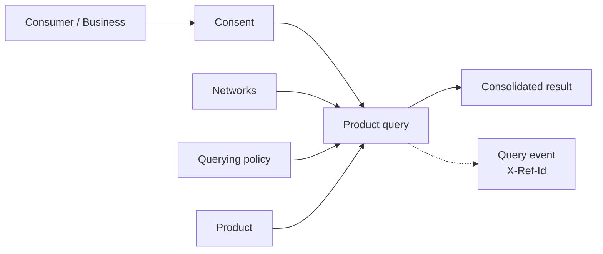

import DashboardQueryingOverview from '/snippets/dashboard/querying-overview.mdx';

**Querying** is how a participant consumes the network: it reads consolidated,
already-verified data about an entity instead of re-collecting it. A single
query brings together four concepts — a **network**, a **policy**, a **product**,
and a **consumer** (or business) — gated by **consent**.

## Why consume network data

You query to reuse work, not to "buy data." A query returns a
[trust asset](/concepts/trust/trust-assets) — an attested verification with its
provenance intact — so the outcome is operational, not informational:

- **Faster onboarding** — reuse a verified [KYC](/concepts/querying/kyc-certificate)
  or [KYB](/concepts/querying/kyb-certificate) certificate instead of repeating
  document collection and review.
- **Less manual review** — start from another institution's completed,
  evidenced verification rather than from zero.
- **Do only the missing work** — a [coverage check](/concepts/querying/coverage-check)
  tells you what already exists, so you collect only what's genuinely absent.

Read it as *"check whether verified trust assets already exist for this
subject,"* not *"fetch a data record."*

## How querying works



Each piece plays a distinct role:

| Concept | Role in the query |
|---|---|
| **Product** | *What* you're reading (e.g. a KYC certificate). Determines the endpoint and schema. See the [product catalog](/concepts/querying/products). |
| **Network** | *Where* you're reading from. You must be a [querier](/concepts/governance/networks#permissions--roles) of every network you include. |
| **Policy** | *Which rules* apply — the field-level [querying policy](/concepts/governance/querying-policies) governing what the query may read and how fresh it must be. |
| **Consumer / Business** | *Who* the query is about — resolved from your [consent](/concepts/identity/consent) record. |

## Anatomy of a query

Every product query is a `POST` to the product's `/query` endpoint. The request
body has two halves: **who** the query is about, and **where + under which rules**
to read.

| Field | Type | Required | Purpose |
|---|---|---|---|
| `consent_id` | string | one of¹ | Consent token identifying the subject and your permission to query them. See [Consent](/concepts/identity/consent). |
| `consumer_id` / `business_id` | UUID | one of¹ | Direct profile reference for permissible-purpose queries, as an alternative to `consent_id`. |
| `network_ids` | UUID[] | yes | One or more networks to read across. You must hold the querier role in each. |
| `policy_id` | UUID | no | The [querying policy](/concepts/governance/querying-policies) applied across every network in `network_ids`. If omitted, each network's default policy is used. |
| `furnishing_entity_ids` | UUID[] | no | Optional furnisher scope. When omitted, data from all furnishers is considered. |

¹ Provide either a `consent_id` *or* a direct profile id — not both.

Why both halves matter:

- The **subject** half (`consent_id`) carries the legal basis. Querying personal
  or business data requires a permissible purpose and the subject's permission,
  and the consent record is the proof. It also resolves the subject's identity so
  you never repeat their personal details on each call.
- The **scope** half (`network_ids` + `policy_id`) tells the network where to
  read and which field-level rules to apply. The same product behaves differently
  under different policies, so the pair determines both *what data is considered*
  and *how fresh and complete it must be*.

<Note>
  Each issued certificate records the exact network + policy pairs it was
  resolved under, so the scope you pass is permanently part of the audit trail.
</Note>

### Full example

```bash
curl -X POST https://api.solo.one/v1/products/kyc_certificate/query \
  -H "Authorization: Bearer $SOLO_TOKEN" \
  -H "Content-Type: application/json" \
  -d '{
    "consent_id": "a3f0b9c7-…",
    "policy_id": "5e7d2a14-…",
    "network_ids": ["9f1c0c2e-…"]
  }'
```

A successful query returns `200 OK` with the consolidated result and an
`X-Ref-Id` response header:

```json
{
  "certificate_id": "1c9f4e2a-…",
  "query_event_id": "7b2d9c4e-…",
  "consumer_id": "c2a4e8d0-…",
  "result": {
    "meta": {
      "network_id": "9f1c0c2e-…",
      "policy_id": "5e7d2a14-…"
    },
    "document_capture": {
      "furnishing_entity_id": "e1d2c3b4-…",
      "attestation_id": "f0a1b2c3-…",
      "assertions": {
        "document_capture_assertion": true,
        "document_capture_timestamp": "2026-04-15T00:00:00Z"
      },
      "data": {
        "document_artifact": "passport_scan.pdf",
        "document_type": "passport",
        "document_issuing_state": "government",
        "document_number": "934712385",
        "document_issue_date": "2021-03-02",
        "document_expiration_date": "2031-03-02",
        "document_capture_method": "mobile_scan"
      }
    },
    "biometric_capture": {
      "furnishing_entity_id": "e1d2c3b4-…",
      "attestation_id": "f0a1b2c3-…",
      "assertions": {
        "biometric_capture_assertion": true,
        "biometric_capture_timestamp": "2026-04-15T00:00:00Z"
      },
      "data": {
        "biometric_artifact": "selfie.jpg",
        "biometric_capture_method": "selfie"
      }
    },
    "document_review": null,
    "biometric_review": null,
    "liveness_capture": null,
    "liveness_review": null,
    "address_capture": null,
    "address_verification": null,
    "identity_corroboration": null
  }
}
```

The shape of `result` is product-specific — see the per-product pages for the
[KYC certificate](/concepts/querying/kyc-certificate),
[KYB certificate](/concepts/querying/kyb-certificate), and
[screening lists](/concepts/querying/screening-lists).

## 200 vs 204 — "here is data" vs "nothing usable"

Product query endpoints distinguish two successful outcomes:

| Status | Meaning | Body |
|---|---|---|
| `200 OK` | The query resolved and produced a usable result (e.g. a certificate was issued). | The product's response schema. |
| `204 No Content` | The query resolved, but the available data did not satisfy the policy's requirements — no certificate could be created, no usable result exists. | **Empty.** |

`204` is not an error. It means the network looked, applied your policy, and
found that the furnished data falls short of what the policy demands — for
example, a required sub-product was never furnished, or the data is older than
the policy's freshness window allows. Clients should treat `204` as "queried,
nothing to show" without inspecting product-specific fields.

<Note>
  A `204` response still carries the `X-Ref-Id` header, because the query
  itself was resolved and recorded. To avoid paying for predictable `204`s, run
  a non-billable [coverage check](/concepts/querying/coverage-check) first.
</Note>

## The `X-Ref-Id` header

Every product query response — `200` and `204` alike — includes an `X-Ref-Id`
response header. Its value is the **query event id**: the durable identifier of
this query in the network's audit trail. On `200` responses the same value also
appears in the body as `query_event_id`.

```text
HTTP/1.1 200 OK
X-Ref-Id: 7b2d9c4e-…
Content-Type: application/json
```

Treat it like a receipt:

- **Quote it to support.** If a query produced an unexpected result, the
  `X-Ref-Id` lets SOLO trace the exact request, the policy applied, and the data
  considered.
- **Store it in your own audit log.** It ties your internal decision record to
  the network's record of the same event.
- **Reconcile billing.** Each billable query corresponds to one query event id.

## What you get back — entitlement

The fields included in a `200` result are the intersection of:

1. what the network's [querying policy](/concepts/governance/querying-policies) allows, and
2. what you're [entitled](/concepts/governance/entitlement) to read for that entity.

Entitlement is earned per participant — typically by having furnished data for
the entity or having previously queried it. Two participants running the same
query against the same subject can therefore receive different results. If a
field you expected is missing, check entitlement before assuming the data was
never furnished. See [Entitlement](/concepts/governance/entitlement) for the
full model.

## Billing

Product query requests are **billable events**. Conservatively:

- Each call to a product's `/query` endpoint that resolves — whether it returns
  `200` or `204` — is recorded as a query event and may be billed.
- The [coverage check](/concepts/querying/coverage-check) (`POST
  /v1/products/check`) is **not** billable. It exists precisely so you can
  pre-flight a query without incurring a billable event.
- Pricing is defined by your network agreement; this documentation does not
  state prices.

<Warning>
  A `204 No Content` response is still a resolved query. If your integration
  retries on `204`, every retry is another billable event. Use the
  [coverage check](/concepts/querying/coverage-check) to avoid querying subjects
  whose data cannot satisfy your policy.
</Warning>

## Multi-network queries

`network_ids` accepts more than one network, letting a single call read across
every network you participate in:

```json
{
  "consent_id": "a3f0b9c7-…",
  "policy_id": "5e7d2a14-…",
  "network_ids": ["9f1c0c2e-…", "4d8a7f31-…"]
}
```

How a multi-network query resolves:

- The single `policy_id` is applied uniformly across **every** network listed.
  If omitted, each network's default policy is used.
- Data is gathered from all listed networks; for each sub-product the network
  selects the oldest matching event from any allowed network.
- The result's `meta.network_id` is **anchored to the first network** in
  `network_ids` — list your primary network first.
- You must hold the querier role in every network listed; a network you cannot
  query fails the request rather than being silently skipped.

## How consent ties in — and why it's needed

You cannot query a consumer or business without a valid `consent_id` (or a
direct profile id under an established permissible purpose).

<Steps>
  <Step title="Gather permission and record consent">
    Create a consent record for the subject and receive a `consent_id`. See
    [Consent](/concepts/identity/consent).
  </Step>
  <Step title="Reference the consent on each query">
    Pass the `consent_id` in the query body. The network resolves it to the
    subject and applies the right field access.
  </Step>
  <Step title="Reuse it">
    The same `consent_id` can be used for repeated queries of that subject while
    the consent remains valid.
  </Step>
</Steps>

<Warning>
  A query without a valid consent for the subject is rejected. Consent is the gate;
  [entitlement](/concepts/governance/entitlement) and [policy](/concepts/governance/querying-policies) shape the
  result once you're through it.
</Warning>

### Consent vs direct profile queries

Product query endpoints accept two identity-resolution paths:

- **`consent_id`** — the standard path. The consent token both identifies the
  subject and proves your permission to query them. Use this for any flow where
  the subject interacts with you (onboarding, re-verification).
- **`consumer_id` / `business_id`** — a direct reference to a profile you can
  already see, for permissible-purpose queries where consent was established
  through another channel. The subject must resolve within your scope or the
  query returns `404`.

Both paths produce the same response shape and the same billable query event.
When in doubt, use `consent_id`.

## Query failure modes

Failures use the standard error envelope —
`{"detail": "…", "error_code": "…"}` — described in
[Errors](/home/errors).

| Status | `error_code` | Typical cause |
|---|---|---|
| `400 Bad Request` | `VALIDATION_ERROR` | The request is structurally valid but semantically wrong — e.g. a consent that doesn't resolve to a subject. |
| `401 Unauthorized` | `AUTHENTICATION_REQUIRED` | Missing, malformed, or expired bearer token. See [Authentication](/home/authentication). |
| `403 Forbidden` | `PERMISSION_DENIED` | You're not a querier of a listed network, or your token lacks the required scope. |
| `404 Not Found` | `RESOURCE_NOT_FOUND` | The consumer, business, consent, or product could not be resolved. |
| `422 Unprocessable Entity` | — | Request body failed schema validation (e.g. `network_ids` empty or missing); `detail` names the field. |
| `500 Internal Server Error` | `INTERNAL_ERROR` / `OPERATION_FAILED` | Unexpected server error. Quote the `X-Ref-Id` or `request_id` to support. |

Remember that `204 No Content` is **not** in this table — it's a success status
meaning the policy's requirements were not met by the available data.

## Integration checklist

A robust querying integration usually looks like this:

1. **Record consent once, reuse it.** One consent record covers repeated
   queries of the same subject while it remains valid.
2. **Pre-flight with the coverage check** when a `204` would hurt your UX or
   your budget — it's free and uses the same scope fields as the query.
3. **Handle `204` as a first-class outcome**, not an error: branch your product
   flow on "no usable result" rather than retrying.
4. **Persist `query_event_id` / `X-Ref-Id`** alongside your own decision
   records for audit, support, and billing reconciliation.
5. **Treat missing fields as an entitlement question first** — check what
   you've furnished and what the policy exposes before raising a data issue.

## The network control plane

Reuse is safe because it is governed by independent controls — the network's
control plane. Every one of these exists today; none can be bypassed by a single
actor:

| Control | What it governs | Where it's defined |
|---|---|---|
| **Consent** | Whether a subject's data may be read at all, its scope, and its expiry | [Consent](/concepts/identity/consent) (`scope`, `expires_at`, `consented_fields`) |
| **Entitlement** | Which fields a given reader may see, earned by participation | [Entitlement](/concepts/governance/entitlement) |
| **Querying policy** | What a product exposes, and how fresh it must be to count | [Querying policies](/concepts/governance/querying-policies) (freshness windows) |
| **`204` on insufficiency** | Refusal to return stale or incomplete results | This page — `204 No Content` |

A governor controls policy but not consent; a subject controls consent but not
entitlement; your own history determines entitlement but not policy. That
separation is what lets institutions reuse each other's work without anyone
losing control of their own.

<DashboardQueryingOverview />

## Related concepts

<CardGroup cols={2}>
  <Card title="Products" icon="box" href="/concepts/querying/products">
    The catalog of what you can query.
  </Card>
  <Card title="Coverage check" icon="list-radio" href="/concepts/querying/coverage-check">
    Pre-flight a query without a billable event.
  </Card>
  <Card title="Furnishing" icon="arrow-up-from-bracket" href="/concepts/furnishing/overview">
    The other half of the network — contributing data.
  </Card>
  <Card title="Query a product" icon="rocket" href="/home/quickstart/query-a-product">
    A hands-on walkthrough.
  </Card>
</CardGroup>
