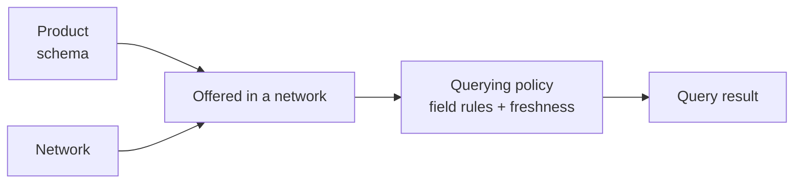

A **product** is a standardized, named data set that you can **query** (read) and
— for certificate products — **furnish** (write) through the network. Products
give every participant a common schema for a given verification domain, so data
furnished by one participant can be queried by another without bespoke
integration.

## The catalog

Four products are queryable today. The exact set available to you depends on the
networks you belong to.

| Product | What it answers | Subject | Query path |
|---|---|---|---|
| [KYC Certificate](/concepts/querying/kyc-certificate) | "Has this consumer's identity been verified — documents, biometrics, liveness, address, and corroboration?" | Consumer | `POST /v1/products/kyc_certificate/query` |
| [KYB Certificate](/concepts/querying/kyb-certificate) | "Has this business been verified — identity, ownership & control, and risk/compliance?" | Business | `POST /v1/products/kyb_certificate/query` |
| [Bank-Specific Bad Actor List](/concepts/querying/screening-lists) | "Has this consumer violated a documented policy of this sponsor bank's program?" | Consumer | `POST /v1/products/bank_specific_bad_actor_list/query` |
| [Cross-Bank Financial Crimes Watch List](/concepts/querying/screening-lists) | "Is this consumer associated with suspicious financial-crimes activity reported across participating banks?" | Consumer | `POST /v1/products/cross_bank_financial_crimes_watch_list/query` |

They fall into two families:

- **Certificates** are consolidated, multi-attribute verification results
  assembled from data furnished by network participants. Querying one can
  *issue* a reusable certificate for the subject. Certificate queries return
  `204 No Content` when the available data cannot satisfy the policy.
- **Screening lists** are read-only yes/no checks against lists of flagged
  individuals. They return a listing indicator plus a small set of context
  fields, never a certificate — and always `200 OK`, with a clean result
  expressed as `"is_listed": false`.

| Behavior | Certificates | Screening lists |
|---|---|---|
| Furnishable via API | Yes — `/furnish` | No (query-only) |
| Issues an artifact | Yes — `certificate_id` | No |
| Empty result | `204 No Content` | `200` with `is_listed: false` |
| Billable query event | Yes | Yes |

## The query / furnish pattern

<CardGroup cols={2}>
  <Card title="Query" icon="magnifying-glass">
    **Read** consolidated data for an entity, drawn from what authorized
    participants have furnished. Requires a [consent](/concepts/identity/consent) ID
    or a direct profile reference.
  </Card>
  <Card title="Furnish" icon="arrow-up-from-bracket">
    **Contribute** verified data for an entity into a network, making it available
    for future queries by entitled participants.
  </Card>
</CardGroup>

```text
POST /v1/products/{product}/query
POST /v1/products/{product}/furnish    (certificate products)
```

Certificate products accept structured JSON furnishing via the API, and bulk
furnishing via [file upload](/concepts/furnishing/file-upload) or
[SFTP](/concepts/sftp/overview). The two screening lists are query-only over
the API; the data behind them is contributed through governed furnishing flows.

There is also one utility endpoint that is **not** a product query:
`POST /v1/products/check`, the non-billable
[coverage check](/concepts/querying/coverage-check), which reports whether the
furnished data for a subject can satisfy a policy *before* you run a billable
query.

## How products relate to networks and policies



A product defines *what* data exists — its models, fields, and types. A
[network](/concepts/governance/networks) decides *which* products it offers to
its members. A [querying policy](/concepts/governance/querying-policies)
defines, per network, *which parts* of a product a query may read and under
what conditions (e.g. how recent a verification must be). The same product can
behave differently in two networks because each network attaches its own
policies.

This is why every query carries both `network_ids` and a `policy_id`: the
product determines the endpoint and response schema, while the network + policy
scope determines what actually comes back. What you're
[entitled](/concepts/governance/entitlement) to read narrows it further.

Each product's schema is defined as a set of **models** — named groups of typed
fields such as `DocumentCaptureEvent` or `BusinessRiskComplianceEvent`. These
model and field names are the shared vocabulary across the platform: policies
select them, the [coverage check](/concepts/querying/coverage-check) reports
against them, and the per-product field reference tables document them. When a
policy "requires liveness within 30 days," it is expressing a filter over a
product model's fields — the same fields you'll see in the query response.

## Querying a product

A product query reads consolidated data for one entity. It needs a **consent
ID** (or direct profile id) identifying the subject, and a **network + policy**
scope:

```json
{
  "consent_id": "a3f0b9c7-…",
  "policy_id": "5e7d2a14-…",
  "network_ids": ["9f1c0c2e-…"]
}
```

See [Querying](/concepts/querying/overview) for the full request anatomy,
`200` vs `204` semantics, the `X-Ref-Id` audit header, and billing notes.

## Furnishing a product

Furnishing contributes one or more records for an entity into a network:

```json
{
  "network_id": "9f1c0c2e-…",
  "program_name": "default",
  "application_date": "2026-05-28",
  "records": [
    {
      "first_name": "Jane",
      "last_name": "Doe",
      "date_of_birth": "1990-01-15",
      "social_security_number": "123-45-6789"
    }
  ]
}
```

The network matches each record to an entity and stores the furnished data under
your organization, building your [entitlement](/concepts/governance/entitlement)
to query it back later. See [Furnishing](/concepts/furnishing/overview).

## Choosing a product

| If you need to… | Use |
|---|---|
| Verify a consumer's identity at onboarding | [KYC Certificate](/concepts/querying/kyc-certificate) |
| Verify a business and its beneficial owners | [KYB Certificate](/concepts/querying/kyb-certificate) |
| Screen a consumer against your sponsor bank's program history | [Bank-Specific Bad Actor List](/concepts/querying/screening-lists) |
| Screen a consumer for cross-bank financial-crimes signals | [Cross-Bank Financial Crimes Watch List](/concepts/querying/screening-lists) |
| Know whether a query can succeed before paying for it | [Coverage Check](/concepts/querying/coverage-check) |

In practice these compose: an onboarding flow might run both screening lists
first, then a coverage check, then the KYC certificate query — three billable
list/certificate queries at most, with the free check deciding whether the
certificate query is worth running.

## Product deep dives

<CardGroup cols={2}>
  <Card title="KYC Certificate" icon="id-card" href="/concepts/querying/kyc-certificate">
    Consolidated consumer identity verification — nine sub-products, full field
    reference.
  </Card>
  <Card title="KYB Certificate" icon="building" href="/concepts/querying/kyb-certificate">
    Business identity, ownership & control, and risk/compliance in one
    certificate.
  </Card>
  <Card title="Screening Lists" icon="list-check" href="/concepts/querying/screening-lists">
    Bank-specific bad actor and cross-bank financial crimes watch lists.
  </Card>
  <Card title="Coverage Check" icon="list-radio" href="/concepts/querying/coverage-check">
    Non-billable pre-flight: can this query succeed under this policy?
  </Card>
</CardGroup>
