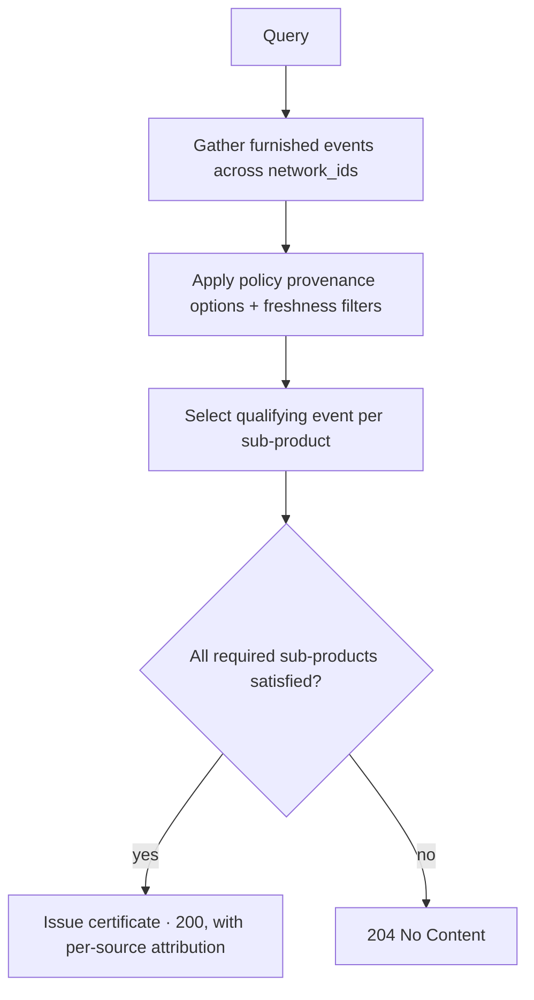

Provenance is what separates a SOLO network from a black box. Banks do not want
to trust SOLO; they want to trust the **institution that did the verification**,
and to see the evidence. So every reusable [trust asset](/concepts/trust/trust-assets)
carries its lineage: who contributed it, who attested to it, when, by what
method, and on what evidence.

> SOLO does not ask participants to trust unattributed data. It preserves the
> lineage of every reusable verification.

## The lineage every certificate carries

When a [product query](/api-overview/querying/products) consolidates verifications
into a certificate, each populated sub-product is self-describing:

```json
"business_identity_verification": {
  "furnishing_entity_id": "e1d2c3b4-…",
  "attestation_id": "f0a1b2c3-…",
  "assertions": {
    "business_identity_verification_assertion": true,
    "business_identity_verification_performed_timestamp": "2026-05-02T00:00:00Z"
  },
  "data": {
    "business_formation_document_artifact": "articles_of_organization.pdf",
    "business_identity_verification_sources": ["state_registry"],
    "business_tax_id_validation_result": "match"
  }
}
```

| Lineage element | Field | What it tells the reader |
|---|---|---|
| **Contributor / verifier** | `furnishing_entity_id` | Which participant furnished and stands behind this verification |
| **Attestation** | `attestation_id` | The attestation record linking that participant to the asserted facts |
| **Assertion + time** | `assertions.*` and its `…_timestamp` | What was asserted, and when the verification was performed |
| **Method & sources** | `data.*_sources`, `*_method`, `*_result` | How it was verified (e.g. `state_registry`, `automated_ocr`, `match`) |
| **Evidence** | artifact/upload fields (e.g. `…_artifact`, `paystub_upload`) | The concrete document behind the assertion |
| **As-of date** | the certificate's `certificate_as_of_date` | How current the consolidated result is |

The [coverage check](/api-overview/querying/coverage-check) goes a step further and
returns a human-readable `furnishing_entity_name` alongside the
`furnishing_entity_id`, so you can see *which banks* can satisfy a product for a
subject before you query.

## One subject, many furnishers

An entity profile is a **shared subject**, not a record any one participant
owns. In a healthy network several participants furnish about the same consumer
or business — one contributes identity verification, another fraud signals, a
third business registration. All of it accrues to the same profile, and each
contribution keeps its own attribution.

Two consequences follow:

1. **You don't own the whole profile.** Your furnished fields sit alongside
   others'. Updating your contribution never overwrites theirs.
2. **What you can read is governed, not automatic.** Sharing a subject with
   another furnisher does not mean you see their data — a query returns the
   intersection of the [querying policy](/concepts/governance/querying-policies)
   and your [entitlement](/concepts/governance/entitlement).

## How the network picks which furnisher's verification to reuse

When multiple furnishers have verified the same thing, the query does not guess.
The querying policy defines **provenance options** — ordered, filtered
preferences for which furnished events qualify and in what priority. At
resolution time the network applies the policy's filters and selects the
**oldest matching event** for each sub-product across the allowed networks,
falling back through the policy's priority order until a qualifying verification
is found.



You can also narrow reuse yourself: pass `furnishing_entity_ids` on a query to
consider only specific contributors.

## Freshness is part of provenance

A verification is only reusable while it is current enough for the reader's
policy. Querying policies enforce **freshness windows** (for example, "identity
corroboration within the last 30 days") using certificate-level fields such as
`days_since_certificate_as_of_date`. Data outside the window is not reused — the
query returns `204` rather than handing back a stale answer dressed up as fresh.
This is why freshness, like attribution, is a first-class part of what makes
reuse safe.

## Why provenance is exposed on purpose

For most software, exposing internals is a mistake. For SOLO it is the product:
participants reuse each other's work *because* they can see who did it, how, and
when. Provenance turns "trust SOLO" into "trust the network, transparently."

<Note>
  Provenance here means the lineage that exists today — `furnishing_entity_id`,
  `attestation_id`, assertion timestamps, source/method/evidence fields, and
  policy freshness. It does not include reuse counters, dispute counts, or
  contributor reputation scores, which are not part of the current platform.
</Note>

## Related

<CardGroup cols={2}>
  <Card title="Trust assets" icon="award" href="/concepts/trust/trust-assets">
    The reusable unit provenance describes.
  </Card>
  <Card title="Entitlement" icon="key" href="/concepts/governance/entitlement">
    Why you can read a given field about a subject.
  </Card>
  <Card title="Querying policies" icon="scale-balanced" href="/concepts/governance/querying-policies">
    Freshness windows and provenance options.
  </Card>
  <Card title="Coverage check" icon="list-radio" href="/api-overview/querying/coverage-check">
    See which furnishers can satisfy a product before you query.
  </Card>
</CardGroup>
