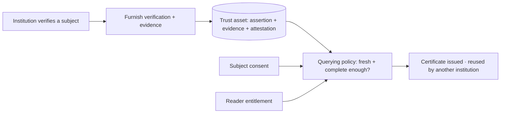

A **trust asset** is the reusable unit of a SOLO network: a verification that
one institution completed, backed by evidence, attributed to its source, and
governed by permission — so that another institution can reuse it instead of
repeating the work.

"Trust asset" is a lens, not a new API object. It names what already exists in
the platform when you put the pieces together: a furnished
[verification](/api-overview/furnishing/overview) event, its supporting evidence,
the [attestation](/concepts/trust/provenance) that records who stands behind it,
and the [consent](/concepts/identity/consent) and
[entitlement](/concepts/governance/entitlement) that decide who may reuse it. A
[product query](/api-overview/querying/products) assembles trust assets into a
certificate.

## What makes a verification a *trust asset*

A raw data point — `revenue: $5.2M` — is not reusable on its own. Another bank
cannot act on a number with no idea who produced it, how, or when. A trust asset
carries the context that makes reuse safe:

| Dimension | The trust question | Where it lives in the API |
|---|---|---|
| **Subject** | Who is this about? | The [entity](/concepts/identity/entities) (consumer or business) |
| **Assertion** | What was attested, and when? | The verification event's `assertions` block (e.g. `business_identity_verification_assertion`, with its `…_timestamp`) |
| **Evidence** | Why should anyone believe it? | The verification event's `data` block and artifact fields (e.g. `business_formation_document_artifact`) |
| **Attribution** | Who verified it? | `furnishing_entity_id` + `attestation_id` on every populated sub-product |
| **Permission** | Who is allowed to reuse it? | The subject's [consent](/concepts/identity/consent) |
| **Precision** | Which fields may *this* reader see? | [Entitlement](/concepts/governance/entitlement), earned by participation |
| **Reuse eligibility** | Is it fresh and complete enough to count? | The [querying policy](/concepts/governance/querying-policies)'s field and freshness filters |
| **Consolidation** | How is it delivered for reuse? | A [certificate](/api-overview/querying/products) (`certificate_id`, with its as-of date) |

A data aggregator returns the first row of that table. SOLO returns all of it.

## A trust asset, concretely

Here is one populated sub-product from a [KYB certificate](/api-overview/querying/kyb-certificate)
query — a single trust asset in the wild:

```json
"business_identity_verification": {
  "furnishing_entity_id": "e1d2c3b4-…",
  "attestation_id": "f0a1b2c3-…",
  "assertions": {
    "business_identity_verification_assertion": true,
    "business_identity_verification_performed_timestamp": "2026-05-02T00:00:00Z"
  },
  "data": {
    "business_formation_document_artifact": "articles_of_organization.pdf",
    "business_jurisdiction_of_formation": "DE",
    "business_registration_identifier": "7423918",
    "business_registration_status": "active",
    "business_identity_verification_sources": ["state_registry"],
    "business_tax_id_validation_result": "match"
  }
}
```

Read it as a trust asset:

- **Subject** — the business the certificate was issued for (`business_id` on
  the enclosing response).
- **Assertion** — business identity *was* verified, on `2026-05-02`.
- **Evidence** — backed by an articles-of-organization artifact, a state
  registry source, and a tax-ID match.
- **Attribution** — furnished and attested by the participant identified by
  `furnishing_entity_id` / `attestation_id`.
- **Reuse** — surfaced to you only because consent permitted the read, your
  entitlement covered these fields, and the data passed the policy's freshness
  window.

The next institution onboarding this business does not re-pull the registry or
re-collect the formation document. It queries the certificate and reuses this
asset — while the contributor's attribution travels with it.

## How trust assets are created and reused



1. **Create.** An institution [furnishes](/api-overview/furnishing/overview) the
   verification it performed. The furnished events, their evidence, and the
   institution's attestation become a trust asset attributed to that
   contributor.
2. **Govern.** [Consent](/concepts/identity/consent) decides whether the asset
   can be read for a subject; [entitlement](/concepts/governance/entitlement)
   decides which fields a given reader sees; the
   [querying policy](/concepts/governance/querying-policies) decides whether the
   asset is fresh and complete enough to count.
3. **Reuse.** A [product query](/api-overview/querying/products) consolidates the
   eligible trust assets into a [certificate](/api-overview/querying/kyc-certificate).
   If nothing eligible exists, the query returns `204` rather than a stale or
   unattributed answer.

## The three layers

Trust assets sit in the middle of how the platform is organized:

| Layer | What it is | Pages |
|---|---|---|
| **Trust graph** | The subjects and the verifications attached to them | [Consumer graph](/concepts/trust/consumer-graph), [Business graph](/concepts/trust/business-graph) |
| **Trust assets** | Attested, evidenced verifications that become reusable | This page, [Provenance](/concepts/trust/provenance) |
| **Trust products** | The outcomes a query delivers | [Products](/api-overview/querying/products), [KYC](/api-overview/querying/kyc-certificate), [KYB](/api-overview/querying/kyb-certificate) |

<Note>
  Trust assets describe data that **exists today** — furnished verification
  events, their attestations, and the certificates that consolidate them. SOLO
  does not expose a standalone `TrustAsset` object, reuse counters, or
  verification "tiers"; the reusable asset is the furnished, attested
  verification itself, surfaced through certificate queries.
</Note>

## Related

<CardGroup cols={2}>
  <Card title="Provenance" icon="fingerprint" href="/concepts/trust/provenance">
    The lineage every trust asset carries.
  </Card>
  <Card title="Business graph" icon="building" href="/concepts/trust/business-graph">
    The trust assets that can exist for a business.
  </Card>
  <Card title="Consumer graph" icon="user" href="/concepts/trust/consumer-graph">
    The trust assets that can exist for a consumer.
  </Card>
  <Card title="Products" icon="box" href="/api-overview/querying/products">
    How trust assets are consolidated and delivered.
  </Card>
</CardGroup>
