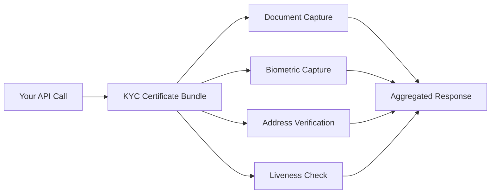

Use case bundles are composite endpoints that orchestrate multiple templates into a single API call. They're designed for common verification workflows where you'd otherwise need to call several templates individually.

## How Bundles Work

A bundle:
1. Accepts a single request with subject identifiers
2. Calls multiple downstream template services internally
3. Returns an aggregated response with data from all templates
4. Includes **completion status flags** indicating which components have data



## Available Bundles

### Identity Breezethrough
A lightweight identity check combining basic identity prefill data. Use this when you need a quick identity lookup without full KYC.

**Underlying templates:** Identity Prefill

---

### KYC Certificate Bundle
Full Know Your Customer verification. Aggregates 8 templates covering document verification, biometric matching, address validation, and liveness detection.

**Underlying templates:**
- Document Capture + Document Attribute Review
- Biometric Capture + Biometric Attribute Review
- Address Verification + Address Data Review
- Liveness Capture + Liveness Evidence Review

---

### KYB Certificate Bundle
Know Your Business verification for entity-level due diligence.

**Underlying templates:**
- Business Identity Verification
- Business Ownership & Control Verification
- Business Risk & Compliance Assessment

---

### Income & Employment Bundle
Income and employment verification for lending and underwriting decisions.

**Underlying templates:**
- Annual Personal Income
- Employment Verification

---

### Credit History Bundle
Consumer credit profile for credit decisioning.

**Underlying templates:**
- Consumer Credit Health Snapshot
- Total Consumer Assets
- Total Consumer Liabilities

---

### Bank Link & Cashflow Bundle
Connected account data for cashflow-based underwriting.

**Underlying templates:**
- Cashflow Snapshots & Trends

## Request Structure

Bundle endpoints follow a different URL pattern from individual templates:

```
POST /api/use_cases/templates/{bundle_name}
```

The request body contains the identifiers relevant to the bundle type (consumer or business).

## Completion Flags

Bundle responses include boolean flags indicating which downstream templates returned data. This lets you determine if the subject has complete verification coverage or if additional data collection is needed.

```json
{
  "document_capture_complete": true,
  "biometric_capture_complete": true,
  "address_verification_complete": false,
  "liveness_capture_complete": true,
  ...
}
```

<Note>
  Bundles are **read-only** — they aggregate data from templates but don't write new data. Use individual template furnish endpoints to submit data.
</Note>
