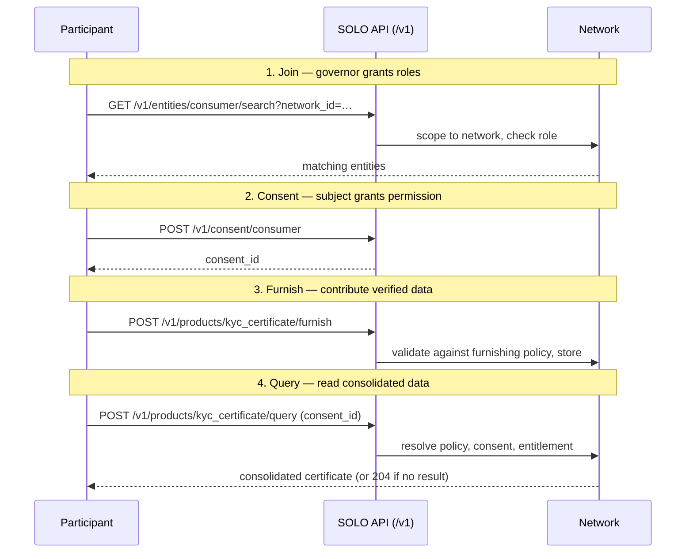

import DashboardHomeOverview from '/snippets/dashboard/home-overview.mdx';

The SOLO Network turns one institution's completed verification work into
another institution's trusted starting point. Participants furnish verified data
about consumers and businesses, and query that data back — under clear rules
about who can read what, and why. Six concepts power everything you do with the
API. Once you understand them and the order they come into play, every endpoint
in the [reference](/api-reference/introduction) reads naturally.

The architecture is not internal plumbing you can ignore — it *is* the trust
mechanism. Each building block exists to answer a question a bank's risk and
compliance teams must be able to answer before they reuse another institution's
work:

| Building block | Trust question it answers |
|---|---|
| Network | Inside which boundary of trusted participants does this data live? |
| Entity | Who is the subject being verified? |
| Consent | Did the subject permit this read? |
| Product | What standardized, reusable result am I asking for? |
| Policy | What may be read, and how fresh must it be, to count? |
| Entitlement | Of what the policy exposes, what may *I* see — and why? |

Read [How SOLO is different](/home/why-solo) for why this matters, and
[Trust assets](/concepts/trust/trust-assets) for how a furnished verification
becomes something reusable.

## The building blocks

### Network

A [network](/concepts/governance/networks) is the trust boundary everything
else lives inside. It groups a set of participating institutions, defines which
products are available to them, and contains the data they furnish. Nothing
crosses a network boundary: a record furnished into one network is invisible to
every other, and every API call that touches data — a consent lookup, an entity
search, a product query — is scoped by a `network_id`. Within a network, each
participant holds one or more [roles](/concepts/governance/network-roles) —
governor, furnisher, querier — that determine which operations it may perform,
and [governance rules](/concepts/governance/network-governance) determine how
the network itself is administered and changed.

### Entity

An [entity](/concepts/identity/entities) is a subject of the network: a
**consumer** (a person) or a **business**. Every furnish writes data about an
entity, and every query reads data about one. Entities have a core identity —
name, email, SSN or EIN, date of birth — that the network uses to recognize
when two participants are talking about the same subject, so that data
furnished by one bank can be consolidated with data furnished by another. You
can look up existing entities with `GET /v1/entities/consumer/search` and
`GET /v1/entities/business/search`, both scoped by a required `network_id`.

### Consent

[Consent](/concepts/identity/consent) is the subject's permission, captured as
a first-class record. Before you query data about a consumer or business, you
record that they agreed — `POST /v1/consent/consumer` or
`POST /v1/consent/business` — and receive a `consent_id` that you pass with
every subsequent query. A consent record carries a scope, an optional expiry,
and the set of consented fields; scope, expiry, and consented fields can be
updated later, but the identity fields are immutable, because the record is an
audit artifact of who consented and when. The API refuses to create a consumer
consent unless you affirm that consent was actually gathered from the consumer
first.

### Product

A [product](/api-overview/querying/products) is the unit of data you furnish or
query — a standardized package rather than a raw table. The network currently
offers KYC and KYB certificates (consolidated identity-verification outcomes
for consumers and businesses respectively) and screening lists (a bank-specific
bad-actor list and a cross-bank financial-crimes watch list). Products expose
`query` and, where applicable, `furnish` operations under
`/v1/products/{product}/…`. A non-billable soft check,
`POST /v1/products/check`, reports per-furnisher field
[coverage](/api-overview/querying/coverage-check) for a product before you commit
to a billable query.

### Policy

A policy is a per-network, per-product rulebook authored by the network
governor. A [querying policy](/concepts/governance/querying-policies) defines
what a product is allowed to read — which models and which fields appear in
query results for that network. A
[furnishing policy](/concepts/governance/furnishing-policies) defines what a
product accepts on write and how submitted data is validated and transformed.
Policies are created as shells (`POST /v1/networks/policies/querying`,
`POST /v1/networks/policies/furnishing`) and then configured field by field via
their `PUT /v1/networks/policies/…/{policy_id}/configuration` endpoints. A
query names the policy it runs under, so the same product can behave
differently in different networks.

### Entitlement

[Entitlement](/concepts/governance/entitlement) answers the last question:
of the fields the policy exposes, which ones can *you* see? Entitlement is
earned through participation — by previously furnishing data about an entity or
querying it — and is evaluated per field at query time. Two participants
issuing the identical query against the same entity can receive different
results, each limited to the data their own history entitles them to. This is
the mechanism that makes a shared network safe: contributing participants are
never exposing data to passive observers.

## The data flow

The building blocks come into play in a fixed order. Here is the lifecycle of a
participant from joining a network to reading its first query result:

1. **Join a network.** Your organization is added by the network governor and
   assigned roles. From this point your token resolves to an account with
   capabilities inside that network. See
   [Join a network](/home/quickstart/join-a-network).
2. **Create consent.** Record the subject's permission and hold on to the
   returned `consent_id`. Without it, product queries fail.
3. **Furnish.** Contribute data through a product's `furnish` endpoint — or in
   bulk via [file upload](/api-overview/furnishing/file-upload) or
   [SFTP](/api-overview/sftp/overview). The network's furnishing policy validates
   what you send.
4. **Query.** Ask a product for consolidated data, citing your `consent_id` and
   the network policy to run under. The result is assembled from every
   furnisher's contributions — filtered through the policy and your
   entitlement. If the available data cannot satisfy the policy's requirements,
   you receive an empty `204 No Content` rather than a partial answer.

## How the pieces enforce privacy

The model is easiest to remember as three independent gates, each answering a
different question. All three must open before a field reaches your response.

| Gate        | Question it answers                       | Granted by                                  |
| ----------- | ----------------------------------------- | ------------------------------------------- |
| Capability  | May you perform this operation at all?    | Your [roles](/concepts/governance/network-roles) in the network |
| Permission  | Did the subject agree to this read?       | A valid [consent](/concepts/identity/consent) record |
| Visibility  | Which fields may you actually see?        | Your [entitlement](/concepts/governance/entitlement), within the policy's bounds |

**Roles grant capability.** A participant without the querier role cannot query
anything, no matter how much consent it holds. Roles are assigned by the
network governor and checked on every request.

**Consent grants permission.** A querier with full capability still cannot read
a specific consumer's data without that consumer's consent record — scoped,
optionally time-limited, and auditable after the fact.

**Entitlement grants visibility.** Even with capability and permission, you see
only the fields your participation has earned, and never more than the
network's querying policy exposes to anyone. The policy is the ceiling;
entitlement is your position under it.

Because the gates are independent, no single actor can bypass the system: the
governor controls policies but not consent, the subject controls consent but
not entitlement, and your own history determines entitlement but not
capability.

## Where to go next

If you learn best by doing, the [Quickstart](/home/quickstart) chains the full
flow — consent, furnish, query — into a few `curl` commands. If you are about
to write integration code, read [Authentication](/home/authentication) to set
up your bearer token and [Errors](/home/errors) to handle failures correctly —
in particular the distinction between a `204` empty result, a `400` domain
rejection, and a `422` malformed request, all of which you will encounter while
integrating.

For depth on any single building block, follow its link above into the
concepts section. Two reading paths are worth calling out: if your organization
primarily contributes data, continue from
[Furnishing](/api-overview/furnishing/overview) into
[file upload](/api-overview/furnishing/file-upload) and the
[SFTP guide](/api-overview/sftp/getting-started) for bulk ingestion; if it
primarily consumes data, continue from
[Querying](/api-overview/querying/overview) into the individual product pages —
[KYC certificate](/api-overview/querying/kyc-certificate),
[KYB certificate](/api-overview/querying/kyb-certificate), and
[screening lists](/api-overview/querying/screening-lists).

<DashboardHomeOverview />

<CardGroup cols={2}>
  <Card title="Querying" icon="magnifying-glass" href="/api-overview/querying/overview">
    How a query resolves across network, policy, consent, and entitlement.
  </Card>
  <Card title="Furnishing" icon="arrow-up-from-bracket" href="/api-overview/furnishing/overview">
    How contributed data is validated, stored, and made queryable.
  </Card>
</CardGroup>
