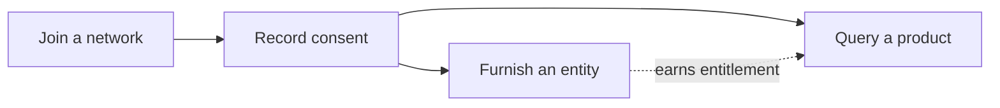

The SOLO Network lets member banks contribute verified data about consumers and
businesses, and read consolidated views of that data back — all governed by
network membership, [consent](/concepts/identity/consent), and
[entitlement](/concepts/governance/entitlement). This quickstart sequences the
three workflows you'll use most, each as a self-contained walkthrough with
complete requests and responses you can adapt directly.

## The sequence

Work through the guides in order the first time:

1. **[Join a network](/home/quickstart/join-a-network)** — membership is arranged
   with your SOLO account manager; this guide shows you how to verify that your
   token, role, and `network_id` actually work before you build anything.
2. **[Furnish an entity](/home/quickstart/furnish-an-entity)** — record consent,
   then contribute KYC certificate data about a consumer into your network.
3. **[Query a product](/home/quickstart/query-a-product)** — reuse the consent
   and read a consolidated KYC certificate back, including how to interpret a
   `200` versus a `204` and the `X-Ref-Id` header.

Furnishing and querying are independent capabilities, but they reinforce each
other: furnishing data about a consumer earns you
[entitlement](/concepts/governance/entitlement) to read that consumer's data on
future queries.

By the end of the sequence you'll have made every call a production
integration makes: a membership sanity check, a consent record, a furnish
submission, and a billable product query — and you'll know how to read each
response, including the empty ones.



## What you'll need

| Requirement | Where it comes from | Used for |
|---|---|---|
| **Network membership + role** | Arranged with your SOLO account manager | Furnisher role to furnish, querier role to query |
| **Bearer token (SDK token)** | Issued by your SOLO account manager | The `Authorization` header on every request |
| **`network_id`** | Provided when your organization joins a network | Scoping every consent, search, furnish, and query |
| **Program name** (furnishers only) | Your network configuration | Routing furnished data to the right [furnishing policy](/concepts/furnishing/overview) |

Export your token once so every example in these guides works as-is:

```bash
export SOLO_TOKEN="your-sdk-token-here"
```

All endpoints live under `https://api.solo.one/v1` and authenticate with the
token as a Bearer credential:

```bash
curl https://api.solo.one/v1/entities/consumer/search \
  -H "Authorization: Bearer $SOLO_TOKEN"
```

See [Authentication](/home/authentication) for token claims and lifetimes, and
[Errors](/home/errors) for the error envelope every endpoint shares.

The walkthroughs use the consumer-side endpoints (`/v1/consent/consumer`,
`/v1/entities/consumer/search`, `/v1/products/kyc_certificate/...`). The
business-side equivalents — `POST /v1/consent/business`,
`GET /v1/entities/business/search`, and the KYB certificate under
`/v1/products/kyb_certificate` — follow the same patterns, so everything you
learn here transfers directly.

<Note>
  Every error response uses the same shape: a human-readable `detail` plus a
  machine-readable `error_code` (for example `AUTHENTICATION_REQUIRED` or
  `RESOURCE_NOT_FOUND`). Each walkthrough includes a troubleshooting section
  with the exact failures you're likely to hit.
</Note>

## Choose your path

<CardGroup cols={3}>
  <Card title="Join a network" icon="sitemap" href="/home/quickstart/join-a-network">
    Verify your token, membership, and role with your first two API calls.
  </Card>
  <Card title="Furnish your first entity" icon="arrow-up-from-bracket" href="/home/quickstart/furnish-an-entity">
    Record consent, then contribute KYC data about a consumer.
  </Card>
  <Card title="Query your first product" icon="magnifying-glass" href="/home/quickstart/query-a-product">
    Read a consolidated KYC certificate back from the network.
  </Card>
</CardGroup>

<Tip>
  New to the platform's vocabulary? Read the
  [high-level concepts](/home/overview) first — entities, products, policies,
  networks, consent, and entitlement in a few minutes. For the full endpoint
  catalog, see the [API reference](/api-reference/introduction).
</Tip>
