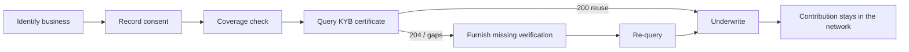

This golden path shows the **reuse-first** pattern for onboarding a business:
identify the subject, check what the network already holds, reuse it, do only
the missing work, and contribute your verification back. It chains real
endpoints end to end and uses the business / KYB side throughout.



## Prerequisites

<Note>
  - Network membership with the **querier** role (and **furnisher** role for
    steps 5–6), arranged with your SOLO account manager.
  - A bearer token exported as `SOLO_TOKEN` (see
    [Authentication](/home/authentication)).
  - Your `network_id`, and the KYB `product_id` for the coverage check.
</Note>

<Steps>
  <Step title="Identify the business">
    Resolve the applicant to a network profile before anything else, so reused
    and contributed work consolidate on one subject.

    ```bash
    curl -G https://api.solo.one/v1/entities/business/search \
      -H "Authorization: Bearer $SOLO_TOKEN" \
      --data-urlencode "network_id=9f1c0c2e-…" \
      --data-urlencode "business_legal_name=Acme Coffee" \
      --data-urlencode "federal_ein=123456789"
    ```

    Keep the `id` from any confident match to link it on consent. No match is
    fine — consent will create the profile.
  </Step>

  <Step title="Record business consent">
    Capture permission to query the business and get a `consent_id`.

    ```bash
    curl -X POST https://api.solo.one/v1/consent/business \
      -H "Authorization: Bearer $SOLO_TOKEN" \
      -H "Content-Type: application/json" \
      -d '{
        "did_gather_consent_from_business_prior": true,
        "business_consent_identity": {
          "business_legal_name": "Acme Coffee LLC",
          "business_jurisdiction_of_formation": "DE",
          "business_registration_identifier_from_jurisdiction_of_formation": 7423918,
          "business_tax_identifier_type": "EIN",
          "business_tax_identifier_value": "12-3456789"
        }
      }'
    ```

    The response carries the `consent_id` you'll pass on the coverage check and
    query. See [Consent](/concepts/identity/consent) for the full shape.
  </Step>

  <Step title="Check what the network already holds">
    Run the non-billable [coverage check](/concepts/querying/coverage-check) to
    see whether reusable KYB [trust assets](/concepts/trust/trust-assets)
    already exist — and which furnishers can satisfy them — before spending a
    billable query.

    ```bash
    curl -X POST https://api.solo.one/v1/products/check \
      -H "Authorization: Bearer $SOLO_TOKEN" \
      -H "Content-Type: application/json" \
      -d '{
        "product_id": "b4a1d6e8-…",
        "consent_id": "a3f0b9c7-…",
        "network_ids": ["9f1c0c2e-…"]
      }'
    ```

    Each entity in the response carries a `furnishing_entity_name` and a
    `complete` flag. A furnisher with `complete: true` can satisfy the KYB
    product for this business — reuse is available.
  </Step>

  <Step title="Query the KYB certificate (reuse)">
    Read the consolidated certificate. This reuses identity, ownership & control,
    and risk/compliance verification already furnished by participants, each
    block carrying its source's `furnishing_entity_id` and `attestation_id`.

    ```bash
    curl -X POST https://api.solo.one/v1/products/kyb_certificate/query \
      -H "Authorization: Bearer $SOLO_TOKEN" \
      -H "Content-Type: application/json" \
      -d '{
        "consent_id": "a3f0b9c7-…",
        "network_ids": ["9f1c0c2e-…"],
        "policy_id": "5e7d2a14-…"
      }'
    ```

    A `200` returns a certificate you can underwrite against. A `204` means the
    available data did not satisfy your policy — continue to step 5.
  </Step>

  <Step title="Do only the missing work, then furnish it">
    For whatever the certificate could not supply (a `204`, or a sub-product the
    coverage check showed as incomplete), perform that verification yourself and
    contribute it back:

    ```bash
    curl -X POST https://api.solo.one/v1/products/kyb_certificate/furnish \
      -H "Authorization: Bearer $SOLO_TOKEN" \
      -H "Content-Type: application/json" \
      -d '{
        "network_id": "9f1c0c2e-…",
        "program_name": "default",
        "application_date": "2026-05-28",
        "records": [
          { "business_legal_name": "Acme Coffee LLC", "business_ein": "12-3456789" }
        ]
      }'
    ```

    Furnishing earns you [entitlement](/concepts/governance/entitlement) to read
    this business back later, and your verification becomes a reusable trust
    asset for the next participant — attributed to you.
  </Step>

  <Step title="Re-query and underwrite">
    Re-run the step 4 query to assemble the now-complete certificate, then use it
    in your underwriting decision. The `query_event_id` / `X-Ref-Id` ties the
    network's record of the read to your internal decision record.
  </Step>
</Steps>

## Why this order

Reuse-first inverts the traditional onboarding loop: instead of collecting
everything up front, you collect *only what the network doesn't already have*.
The coverage check is free, so it always precedes the billable query; furnishing
last means your one verification compounds for every future participant.

## Related

<CardGroup cols={2}>
  <Card title="Network consumption" icon="magnifying-glass" href="/concepts/querying/overview">
    The reuse-first read model in depth.
  </Card>
  <Card title="KYB Certificate" icon="building" href="/concepts/querying/kyb-certificate">
    The business trust asset, field by field.
  </Card>
  <Card title="Coverage check" icon="list-radio" href="/concepts/querying/coverage-check">
    Pre-flight what already exists.
  </Card>
  <Card title="Trust assets" icon="award" href="/concepts/trust/trust-assets">
    What you reuse and what you create.
  </Card>
</CardGroup>
