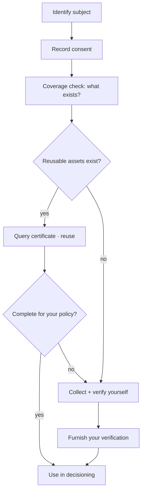

import DashboardQuickstartNetworkConsumption from '/snippets/dashboard/quickstart-network-consumption.mdx';


This golden path is the general **reuse-first** pattern for any consumer
onboarding or re-verification: before you collect and verify from scratch, ask
the network what reusable [trust assets](/concepts/trust/trust-assets) already
exist, reuse them, and limit your own work to the gaps. It uses the consumer /
KYC side; the business / KYB equivalent is
[Business lending onboarding](/home/quickstart/business-lending-onboarding).



## Prerequisites

<Note>
  - Network membership with the **querier** role (and **furnisher** role to
    contribute), arranged with your SOLO account manager.
  - A bearer token exported as `SOLO_TOKEN`.
  - Your `network_id`, and the product's `product_id` for the coverage check.
</Note>

<Steps>
  <Step title="Identify the subject">
    Find an existing profile so reuse and any later contribution consolidate on
    one consumer.

    ```bash
    curl -G https://api.solo.one/v1/entities/consumer/search \
      -H "Authorization: Bearer $SOLO_TOKEN" \
      --data-urlencode "network_id=9f1c0c2e-…" \
      --data-urlencode "social_security_number=123-45-6789"
    ```
  </Step>

  <Step title="Record consent">
    Capture the subject's permission and keep the `consent_id`.

    ```bash
    curl -X POST https://api.solo.one/v1/consent/consumer \
      -H "Authorization: Bearer $SOLO_TOKEN" \
      -H "Content-Type: application/json" \
      -d '{
        "network_id": "9f1c0c2e-…",
        "did_gather_consent_from_consumer_prior": true,
        "consumer_consent_identity": {
          "first_name": "Jane",
          "last_name": "Doe",
          "date_of_birth": "1990-01-15",
          "personal_email": "jane@example.com",
          "phone_number": "+14155550100",
          "social_security_number": "123-45-6789"
        }
      }'
    ```
  </Step>

  <Step title="Ask what verified work already exists">
    The [coverage check](/concepts/querying/coverage-check) is non-billable and
    answers the reuse question directly: *which furnishers already hold complete
    data for this subject and product?*

    ```bash
    curl -X POST https://api.solo.one/v1/products/check \
      -H "Authorization: Bearer $SOLO_TOKEN" \
      -H "Content-Type: application/json" \
      -d '{
        "product_id": "b4a1d6e8-…",
        "consent_id": "5f3a8c21-…",
        "network_ids": ["9f1c0c2e-…"]
      }'
    ```

    If any furnisher is `complete: true`, reusable trust assets exist — query
    them in the next step. If none are, skip to step 5 and do the work yourself.
  </Step>

  <Step title="Reuse: query the certificate">
    ```bash
    curl -X POST https://api.solo.one/v1/products/kyc_certificate/query \
      -H "Authorization: Bearer $SOLO_TOKEN" \
      -H "Content-Type: application/json" \
      -d '{
        "consent_id": "5f3a8c21-…",
        "network_ids": ["9f1c0c2e-…"],
        "policy_id": "5e7d2a14-…"
      }'
    ```

    - **`200`** — reuse the consolidated certificate. Each populated sub-product
      carries its source's `furnishing_entity_id` and `attestation_id`, so the
      reuse is fully attributed.
    - **`204`** — nothing you're entitled to read satisfied the policy. Treat it
      as "do the missing work," not as an error.
  </Step>

  <Step title="Do only the missing work, then furnish it">
    Verify whatever the network couldn't supply, then contribute it back so the
    next participant reuses it — and so you earn
    [entitlement](/concepts/governance/entitlement) to read this subject later.

    ```bash
    curl -X POST https://api.solo.one/v1/products/kyc_certificate/furnish \
      -H "Authorization: Bearer $SOLO_TOKEN" \
      -H "Content-Type: application/json" \
      -d '{
        "network_id": "9f1c0c2e-…",
        "program_name": "default",
        "application_date": "2026-05-28",
        "records": [
          {
            "first_name": "Jane",
            "last_name": "Doe",
            "date_of_birth": "1990-01-15",
            "social_security_number": "123-45-6789"
          }
        ]
      }'
    ```
  </Step>
</Steps>

## The decision rule

Every step exists to push work onto the network before it falls on you:

1. **Identify** so contributions consolidate, not fragment.
2. **Check** (free) before you **query** (billable).
3. **Reuse** on `200`; **complete only the gaps** on `204` or partial coverage.
4. **Furnish** what you verified, turning a one-off cost into a reusable asset.

## Related


<DashboardQuickstartNetworkConsumption />
<CardGroup cols={2}>
  <Card title="Business lending onboarding" icon="building-columns" href="/home/quickstart/business-lending-onboarding">
    The same pattern on the business / KYB side.
  </Card>
  <Card title="Network consumption" icon="magnifying-glass" href="/concepts/querying/overview">
    Request anatomy, 200 vs 204, and the control plane.
  </Card>
  <Card title="Coverage check" icon="list-radio" href="/concepts/querying/coverage-check">
    The non-billable reuse pre-flight.
  </Card>
  <Card title="Trust assets" icon="award" href="/concepts/trust/trust-assets">
    What you're reusing and creating.
  </Card>
</CardGroup>
