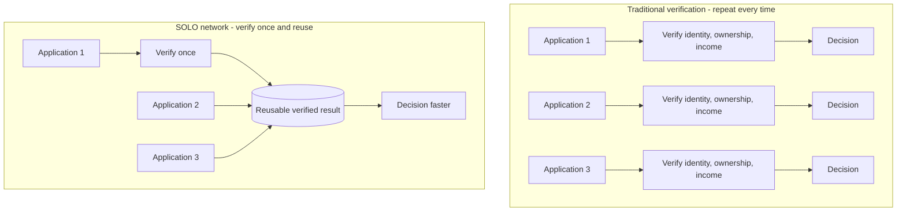
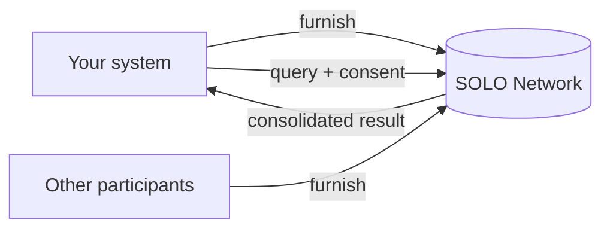

SOLO is **not a data aggregator**. It is a reusable verification network.

A data provider answers *"what can we discover about this business or
consumer?"* — and every institution starts that discovery from scratch. SOLO
answers a different question: *"what has already been verified about this
subject, who verified it, on what evidence, and can I safely reuse it?"* When
one institution verifies a consumer or business, that completed work becomes a
**reusable, permissioned, attributable result** that other participants can
build on instead of repeating.

> Data providers help you *verify* a business. SOLO helps you avoid *verifying
> the same business again.*

Banks and other institutions **furnish** verified data about consumers and
businesses into networks they belong to, and **query** that data back — under
explicit, auditable rules about who can read what, and why. Instead of
integrating with dozens of verification vendors one at a time, you connect to
SOLO once and work with standardized **products** — a KYC certificate, a KYB
certificate, screening lists — inside a
[network](/concepts/governance/networks) of participants you already trust.
Every read is gated by the subject's [consent](/concepts/identity/consent),
shaped by the network's policies, and limited to the fields you are entitled to
see.

## Verify once, reuse everywhere

In the traditional model, every application triggers a fresh round of
verification. Three banks onboarding the same business each collect the same
documents, run the same registry lookups, and trace the same ownership — paying
again to rediscover the same facts. In a SOLO network, the first verification
is preserved as a reusable result; later participants reuse it, with full
provenance, and only do the work that is genuinely missing.

See [How SOLO is different](/home/why-solo) for the full contrast with
traditional data and KYB/KYC providers.

## How the network works

Every interaction with the API is one of two operations on a product:

1. **Furnish** — contribute verified data about a
   [consumer or business](/concepts/identity/entities) into a network. Other
   participants can then query it, subject to the network's rules.
2. **Query** — read consolidated data about an entity from the network. A query
   requires a `consent_id` proving the subject agreed, and returns only the
   fields the network's policy exposes and you are
   [entitled](/concepts/governance/entitlement) to read.

The product catalog covers the core verification workload of a bank:
**KYC certificates** consolidate identity-verification outcomes for consumers,
**KYB certificates** do the same for businesses, and two **screening lists** —
a bank-specific bad-actor list and a cross-bank financial-crimes watch list —
answer targeted risk questions. Before committing to a billable query, you can
run a non-billable coverage check (`POST /v1/products/check`) to see whether
the network holds enough data about a subject to make the query worthwhile.

The rules sit in the network itself: roles define what each participant *can*
do, policies define what each product reads and writes, and entitlement defines
what each participant *sees*. [High-level concepts](/home/overview) walks
through the full model.

The API itself is plain REST: JSON request and response bodies, standard HTTP
status codes, and a single versioned prefix (`/v1`) for every public endpoint.
Errors follow one consistent envelope — see [Errors](/home/errors) — so the
handling code you write for your first endpoint works for all of them.

## Where to start

Most organizations play one or more of three roles in a network. Find yours and
follow its path.

### Network governors

You operate a network: you decide which products it offers, what each product
is allowed to read and write, and who participates. Start with
[Networks](/concepts/governance/networks) to understand the trust boundary you
are administering, then define the rules of the road with querying and
furnishing policies — `POST /v1/networks/policies/querying` and
`POST /v1/networks/policies/furnishing` create the policy shells, and the
`PUT .../{policy_id}/configuration` endpoints author the per-field selections.
The [Join a network](/home/quickstart/join-a-network) quickstart shows the
participant side of what you are governing.

### Furnishers

You contribute data: KYC or KYB outcomes your institution has already verified.
Start with the [Furnishing overview](/concepts/furnishing/overview) to learn
how contributed data is validated and stored, then run the
[Furnish an entity](/home/quickstart/furnish-an-entity) quickstart to push your
first record through `POST /v1/products/kyc_certificate/furnish`. High-volume
furnishers can ingest files through `POST /v1/file-upload/ingest` or automated
SFTP delivery instead of per-record API calls.

### Queriers

You consume data: you want a consolidated KYC certificate or a screening-list
answer for an entity you are onboarding. Start with the
[Querying overview](/concepts/querying/overview) to see how a query resolves
across network, policy, and consent, and read
[Consent](/concepts/identity/consent) — you must record consent and obtain a
`consent_id` before any query. Then run the
[Query a product](/home/quickstart/query-a-product) quickstart, which takes you
from `POST /v1/consent/consumer` to
`POST /v1/products/kyc_certificate/query` end to end.

<Tip>
  Not sure which role you hold? Your network governor assigned it when your
  organization joined. Many participants are both furnishers and queriers — the
  two paths share the same concepts, so read both overviews.
</Tip>

## Environments

The API is served per environment. All public endpoints sit under the `/v1`
prefix and require a bearer token (see
[Authentication](/home/authentication)).

| Environment | Base URL                       | Purpose                                  |
| ----------- | ------------------------------ | ---------------------------------------- |
| Development | `https://api.dev.solo.one`     | Early integration and experimentation    |
| Sandbox     | `https://api.sandbox.solo.one` | Pre-production testing with test data    |
| Production  | `https://api.prod.solo.one`    | Live traffic                             |

Two endpoints are available without authentication for monitoring:
`GET /health` returns `{"status": "healthy"}`, and `GET /version` reports the
supported API versions and build information.

<Note>
  Credentials are scoped to a single environment. A token minted for sandbox
  will not authenticate against production, and vice versa.
</Note>

Build against sandbox first: it mirrors production behavior — including
consent enforcement, policy evaluation, and the full error model — without
touching live data, so your integration is exercised end to end before you
switch base URLs.

## Next steps

<CardGroup cols={2}>
  <Card title="How SOLO is different" icon="arrows-rotate" href="/home/why-solo">
    Why SOLO is a reusable trust network, not a data aggregator.
  </Card>
  <Card title="Trust assets" icon="award" href="/concepts/trust/trust-assets">
    How a furnished verification becomes reusable, with provenance intact.
  </Card>
  <Card title="Quickstart" icon="rocket" href="/home/quickstart">
    Furnish an entity, query a product, and join a network — hands-on, in
    minutes.
  </Card>
  <Card title="High-level concepts" icon="shapes" href="/home/overview">
    Networks, entities, consent, products, policies, and entitlement — and how
    they fit together.
  </Card>
  <Card title="API Reference" icon="webhook" href="/api-reference/introduction">
    Endpoint-by-endpoint request and response schemas for the full `/v1`
    surface.
  </Card>
</CardGroup>
