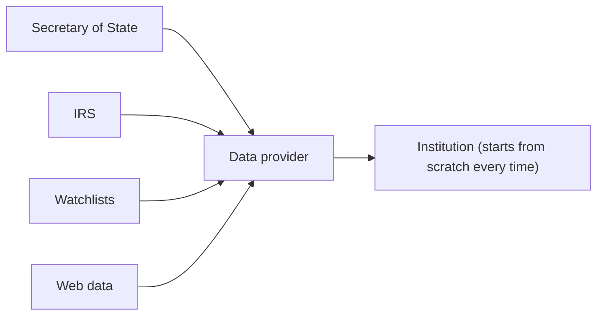
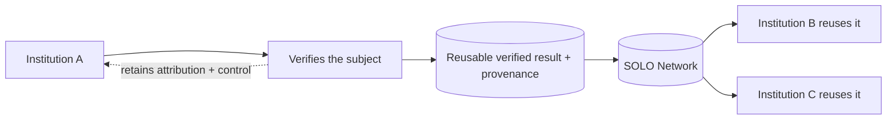

Most data and KYB/KYC vendors share one shape: they aggregate from external
sources and hand each institution a fresh answer. SOLO has a different shape: it
**preserves completed verification work** and lets the next institution reuse
it, with provenance intact. This page makes that distinction concrete.

## Two architectures

A traditional provider sits between external sources and the institution. Every
institution that asks a question pays to rediscover the same facts.

SOLO sits *between institutions*. The institution that does the verification
creates a reusable result; the network preserves it, and other participants
reuse it under permission.

This is not better data aggregation. It is **trust portability**: the
verification stops dying at the end of a single application.

## The one-sentence difference

The same idea, said a few ways:

- Data providers help you *verify* a business. SOLO helps you avoid *verifying
  the same business again*.
- Providers *sell information*. SOLO makes *verified work reusable*.
- Aggregators answer *"what data exists?"* SOLO answers *"what trust already
  exists?"*

## Side by side

| Traditional data / KYB / KYC providers | SOLO |
|---|---|
| Discover information | Reuse verified information |
| Aggregate external sources | Preserve completed verification work |
| Every institution verifies again | Participants reuse prior verification |
| Vendor owns the intelligence | Network participants create the intelligence |
| Point-in-time lookup | Persistent, queryable verification |
| More applications create more work | More applications create more reuse |
| You only pay for data | You contribute *and* benefit from verified work |

## Every claim above maps to a real mechanism

This is not aspirational positioning. Each contrast is backed by a feature that
exists in the API today:

| Claim | How SOLO actually does it |
|---|---|
| "Reuse verified information" | A [product](/concepts/querying/products) query *consolidates* verification events furnished by participants into a single [KYC](/concepts/querying/kyc-certificate) or [KYB](/concepts/querying/kyb-certificate) certificate, instead of re-collecting the underlying evidence. |
| "Preserve completed verification work" | Furnished work is stored as attested verification events and re-resolved on every future query — see [Trust assets](/concepts/trust/trust-assets). |
| "Attributable" | Every certificate sub-product carries the `furnishing_entity_id` and `attestation_id` of its source — see [Provenance](/concepts/trust/provenance). |
| "Permissioned" | Reads require the subject's [consent](/concepts/identity/consent), and fields are filtered by your [entitlement](/concepts/governance/entitlement). |
| "How fresh must it be to count?" | [Querying policies](/concepts/governance/querying-policies) enforce freshness windows; data outside the window is not reused (a `204`, not a stale answer). |
| "Contribute *and* benefit" | Furnishing earns the [entitlement](/concepts/governance/entitlement) that lets you read an entity back later — contribution and consumption are the same loop. |
| "Know before you pay" | The non-billable [coverage check](/concepts/querying/coverage-check) answers *"does reusable verified work already exist for this subject?"* before a billable query. |

## What SOLO is not

To avoid the wrong takeaway:

- **Not another KYB/KYC workflow tool.** SOLO does not replace your verification
  vendors with one more; it makes the verifications already done reusable across
  the network.
- **Not an aggregator with permissions bolted on.** The unit of value is a
  *reusable, attributed verification*, not a fresh external lookup.
- **Not a black box you must trust blindly.** The architecture is exposed on
  purpose — provenance, consent, entitlement, and policy are all visible,
  because visibility is what makes participants comfortable reusing each other's
  work.

## Where to go next

<CardGroup cols={3}>
  <Card title="Trust assets" icon="award" href="/concepts/trust/trust-assets">
    How a furnished verification becomes something reusable.
  </Card>
  <Card title="Provenance" icon="fingerprint" href="/concepts/trust/provenance">
    Who verified what, when, and on what evidence.
  </Card>
  <Card title="High-level concepts" icon="shapes" href="/home/overview">
    Networks, entities, consent, products, policies, entitlement.
  </Card>
</CardGroup>
