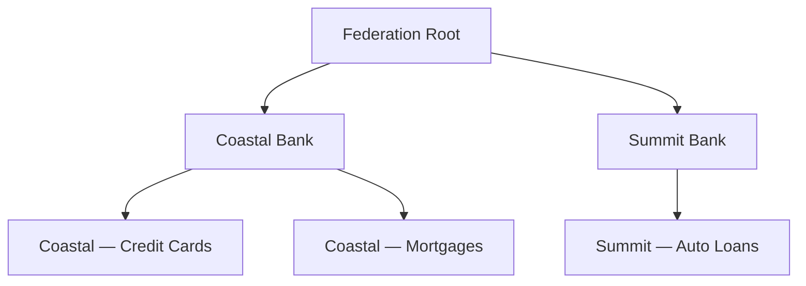

A **network** is the unit of organization for participants and data in SOLO. Every piece of data you furnish or query is scoped to a network, and the network determines who else can see that data.

Networks are not flat. They form a **tree**, where smaller, more specific networks live underneath broader ones. A bank might run its own network at the top, with a separate network underneath for each consumer-facing product it operates. A larger consortium might sit above several member banks.

## What a network represents

A network is a logical grouping that ties together three things:

- **Participants** — the entities that operate within the network (see [Network Roles](/permissioning/network-roles))
- **Data** — every furnished record carries a network reference, so the network acts as a boundary on what data can be read
- **Rules** — how data is allowed to move between this network and neighbouring networks (see [Network Governance](/permissioning/network-governance))

A network has a name, an optional description, and a single **governor entity** that owns it.

## The network tree

Every network has at most one **parent network**. A network with no parent sits at the top of the tree and is called a **root** network. Networks below it are its **descendants**; the networks directly under it are its **children**.

In the diagram above, *Coastal Bank* is a child of *Federation Root* and a parent of *Coastal — Credit Cards*. *Summit Bank* is a **sibling** of *Coastal Bank* because they share a parent. *Coastal — Credit Cards* and *Summit — Auto Loans* are **cousins** because they share a common ancestor (the Federation) without being in each other's direct line.

## Relations between networks

These are the words SOLO uses to describe how any two networks relate. They show up throughout the permissioning model, so it's worth getting them straight up front.

| Term | Meaning |
|---|---|
| **Parent** | The network directly above this one. |
| **Child** | A network whose parent is this one. |
| **Ancestor** | Any network reachable by walking upward — parent, grandparent, and so on, up to the root. |
| **Descendant** | Any network reachable by walking downward — child, grandchild, and so on. |
| **Sibling** | Two networks that share the same parent. |
| **Cousin** | Two networks that share a common ancestor but are not in each other's ancestor or descendant line. |
| **Root** | A network with no parent. |

<Note>
SOLO treats siblings as a special case of cousins for permissioning purposes. Anywhere governance rules talk about cousins, siblings are included.
</Note>

## Standard networks and programs

Networks come in two kinds, distinguished by their `network_type`:

- **Standard networks** are the default. A bank, a consortium, or a fintech operating in SOLO each runs as a standard network. These are typically created through the SOLO Dashboard.
- **Program networks** are child networks of a standard network that represent a specific product or initiative the operator runs — a credit card program, a mortgage line, a partnership offering. Programs are usually created automatically by SOLO's data-furnishing workflows when a new program first appears in furnished data.

Programs always sit beneath a standard parent network. They behave like any other network in the tree — they can have their own participants, their own data, and their own governance settings — but their lifecycle is typically tied to the upstream data flow that created them.

<Tip>
If you operate a single product line, you probably only need a standard network. Programs become useful when you want to keep data, participants, or rules isolated between distinct product offerings under the same operator.
</Tip>

## What's next

- See [Network Roles](/permissioning/network-roles) for how entities participate in a network.
- See [Network Governance](/permissioning/network-governance) for how data can flow between related networks.
