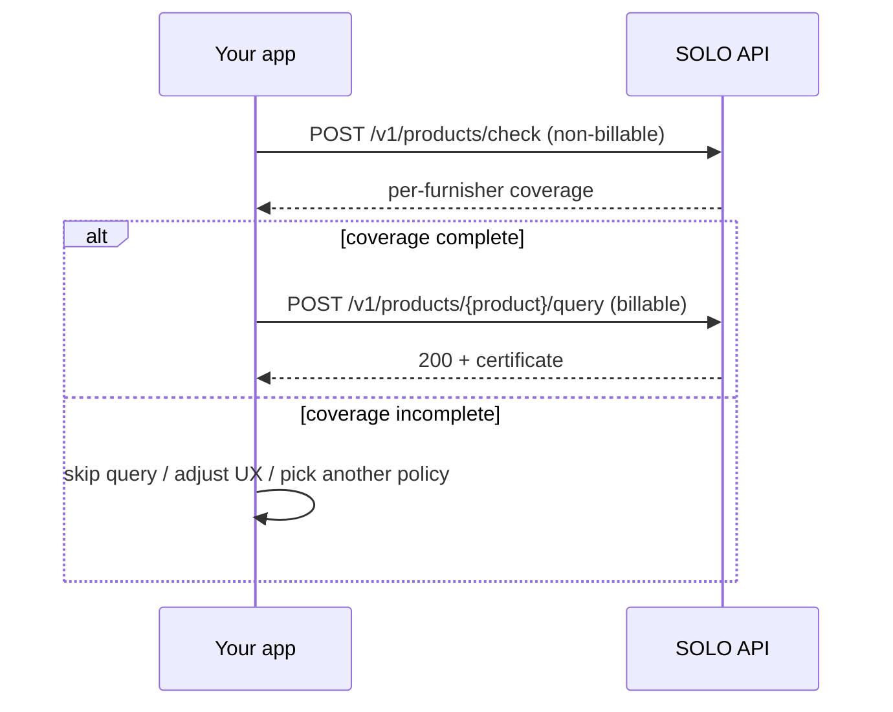

The **coverage check** is a non-billable, read-only pre-flight for product
queries. Given a product, a subject, and a network + policy scope, it reports —
**per furnisher** — which of the policy's required fields are covered by data
already furnished to the network. It answers *"if I run this query now, can it
succeed?"* without issuing a certificate, recording a query event, or creating a
billable event.

| | |
|---|---|
| **Category** | Utility (not a product query) |
| **Use case** | Pre-flight a query, avoid predictable `204`s |
| **Subject** | Consumer or business (matches the checked product) |
| **Family** | Non-billable check |
| **Operation** | `POST /v1/products/check` |

One endpoint serves every product: pass the `product_id` of the product you
intend to query.

## Why it exists

A product query that resolves but cannot satisfy the policy returns
[`204 No Content`](/concepts/querying/overview#200-vs-204-here-is-data-vs-nothing-usable)
— and that resolved query is still a billable event. The coverage check lets you
avoid predictable `204`s for free.



## At a glance

```bash
curl -X POST https://api.solo.one/v1/products/check \
  -H "Authorization: Bearer $SOLO_TOKEN" \
  -H "Content-Type: application/json" \
  -d '{
    "product_id": "3e8a1d5f-…",
    "consent_id": "a3f0b9c7-…",
    "policy_id": "5e7d2a14-…",
    "network_ids": ["9f1c0c2e-…"]
  }'
```

A `200 OK` returns one entry per furnisher that has relevant data, each with a
`complete` flag and a per-model, per-field breakdown of which requirements are
`met`. The `field_name` values trace directly to each product's field reference.

<Warning>
  The coverage check is a *soft* check. It does not issue a certificate, return
  subject data, record a query event, or guarantee the subsequent query returns
  `200` — data can change between the check and the query.
</Warning>

<Card title="Full request & response schema" icon="book" href="/concepts/querying/coverage-check">
  The complete coverage check deep dive — full request fields, the response
  shape, and when to use it.
</Card>

## Related

<CardGroup cols={2}>
  <Card title="Products" icon="box" href="/products/overview">
    The full product catalog.
  </Card>
  <Card title="Querying" icon="magnifying-glass" href="/concepts/querying/overview">
    The billable query the coverage check pre-flights.
  </Card>
</CardGroup>
