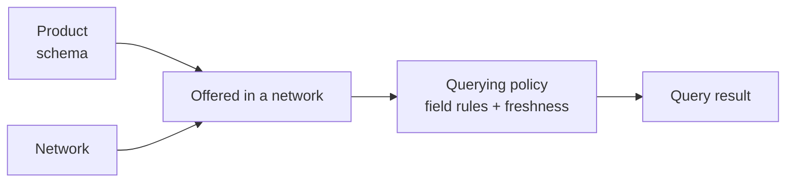

A **product** is a standardized, named data set you can **query** (read) and —
for certificate products — **furnish** (write) through the network. Every
product gives all participants a common schema for one verification domain, so
data furnished by one participant can be queried by another without bespoke
integration.

This tab is the high-level outline of each product. For request anatomy, `200`
vs `204` semantics, billing, and the `X-Ref-Id` header, see
[Network consumption](/concepts/querying/overview).

## The catalog

SOLO offers **five products**, in two categories. The exact set available to you
depends on the [networks](/concepts/governance/networks) you belong to.

| Product | Category | Subject | What it answers |
|---|---|---|---|
| [KYC Certificate](/products/kyc-certificate) | Identity Verification | Consumer | "Has this consumer's identity been verified — documents, biometrics, liveness, address, and corroboration?" |
| [KYB Certificate](/products/kyb-certificate) | Identity Verification | Business | "Has this business been verified — identity, ownership & control, and risk/compliance?" |
| [Bank-Specific Bad Actor List](/products/bank-specific-bad-actor-list) | Fraud & Financial Crime | Consumer | "Has this consumer violated a documented policy of this sponsor bank's program?" |
| [Cross-Bank Financial Crimes Watch List](/products/cross-bank-financial-crimes-watch-list) | Fraud & Financial Crime | Consumer | "Is this consumer associated with suspicious financial-crimes activity reported across participating banks?" |
| [Confirmed Fraud Attribute List](/products/confirmed-fraud-attribute-list) | Fraud & Financial Crime | Consumer | "Is this consumer tied to a confirmed fraud event, and which identifying attributes were implicated?" |

## Two families

| Behavior | Certificates | Lists |
|---|---|---|
| Examples | KYC Certificate, KYB Certificate | Bad Actor List, Financial Crimes Watch List, Confirmed Fraud Attribute List |
| What you get | A consolidated, multi-attribute verification result | A listing indicator plus a small set of context fields |
| Furnishable via API | Yes — `/furnish` | No (query-only) |
| Issues an artifact | Yes — `certificate_id` | No |
| Empty result | `204 No Content` | `200` with `is_listed: false` |
| Billable query event | Yes | Yes |

- **Certificates** are consolidated verification results assembled from data
  furnished by network participants. Querying one can *issue* a reusable
  certificate for the subject, and returns `204 No Content` when the available
  data cannot satisfy the policy.
- **Lists** are read-only yes/no checks against flagged individuals. They always
  return `200 OK`, with a clean result expressed as `"is_listed": false`.

## The query / furnish pattern

<CardGroup cols={2}>
  <Card title="Query" icon="magnifying-glass">
    **Read** consolidated data for an entity, drawn from what authorized
    participants have furnished. Requires a [consent](/concepts/identity/consent)
    ID or a direct profile reference.
  </Card>
  <Card title="Furnish" icon="arrow-up-from-bracket">
    **Contribute** verified data for an entity into a network, making it
    available for future queries by entitled participants.
  </Card>
</CardGroup>

```text
POST /v1/products/{product}/query
POST /v1/products/{product}/furnish    (certificate products)
```

There is also one utility endpoint that is **not** a product query:
`POST /v1/products/check`, the non-billable
[coverage check](/products/coverage-check), which reports whether the furnished
data for a subject can satisfy a policy *before* you run a billable query.

## How products relate to networks and policies



A product defines *what* data exists — its models, fields, and types. A
[network](/concepts/governance/networks) decides *which* products it offers to
its members. A [querying policy](/concepts/governance/querying-policies)
defines, per network, *which parts* of a product a query may read and under what
conditions. The same product can behave differently in two networks because
each network attaches its own policies.

## Choosing a product

| If you need to… | Use |
|---|---|
| Verify a consumer's identity at onboarding | [KYC Certificate](/products/kyc-certificate) |
| Verify a business and its beneficial owners | [KYB Certificate](/products/kyb-certificate) |
| Screen a consumer against your sponsor bank's program history | [Bank-Specific Bad Actor List](/products/bank-specific-bad-actor-list) |
| Screen a consumer for cross-bank financial-crimes signals | [Cross-Bank Financial Crimes Watch List](/products/cross-bank-financial-crimes-watch-list) |
| Screen a consumer against confirmed-fraud attributes | [Confirmed Fraud Attribute List](/products/confirmed-fraud-attribute-list) |
| Know whether a query can succeed before paying for it | [Coverage Check](/products/coverage-check) |

## Product deep dives

<CardGroup cols={2}>
  <Card title="KYC Certificate" icon="id-card" href="/products/kyc-certificate">
    Consolidated consumer identity verification — up to nine sub-products.
  </Card>
  <Card title="KYB Certificate" icon="building" href="/products/kyb-certificate">
    Business identity, ownership & control, and risk/compliance in one
    certificate.
  </Card>
  <Card title="Bank-Specific Bad Actor List" icon="user-xmark" href="/products/bank-specific-bad-actor-list">
    Sponsor-bank-scoped repeat-offender screening.
  </Card>
  <Card title="Cross-Bank Financial Crimes Watch List" icon="building-shield" href="/products/cross-bank-financial-crimes-watch-list">
    314(b) consortium financial-crimes signals.
  </Card>
  <Card title="Confirmed Fraud Attribute List" icon="fingerprint" href="/products/confirmed-fraud-attribute-list">
    Discrete identifying attributes tied to confirmed fraud events.
  </Card>
  <Card title="Coverage Check" icon="list-radio" href="/products/coverage-check">
    Non-billable pre-flight: can this query succeed under this policy?
  </Card>
</CardGroup>
