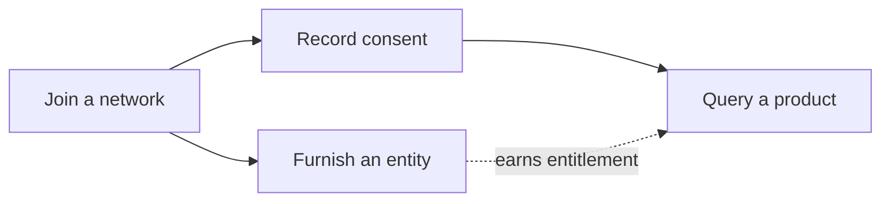

This quickstart walks through the three things you'll do most on the network:
**furnish** an entity, **query** a product, and **join** a network. Each guide is
self-contained and takes only a few minutes.

## Before you start

You'll need:

- A SOLO Network account with API credentials (an **SDK token**, provided by your
  SOLO account manager).
- Membership in at least one [network](/concepts/networks) with the appropriate
  role — **furnisher** to furnish, **querier** to query.

Set your token as an environment variable so the examples work as-is:

```bash
export SOLO_TOKEN="your-sdk-token-here"
```

All requests use this token as a Bearer credential. See
[Authentication](/authentication) for details.

## Choose your path

<CardGroup cols={3}>
  <Card title="Furnish your first entity" icon="arrow-up-from-bracket" href="/quickstart/furnish-an-entity">
    Contribute verified data about a consumer into a network.
  </Card>
  <Card title="Query your first product" icon="magnifying-glass" href="/quickstart/query-a-product">
    Record consent and read consolidated data back.
  </Card>
  <Card title="Join a network" icon="sitemap" href="/quickstart/join-a-network">
    Understand membership, roles, and your first calls.
  </Card>
</CardGroup>

## The big picture



New to the platform? Read [High-level concepts](/concepts/overview) first — it
introduces entities, products, policies, networks, consent, and entitlement in a
few minutes.
