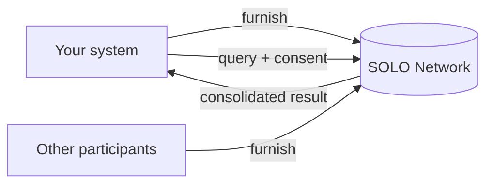

The SOLO Network is a shared data network for identity, compliance, and financial
verification. Participants **furnish** verified data about consumers and
businesses and **query** that data back — under clear, auditable rules about who
can read what, and why.

Instead of integrating with dozens of vendors individually, you connect to SOLO
and work with standardized **products** inside a **network** you belong to.

## What you can do

<CardGroup cols={2}>
  <Card title="Verify identities" icon="id-card">
    KYC and KYB certificates consolidating identity, document, biometric, address,
    ownership, and risk signals.
  </Card>
  <Card title="Screen for risk" icon="shield-check">
    Query bad-actor and cross-bank financial-crimes watch lists for consumers and
    businesses.
  </Card>
  <Card title="Contribute data" icon="arrow-up-from-bracket">
    Furnish verified data into a network so entitled participants can query it.
  </Card>
  <Card title="Ingest at scale" icon="file-import">
    Bulk furnish via spreadsheet upload or automated SFTP ingestion.
  </Card>
</CardGroup>

## How it works

Every interaction is one of two operations on a **product**:

1. **Query** — read consolidated data about a [consumer or business](/concepts/entities)
   from the network. Requires [consent](/concepts/consent).
2. **Furnish** — contribute new data about a subject into the network.

Both happen inside a [network](/concepts/networks) you've joined, governed by its
[policies](/concepts/policies), and shaped by what you're
[entitled](/concepts/entitlement) to read.



## Base URL

```
https://api.solo.one
```

## Next steps

<CardGroup cols={2}>
  <Card title="High-level concepts" icon="shapes" href="/concepts/overview">
    Entities, products, policies, networks, consent, and entitlement.
  </Card>
  <Card title="Quickstart" icon="rocket" href="/quickstart">
    Furnish an entity, query a product, and join a network.
  </Card>
  <Card title="Authentication" icon="key" href="/authentication">
    Set up Bearer token authentication.
  </Card>
  <Card title="API Reference" icon="webhook" href="/api-reference/introduction">
    Browse the full endpoint reference.
  </Card>
</CardGroup>
